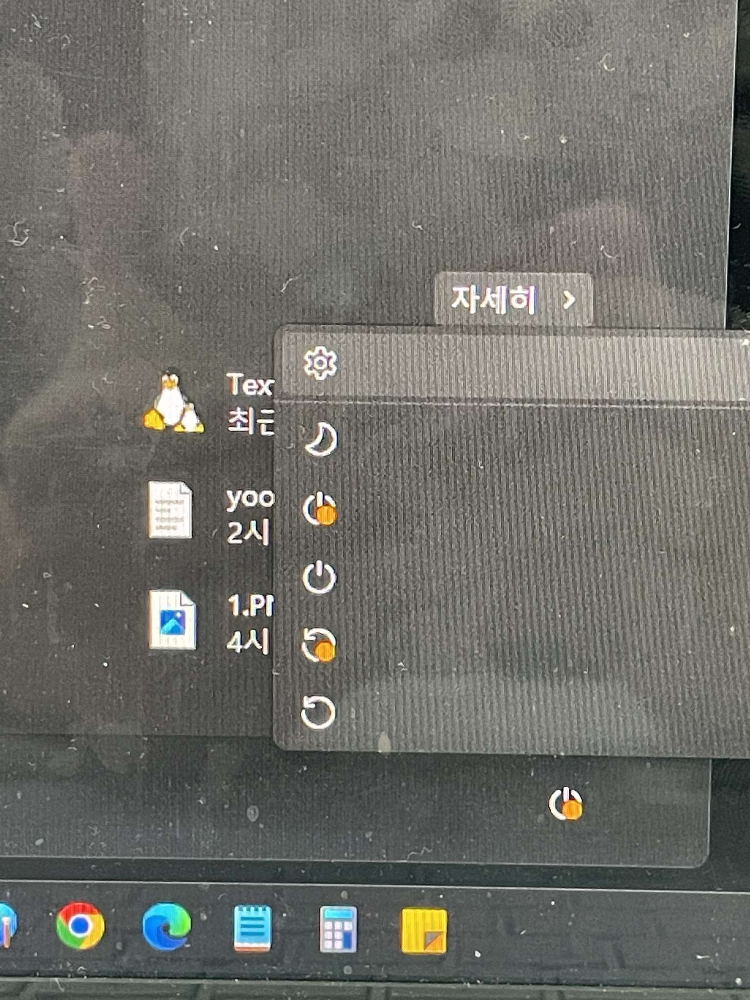
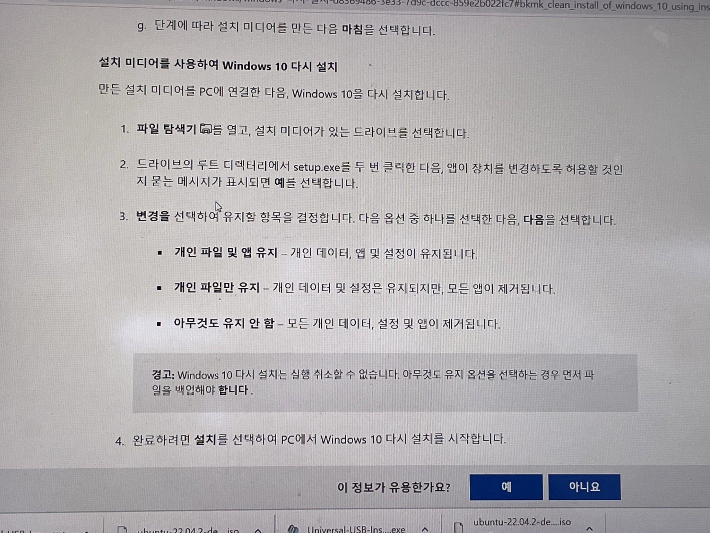
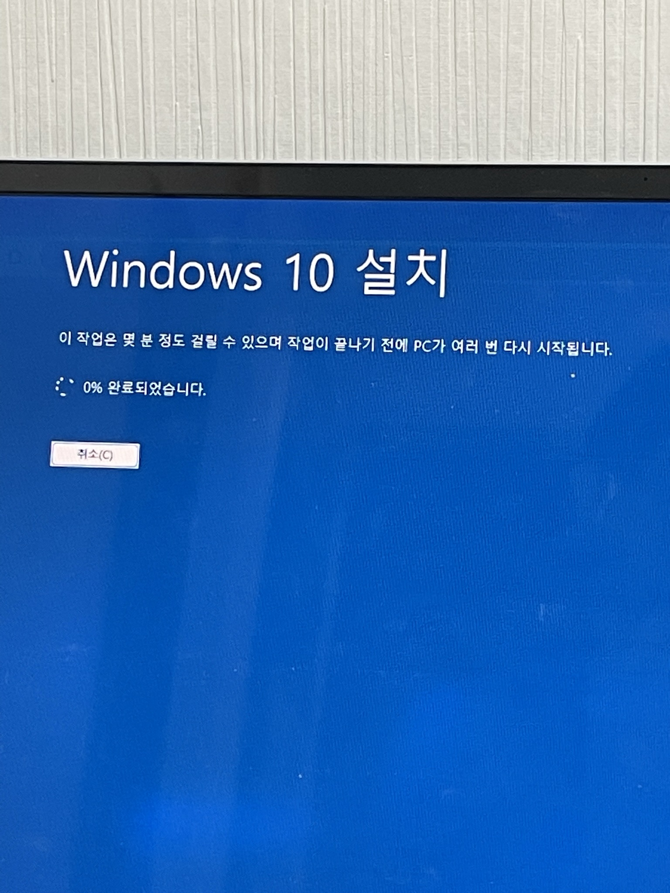
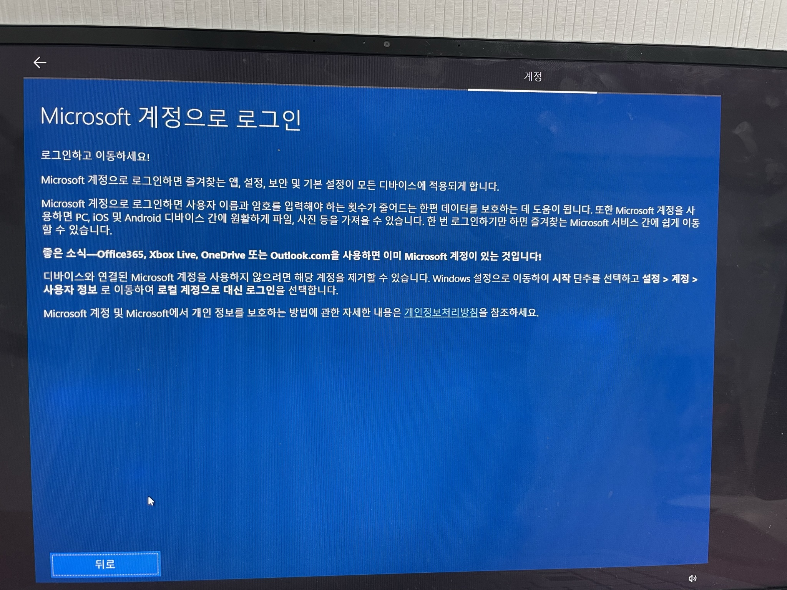
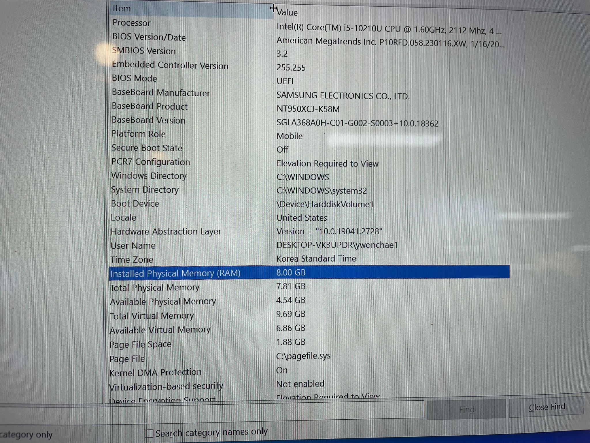
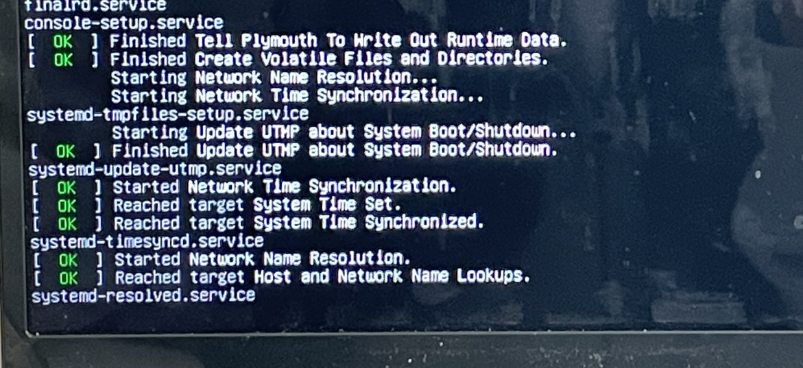
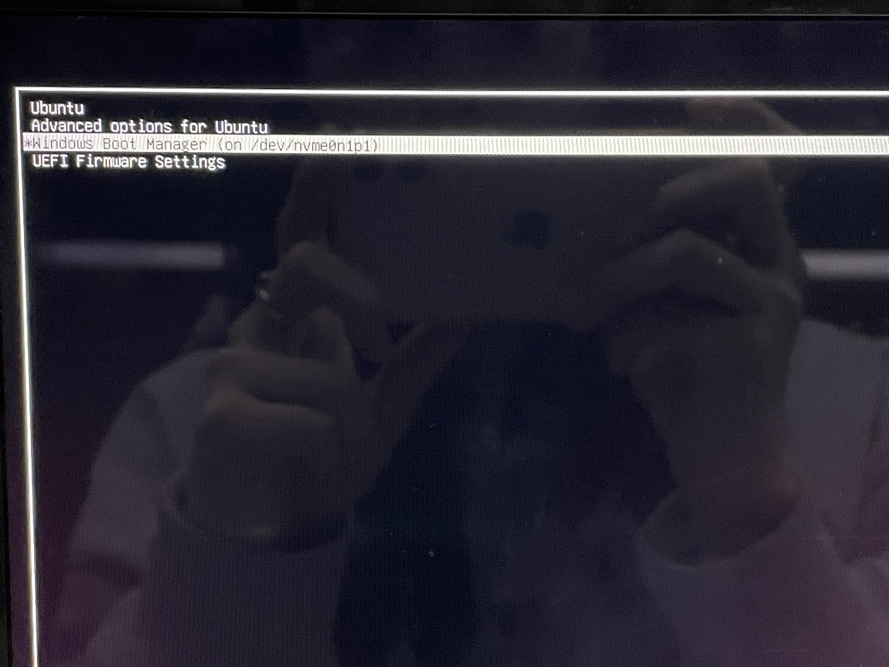

## WSL은 너무 답답해

무엇보다 윈도우 11은 시험기간에도 노트북을 초기화하게 만들었다..

#### 진심 이게 뭐람.........

게다가 급격히 느려진 운영체제는 어플리케이션이 세 개를 넘어가자 힘겨워하기 시작했다.

WSL은 커서가 제대로 움직이지도 않아서 몇 번을 재부팅해야 했다..

## 이렇게 된 김에 윈도우도 다시 깔고! 리눅스를 같이 깔아 보기로 했다.

리눅스는 항상 가상머신으로만 돌렸는데 그냥 디스크 파티션을 나누면 되지 않나 싶어 찾아보니 방법이 있었다.

윈도우 7 설치 파일을 32기가 이상 USB에 받았다. 이 과정에서 USB는 초기화되니 나는 빈 USB를 사용했다.

여기서 아무것도 유지 안 함을 선택했는데도 남아있어서 다시 완전 초기화 과정을 거쳤다.

드디어!

윈도우 처음 설치할 때 하라는 대로 했다가 ... 개발자에게는 낭패

윈도우 계정으로 로그인을 해 버리면 대표적으로 원격 접속에서 문제가 생긴다. ssh 계정이름@IP주소에서 계정이름도 안 맞을 뿐더러 그게 어찌 잘 통과 되었다 해도 비밀번호가 절대 맞을 수가 없다 허허

로컬로 계정을 만들어야 한다.

리눅스 설치 전에 램 한 번 확인해 준다.

나 8기가..였구나😅

다시 찾아온 리눅스 설치

VMware 쓸 때는 다시는 리눅스 안 쓴다 했는데..

리눅스가 편한 거였다

이제 노트북을 켜면 어떤 OS로 부팅을 할 지 선택할 수 있다.

<https://rufus.ie/ko/>

그리고 나는 rufus를 사용해서 리눅스를 설치했다.

다른 것도 있던데 그건 잘 안 됐었다.

리눅스에서 device for boot loader installation은 window가 설치된 경로와 동일한 경로로 설정했다. 문제 없이 잘 동작하는데 이 부분은 잘 찾아보고 해야 할 것 같다.

> 교수님은 WSL이 훨씬 편하다고 하셨다.

칫...

