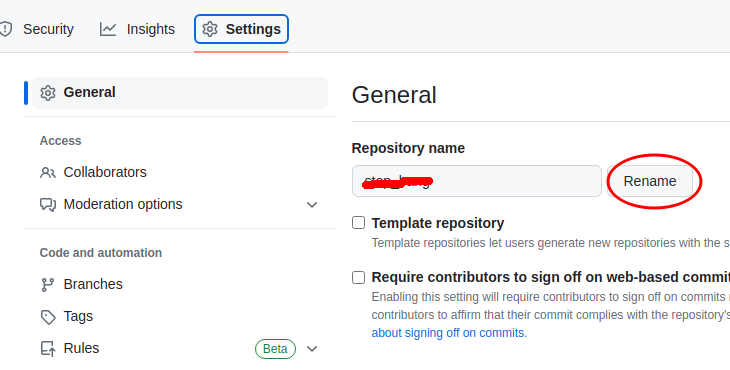

## Contributors에 다른 사용자 삭제하기

<p align="central">
	
</p>

공용 컴퓨터를 쓰다가 실수로 다른 사람의 계정으로 내 블로그 리포지토리에 push를 해버렸다.

공동 작업자도 아닌 정말 다른 사람..!

```
git config --global user.name [사용자이름]
git config --global user.email [사용자이메일]
```

이걸로 분명 변경했는데 다른 사람의 계정이 add 했다고 뜨고 있었다..

**하지만 그렇다고 리포지토리를 삭제하면 잔디가 다 날아간다**

## 해결방법

생각보다 단순하다!

리포지토리 이름을 다른 거로 바꾸었다가 다시 원래대로 돌리면 된다.

<p align="central">
	
</p>
