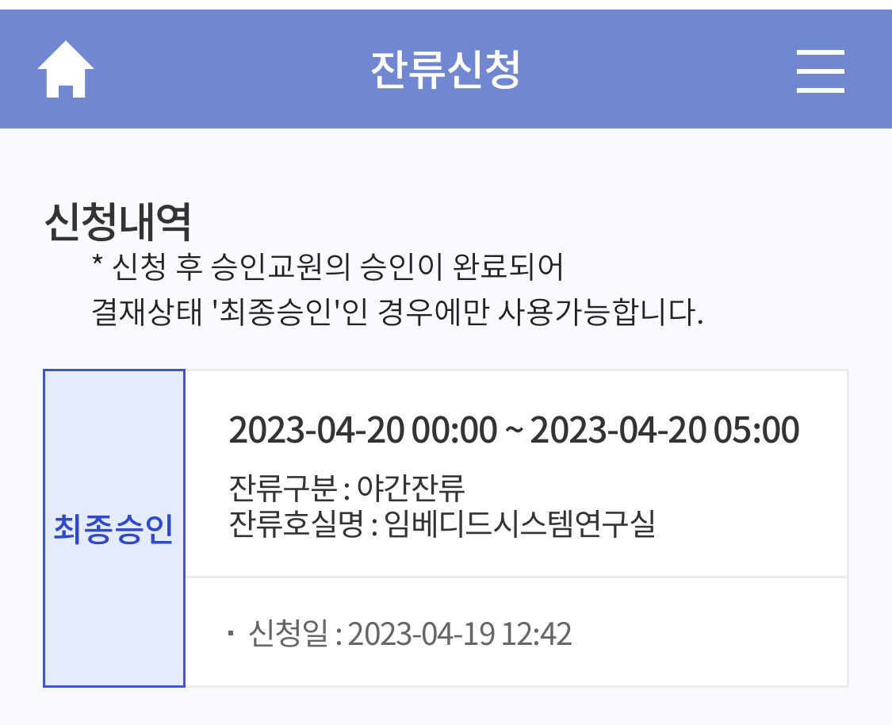
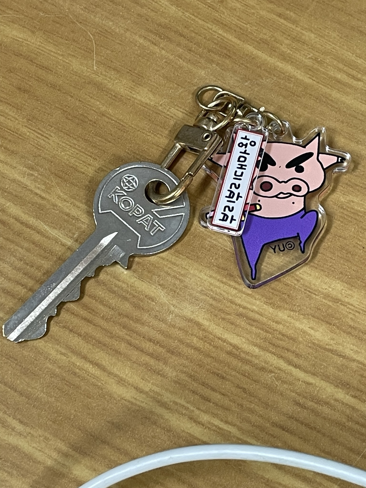

## 학부연구생

학부연구생을 시작하게 되었다.
1일차인데 설레고 기분 좋다.
선배들의 논문 세미나를 들었다. 논문을 읽어 와서 설명해 주는 시간이었는데 정말 유익했고 확실히 내가 좋아하는 분야들이라 나도 빨리 논문을 읽고 자유롭게 설명해 보고 싶어졌다.

교수님의 은근-한 귀여운 면을 보는 것도 재밌고 연구실 선배님들도 엄청 착하고 재밌다.
연구실에 내 자리가 생기고 커다란 모니터를 두 대나 가지게 되었고, 프린터기, 냉장고, 내선전화까지 사용할 수 있게 되었다.

## 우리 연구실의 연구

아직은 잘 모르지만 [SYSTEM SOFTWARE LABORATORY](https://sites.google.com/sungshin.ac.kr/ssl/home)라고 부른다.
나는 운영체제 수업과 시스템프로그래밍 과목을 너무 재밌게 듣고 있어서 교수님께서 하시는 연구를 경험해 보고 싶었다.
앉아서 보고 듣다 보면 내가 고민하고 있는 방향성도 잡힐 거라고 생각한다.
항상 현상 유지를 하는 것보다 뭔가 새로운 일을 시작해야 그 다음으로 진행할 수 있다고 생각한다.

## 지금

연구실에서 혼자 밤을 새고 있다.
할 거 너무 많고...
다음주 시험이고...
나는 시험 기간에는 밤을 잘 못 새는 편이라
일찍 샌다 ㅎ ㅡㅎ

연구실 열쇠를 가졌다. 기분이 좋다.
언니가 너무 귀여운 부리부리대마왕 키링도 주었다 !! :\()\() 고마워 <3
