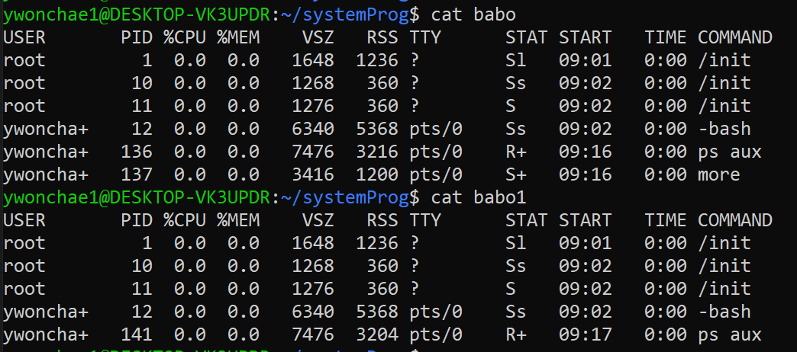

## 기억할 리눅스 명령어

- pwd
    - 현재 디렉토리

- id \[사용자이름\]
    - 사용자이름에 해당하는 id 정보를 보여준다. 사용자 id, 그룹 id
    - 사용자이름을 비워두면 자동으로 본인

- whoami
    - 지금 사용 중인 사용자의 이름을 보여준다

- /etc/passwd
    - 이곳에 리눅스의 사용자들에 대한 정보가 다 들어 있다.
    - 비밀번호는 x로 암호화 되어 있다.

- 명령어 \>\> 파일
    - 파일의 뒤에 명령어의 결과를 추가한다.
    - \>를 하나만 쓰면 덮어쓰기.

- ps
    - 현재 작업 중인 터미널의 프로세스들을 보여준다.

- ps aux
    - 모든 프로세스를 다 보여준다.

- more
    - 긴 내용을 페이지로 나누어서 보여준다.

- wc
    - 어떤 내용의 라인 수, 단어 수, 문자 수를 보여준다.

- grep \[찾을내용\]
    - 찾을내용만 골라낸다.

- kill -9 \[프로세스번호\]
    - 프로세스번호에 해당하는 프로세스를 강제로 종료시킨다.
    - -9 대신 SIGKILL을 사용해도 된다.
    - 기본은 SIGTERM이다.
    - 프로세스가 시그널을 무시하면 반응을 안 하므로 강제로 종료하는 -9를 사용해야 할 때가 있다.

## 기억할 용어

cwd : current working directory

## 활용 예시

> ps aux | wc 는?

- 라인 수, 단어 수, 문자 수가 나오므로 라인 수가 곧 프로세스의 개수임.

> ps aux | wc 와 ps aux | more | wc의 차이

- babo 파일 : ps aux | more > babo로 만들어진 파일

- babo1 파일 : ps aux > babo1으로 만들어진 파일

babo 파일은 more 프로세스가 추가되어 있다. more를 실행했으니까.

하지만 babo1파일은 more 프로세스가 없다.

따라서 이를 wc로 라인, 단어, 문자 수를 세어 보면 차이가 생긴다.

**ps aux | wc가 ps aux | more | wc보다 적은 숫자로 출력이 된다.**

> a.out \< a \> b 는?

a의 내용이 a.out의 표준입력대신 들어가고, 그 결과가 b에 저장됨.

> a.out \< a \>\> b 는?

a의 내용이 a.out의 표준입력대신 들어가고, 그 결과가 b의 **뒤쪽에** 이어서 저장됨.