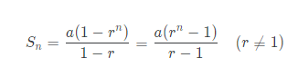
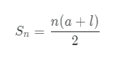

## 여러가지 공식들...

1. 등비수열의 합

    

2. 등차수열의 합

    

## 알고리즘과 복잡도

1. 이분검색(Binary Serch): 재귀 알고리즘
    - 최악경우:
    $$
    \Theta(lg\ n)
    $$

2. 합병정렬(Mergesort)
    - 가장 많은 비교 횟수: h + m - 1
        
        m - 1 개 항목 < h개 항목 < 마지막 한 개
    
    - 시간복잡도
    $$
    W(n) = 2W(n/2) + n - 1
    $$
    $$
    W(1) = 0
    $$
    결국
    $$
    \Theta(nlog\ n)
    $$
    - **공간복잡도** 2n

3. 제자리정렬(in-place sort)
    - 합병정렬에서 U, V 만들지 않고 지역 배열 한 개만 사용해 S에 덮어 씌우는 것
    - **공간복잡도** n

4. 빠른정렬(Quicksort) / 분할교환정렬(partition exchange sort)
    - 부분배열이 가지고 있는 항목의 수(입력크기): n = high - low + 1
    - 최악경우:
    $$
    T(n) = T(n - 1) + n - 1
    $$
    $$
    T(n) = \frac{n(n-1)}{2}
    $$
    $$
    \Theta(n^2)
    $$
    - 평균경우:
    $$
    \Theta(nlog\ n)
    $$

5. 행렬곱셈(Matrix Multiplication)
    - 시간복잡도 - 곱셈 칸 당 n회
    $$
    \Theta(n^3)
    $$
    - 시간복잡도 - 덧셈 칸 당 n-1회
    $$
    \Theta(n^3)
    $$

6. 쉬트라쎈 방법
    - 다음을 구함
    $$
    M1 = (A11+A22)*(B11+B22)\\
    M2 = (A21+A22)*B11\\
    M3 = A11*(B12-B22)\\
    M4 = A22*(B21-B11)\\
    M5 = (A11+A12)*B22\\
    M6 = (A21-A11)*(B11+B12)\\
    M7 = (A12-A22)*(B21+B22)\\
    $$
    - 시간복잡도 - 곱셈
    $$
    T(n) = 7T(\frac{n}{2})\\
    T(1) = 1
    $$
    $$
    \Theta(n^{2.81})
    $$
    - 시간복잡도 - 덧셈
    $$
    T(n) = 7T(\frac{n}{2})+18(\frac{n}{2})^2\\
    T(1) = 1
    $$
    $$
    \Theta(n^{2.81})
    $$

7. 순차검색
    - 최악경우: n
    - 평균경우: (n + 1) / 2
    - 최선경우: 1

8. 피보나치 수열
    - 재귀방식: 2^(n/2)
    - 반복방식: n + 1

9. 배열덧셈
    - 덧셈연산기준 복잡도: n
    - 지정문기준 복잡도: n + n + 1

10. 교환정렬
    - 이중for문
    - n - 1 + n - 2 ....
    $$
    \frac{(n-1)n}{2}
    $$

---

## 동적계획법

---

11. 이항계수 공식
    $$
    nCk = n-1Ck-1 + n-1Ck
    $$
    재귀적 방식이 아닌 배열을 만들어 처리

    nCk는 B[n][k]에 저장됨

    자신의 왼쪽 위, 바로 위 값만 알면 됨

    - 총 수행횟수:
    $$
    \Theta(nk)
    $$

12. 플로이드 알고리즘

    최단경로 찾기, 최적화 문제.
    
    - 무작정 알고리즘 (brute-force algorithm)

        정점이 n개이면 이음선은
        $$
        \frac{(n-1)n}{2}
        $$
        $$
        (n-2)!
        $$
        가지 경로 계산

    - 인접행렬
        
        필요 없는 항까지 구하게 된다.
    
    - 플루이드 알고리즘

        거쳐갈 수 있는 정점을 하나씩 늘려가면서 해결
        
        - 모든 경우 분석:
        $$
        \Theta(n^3)
        $$

        - 경로를 찾으려면? 경로를 기록해 두는 배열 P 하나 더 사용.
        
            P(5,3) = 4라면 V5 - V4 - V3이라는 뜻
        
            P(5,4) = 1이라면 V5 - V1 - V4 - V3이라는 뜻...

## 최적의 원칙

최단이라면 부분경로도 최단이어야 한다.

최장경로 문제는 최적의 원칙이 적용되지 않는다.

### 개념

1. 행렬곱셈은 제곱이하로 떨어진 적이 없다.

2. 분할정복을 사용하지 말아야 하는 경우
    1. 분할된 조각들이 원본보다 커질 때 (피보나치)
    2. n/c 크기의 거의 n개 사례로 분할될 때
    
