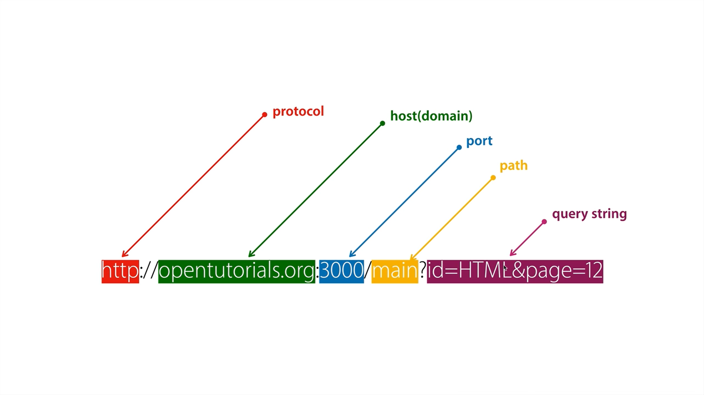

## 배운 내용

🥝 웹페이지를 동적으로 생성할 수 있다.

> console.log()로는 말 그대로 서버의 콘솔 창에서 결과를 확인할 수 있다.

```js
console.log(1+1);    //결과: 2
console.log(2*2);    // 4
console.log("1"+"1");    //11
console.log('1'+'1');    //11
```

> Template Literal

```js
var name = 'yangyang';
console.log(`hello, ${name}!`);
console.log(`hello, ${name}!`.length);
```

.length는 문자열의 길이를 알 수 있다.

🥝 뭔가 궁금하다면?

*javascript string count*

이런 식으로 검색하기

<W3schools.com> 많이 참고하기!

> URL의 이해



*쿼리스트링이 중요*

```js
var url = require('url');
```

🥝 url 모듈을 불러온다.

```js
var _url = request.url;
var queryData = url.parse(_url, true).query;
```

🥝 queryData에는 URL의 내용 중 querystring 부분만 parse(분석)하여 들어가 있다.

    localhost:3000/?id=HTML&page=12

위와 같다면 queryData라는 변수는 id가 HTML, page는 12라는 사실을 담고 있는 것이다.

## 감상과 질문

Node.js를 배우는 건지 JavaScript를 배우는 건지 모르겠다.

웹페이지 생성하는 코드가 전반적으로 이해되기 시작했다.

재밌다!!