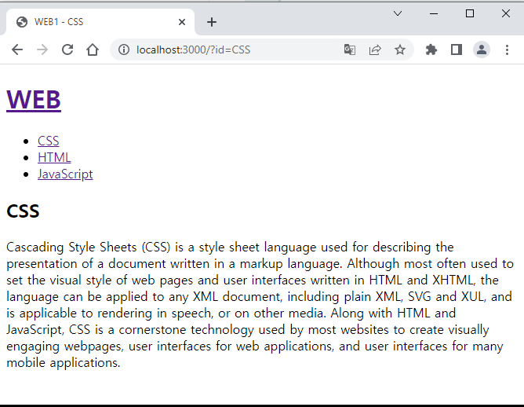
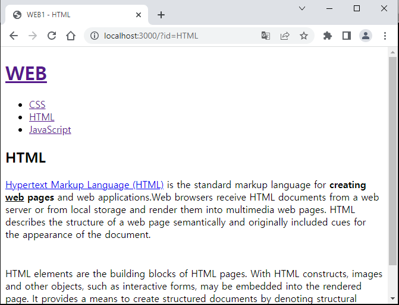
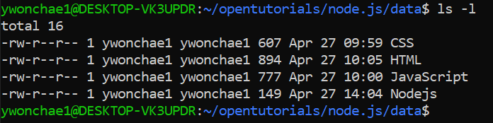
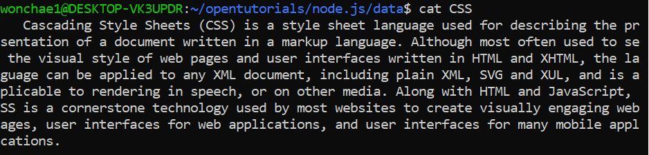

## 배운 내용

🍙🍙화이탱~🍙🍙

url로 가져온 내용을 토대로 페이지의 문구를 변경할 수 있다.






주소를 잘 보면, ?뒤의 쿼리스트링이 id=CSS, id=HTML로 id값이 어떠냐에 따라 다른 페이지가 나오고 있다.

id 값이 없을 때는 아직 처리하지 않아 undefined가 나오고 있다.

### 🍙 목표

- HTML을 누르면 HTML이라는 큰 글자와 함께 HTML에 대한 내용이 나오기

- CSS를 누르면 CSS라는 큰 글자와 함께 CSS에 대한 내용이 나오기

- 매번 같은 내용의 HTML 코드를 사용한 코드파일을 새롭게 생성하는 게 아니라, 하나의 main.js에서 그 일을 해낼 수 있어야 한다.

### 🍙 방법

💡 HTML, CSS... 각각의 내용을 담고 있는 파일을 따로 만든다. 폴더를 생성하여 따로 보관하는 게 좋다. 파일명이 CSS인 파일은 CSS에 대한 내용이 담겨 있다.





💡 fs라는 모듈로 파일을 읽을 수 있다.

*nodejs read file*로 검색해보기

```js
const myfs = require('fs');

myfs.readFile('/path/to/file', 'utf8', (err, data) => {
  if (err) {
    console.error(err);
  } else {
    console.log(data);
  }
});
```

💡 myfs를 잊지 말자. 헷갈리지 말라고 내가 만든 변수는 my를 붙였다.

readFile의 parameter(매개변수)에는 읽으려는 파일의 위치, 인코딩 방식, 읽은 파일의 데이터를 처리하는 방법을 기술한 함수로 구성된다.

위의 코드에 의하면, /path/to/file을 찾아간다. (리눅스로 따지면 
절대 경로로, root밑의 path밑의 to밑의 file이다.)

그러니까 file을 열어, 그 안의 데이터를 뒤에 나오는 data 변수가 가지고 가게 된다.

함수 안의 console.log(data)에서는 data의 내용을 출력하게 된다.

위에 err이 true인 경우는 data의 내용을 출력하지 않으므로 오류를 잡는 기본적인 코드이다.

```js
myfs.readFile(`data/${queryData.id}`, 'utf8', function(err, description){
    ...
});
```

나의 코드는 이렇게 되어 있다. queryData는 다음과 같이 미리 위쪽에 만들어져 있는 변수다.

```js
var queryData = myurl.parse(_url, true).query;

myfs.readFile(`data/${queryData.id}`, 'utf8', function(err, description){
    ...
});
```

_url도 다음과 같이 미리 위쪽에 만들어져 있는 변수이다.

```js
var _url = request.url;
var queryData = myurl.parse(_url, true).query;

myfs.readFile(`data/${queryData.id}`, 'utf8', function(err, description){
    ...
});
```

request는 함수의 parameter(매개변수)이다. 앞서 공부했던 URL 등 클라이언트가 서버에 요청한 정보를 갖고 있다.

```js
var app = myhttp.createServer(function(request,response){
    var _url = request.url;
    var queryData = myurl.parse(_url, true).query;

    myfs.readFile(`data/${queryData.id}`, 'utf8', function(err, description){
        ...
    });
    ...
});
```

또다시 myhttp, myurl, myfs도 마찬가지로 위에 선언된 변수다. 완성은 다음과 같다. 이러한 큰 틀을 이해하자.

```js
var myhttp = require('http');
var myfs = require('fs');
var myurl = require('url');

var app = myhttp.createServer(function(request,response){
    var _url = request.url;
    var queryData = myurl.parse(_url, true).query;

    myfs.readFile(`data/${queryData.id}`, 'utf8', function(err, description){
        ...
    });
    ...
});
```

**myfs.readFile()의 function() 안쪽에 있는 ... (첫 번째 나오는 ...)에는 화면에 뿌리고 싶은 HTML 코드가 들어가 있다. 너무 길어서 생략.**

**그렇다면 이 코드 안에서 동적으로 코드 안의 글자를 변경해 주어야 한다. 그것을 위해 queryData와 description을 사용하게 되는 것이다**

**queryData.id는 HTML파일의 큰 글자에 `${queryData.id}` 이런 형식으로 들어가게 되고, description은 HTML 파일의 내용에 `<p>${description}</p>`이런 식으로 들어가게 되는 것이다.**

물론 새로운 변수를 만들어도 된다.

```js
title = queryData.id
```

[전체소스코드와 수업영상](https://opentutorials.org/module/3549/21049)

이렇게!

## 감상과 질문

🍙 재미가 있다. 웹페이지 만드는 건 눈에 보이는 결과가 신기하다. 근데 나중되면 코드 붙여넣기 정도로 느껴질 거 같기도 하다.