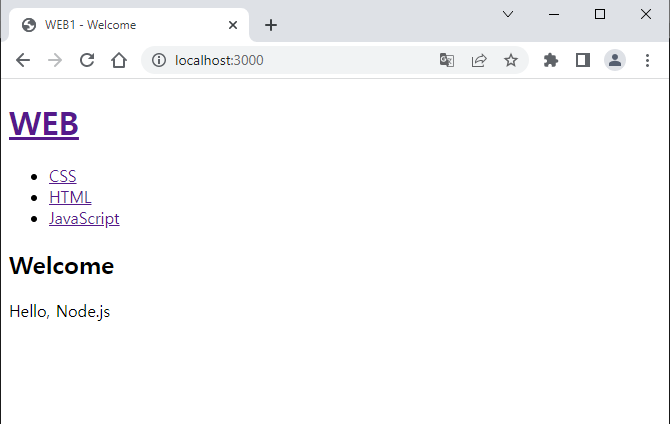
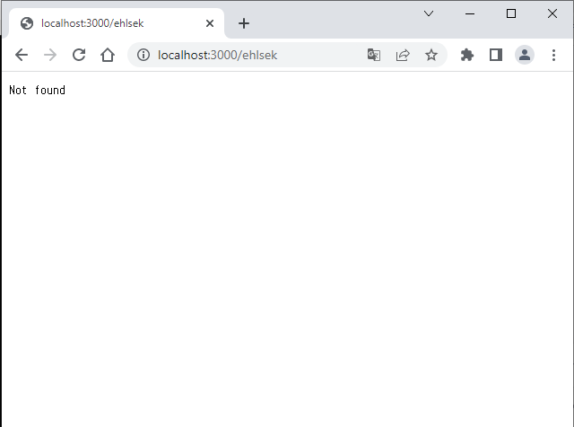
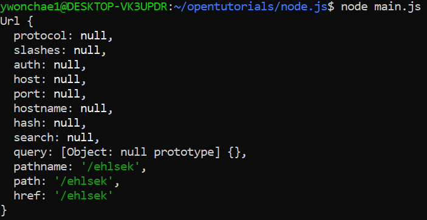

## 배운 내용

🔑 URL의 정보를 보고(특히 쿼리스트링) 제대로된 정보가 아니라면 404페이지처럼 오류를 띄울 수 있다.

🔑 if문을 사용한 코드를 만들 수 있다.







```js
console.log(myurl.parse(_url, true));
```
의 결과는 위와 같다.

path 부분에서 경로가 /가 아니라서 Not found가 보여지는 것을 확인할 수 있다.

### 🔑 목표

- 쿼리스트링의 경로가 /로 시작하면 통과, 뒤의 쿼리스트링에 따라 페이지를 보여준다.

- 쿼리스트링이 그렇지 않고 이상하다면 오류를 보여준다.

### 🔑 방법

💡 if문을 활용한다. myurl이 담고 있는 내용 중 pathname을 활용한다.

지난 글 마지막 코드이다.

```js
var myhttp = require('http');
var myfs = require('fs');
var myurl = require('url');

var app = myhttp.createServer(function(request,response){
    var _url = request.url;
    var queryData = myurl.parse(_url, true).query;

    myfs.readFile(`data/${queryData.id}`, 'utf8', function(err, description){
        ...
    });
    ...
});
```

```js
var myhttp = require('http');
var myfs = require('fs');
var myurl = require('url');

var app = myhttp.createServer(function(request,response){
    var _url = request.url;
    var queryData = myurl.parse(_url, true).query;
    var mypathname = myurl.parse(_url, true).pathname; //요기

    myfs.readFile(`data/${queryData.id}`, 'utf8', function(err, description){
        ...
    });
    ...
});
```

💡 헷갈리지 말라고 내가 만든 변수는 my를 붙였다.


💡 mypathname이라는 변수는 여기서 노란색 부분에 대한 정보를 담고 있는 변수이다.

> The pathname property of the parsed URL object represents the path component of the URL, which is the part of the URL after the hostname and port (if present), and before any query parameters or fragment identifiers. For example, in the URL https://www.example.com/foo/bar?baz=qux#quux, the pathname would be /foo/bar.

ChatGPT가 설명을 참 잘해준다.

💡 mypathname 변수의 값이 /와 같은지 확인한다.

```js
var myhttp = require('http');
var myfs = require('fs');
var myurl = require('url');

var app = myhttp.createServer(function(request,response){
    var _url = request.url;
    var queryData = myurl.parse(_url, true).query;
    var mypathname = myurl.parse(_url, true).pathname; //요기

    if(mypathname === '/'){   //요기
        myfs.readFile(`data/${queryData.id}`, 'utf8', function(err, description){
            ...
        });
        ...
    }
});
```

💡 if문의 조건에는 등호가 세개 들어간다. JavaScript에는 세개의 등호는 두 데이터가 정말 정말 정말 같은지 점검한다.

```js
var myhttp = require('http');
var myfs = require('fs');
var myurl = require('url');

var app = myhttp.createServer(function(request,response){
    var _url = request.url;
    var queryData = myurl.parse(_url, true).query;
    var mypathname = myurl.parse(_url, true).pathname; //요기

    if(mypathname === '/'){   //요기
        myfs.readFile(`data/${queryData.id}`, 'utf8', function(err, description){
            ...
        });
        ...
    } else {
       response.writeHead(404);
       response.end('Not found');
    }
});
```

마지막으로 오류를 나타내는 else 내용도 추가해 주자.

*404라는 값을 보내면 웹서버는 오류라고 판단한다*

그래서 404가 떴던 거구나...

'Not found'를 페이지에 뿌려 주며 끝난다.

---

이번엔 이 상태에서 Home과 다른 페이지를 구분해 본다.

### 🔑 목표

- Home은 queryData.id 값이 undefined 값을 가진다는 것을 알 수 있다.

- 이를 활용하여 undefined일 때는 undefined를 페이지에 뿌리는 것이 아니라 Welcome이라는 큰 글자와 Hello, Node.js라는 내용을 뿌릴 수 있도록 만든다.

### 🔑 방법

💡 마찬가지로 if문을 사용한다. 현재 상태에서 안쪽으로 중첩 if문이 들어가게 된다.

💡 undefined 값이 들어왔다는 것은 쿼리스트링이 없다는 것과 같다. 쿼리스트링이 없다는 것은 undefined 값이 들어간다는 것과 같다.

💡 그렇다면 일단 pathname은 적절하게 / 이걸로 잘 들어왔을 것이다.

💡 첫 번째 if문 안쪽에만 중첩 if문이 만들어지게 된다!

```js
var myhttp = require('http');
var myfs = require('fs');
var myurl = require('url');

var app = myhttp.createServer(function(request,response){
    var _url = request.url;
    var queryData = myurl.parse(_url, true).query;
    var mypathname = myurl.parse(_url, true).pathname;

    if(mypathname === '/'){
        if(queryData.id === undefined){     //요기
            //이때는 읽을 파일이 없기 때문에 readFile 함수는 뒤로 미뤄두자.
        }
        
        myfs.readFile(`data/${queryData.id}`, 'utf8', function(err, description){
                ...
        });
        ...
    } else {
       response.writeHead(404);
       response.end('Not found');
    }
});
```

id의 값이 undefined와 같다면 HTML 코드에서 큰 글자에 해당하는 값, 본문에 해당하는 값을 적절한 문자로 변경해 주어야 한다. 변수를 사용하여 코드의 확장성을 높인다.


```js
var myhttp = require('http');
var myfs = require('fs');
var myurl = require('url');

var app = myhttp.createServer(function(request,response){
    var _url = request.url;
    var queryData = myurl.parse(_url, true).query;
    var mypathname = myurl.parse(_url, true).pathname;

    if(mypathname === '/'){
        if(queryData.id === undefined){     //요기
            var title = 'Welcome';      //요기
            var description = 'Hello, Node.js'; //요기
            ...${title}...
            ...${description}...
        }

        myfs.readFile(`data/${queryData.id}`, 'utf8', function(err, description){
                ...
        });
        ...
    } else {
       response.writeHead(404);
       response.end('Not found');
    }
});
```

id가 CSS, HTML 등인 경우는 else에 넣어준다.

```js
var myhttp = require('http');
var myfs = require('fs');
var myurl = require('url');

var app = myhttp.createServer(function(request,response){
    var _url = request.url;
    var queryData = myurl.parse(_url, true).query;
    var mypathname = myurl.parse(_url, true).pathname;

    if(mypathname === '/'){
        if(queryData.id === undefined){     //요기
            var title = 'Welcome';      //요기
            var description = 'Hello, Node.js'; //요기
            ...${title}...
            ...${description}...
        } else {        //요기
            myfs.readFile(`data/${queryData.id}`, 'utf8', function(err, description){
                ...
            });
        }
        ...
    } else {
       response.writeHead(404);
       response.end('Not found');
    }
});
```

else인 경우에는 queryData.id를 그대로 사용해도 된다.

또는 마찬가지로 변수를 설정해도 된다.

크게 이해하기...

[전체소스코드와 수업영상](https://opentutorials.org/module/3549/21064)

## 감상과 질문

🔑 글을 정리하다보니 뇌도 정리가 된다