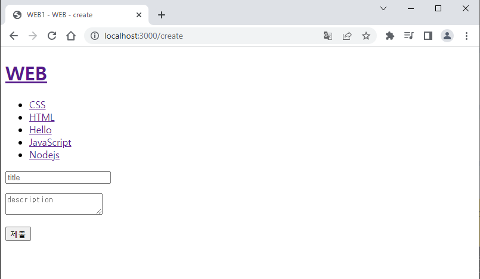
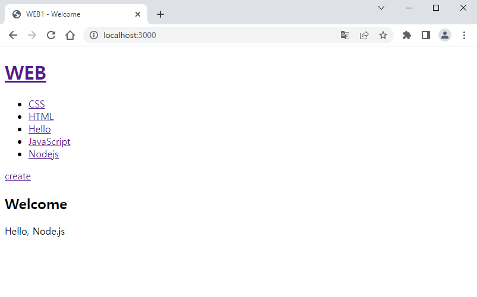
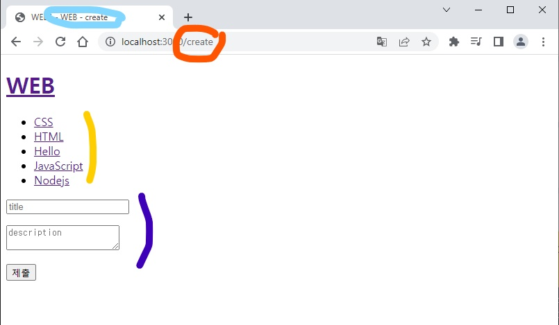

## 🐘

> 가장 좋아하는 부분이니 코끼리 이모티콘을 채택한다!

## 배운 내용

🐘 HTML의 form 태그의 역할을 알 수 있다.

🐘 post 방식을 이해할 수 있다.

🐘 클라이언트가 서버에 데이터를 비밀스럽게 전송할 수 있다.

🐘 객체나 딕셔너리에 대한 이해가 있으면 도움이 된다!

### 🐘 목표

- 사용자가 자신의 컴퓨터 상 웹페이지에서 create를 클릭했을 때 글의 제목과 내용을 작성하고 이를 서버에 파일 형태로 저장

- create를 클릭하면 글의 제목, 내용을 입력할 수 있는 텍스트박스가 원래 제목과 본문이 나왔던 부분을 대체

- 제출 버튼을 클릭하면 post 방식으로 작성된 데이터가 '서버로' 전송

- 파일명이 작성한 제목, 파일의 내용이 작성된 내용으로 새로운 파일이 생성되어 서버에 저장

- 제출 버튼을 클릭하면 자신이 만든 페이지에 도착



여기서 중요한 점은 링크에 경로, 즉 path에 해당하는 내용이 지금까지는 /였다면 /create로 바뀌었다는 것이다.

title, description은 어떤 내용을 적어야 하는지 안내해 주는 역할을 한다.

저렇게 보여도 사실은 비어있다는 뜻이다.

### 🐘 방법

💡 나의 공부에 html은 중요한 게 아니지만 html은 이렇게 구성이 되어 있다.

```js
`
<!doctype html>
<html>
    <head>
        <title>WEB1 - ${title}</title>
        <meta charset="utf-8">
    </head>
    <body>
        <h1><a href="/">WEB</a></h1>
        ${list}
        <a href="/create">create</a> //중요
        ${body}
    </body>
</html>
`
```

> 중요 부분을 잘 본다.

create라는 하이퍼링크가 생성되었다.

*이 링크를 클릭하면 현재 URL의 뒤에 /create가 붙게 된다.*

위의 사진처럼!

title과 list, body는 함수의 인자로 넘어온다.

```js
function templateHTML(title, list, body){
    return `
        <!doctype html>
        <html>
            <head>
                <title>WEB1 - ${title}</title>
                <meta charset="utf-8">
            </head>
            <body>
                <h1><a href="/">WEB</a></h1>
                ${list}
                <a href="/create">create</a>
                ${body}
            </body>
        </html>
        `;
}
```

인자로 받은 body 값이 ${body} 부분에 대입이 되는 것이다.

함수를 부를 때, body에 넣을 html 코드를 넘겨 주면 된다.

그러니 목록의 제목을 클릭해 글을 볼 땐 제목과 본문이, create를 클릭해 새롭게 생성할 땐 제목 텍스트 박스와 내용 텍스트 박스, 제출 버튼이 보이도록 하면 된다.

create일 때 body에 들어갈 html 코드는 다음과 같다.

```html
<form action="/process_create" method="post">
    <p><input type="text" name="title"></p>
    <p>
    <textarea name="description"></textarea>
    </p>
    <p>
    <input type="submit">
    </p>
</form>
```

하나씩 살펴보기

1. ```html
    <form action="/process_create" method="post">
        ...
    </form>
    ```

    post 방식으로 데이터를 보내게 된다.

    html에서 form이 이렇게 중요한 거였는 줄은 몰랐다..!

    action에 해당하는 경로, /process_create로 링크가 변환이 된다.

2. ```html
    <p><input type="text" name="title"></p>
    ```

    짧은 글을 담는 박스는 input 태그를 사용하고, 속성들 중 name을 유심히 보아야 하는데, 이는 title이라는 이름으로 사용자가 입력한 내용을 전달한다는 뜻이다!!!!

    그러니까 딕셔너리처럼, {title : "yangyang"} 이렇게 받아들인다고 생각하면 좋다.

    누가?? 서버가!

3. ```html
    <textarea name="description"></textarea>
    ```

    긴 글을 담는 박스는 textarea이다. 여기도 마찬가지로 description이라는 이름으로 사용자가 입력한 내용을 전달한다.

4. ```html
    <input type="submit">
    ```

    제출버튼이 생성된다.

    2번에서도 input을 사용했는데 약간 다르다.

    그렇다는 것은 type이 화면에 표현되는 형태를 크게 결정한다는 것을 알 수 있다.


이 코드는 create를 클릭했을 때 발현되어야 한다.


create를 클릭하면 이런 화면이 보이고, URL은 뒤에 /create가 붙은 형태로 변경된다고 했다. (이유는 위쪽 html 코드에 설명이 되어 있다.)

```js
var myhttp = require('http');
var myfs = require('fs');
var myurl = require('url');

var app = myhttp.createServer(function(request,response){
    var _url = request.url;
    var queryData = myurl.parse(_url, true).query;
    var mypathname = myurl.parse(_url, true).pathname;

    if(mypathname === '/'){
        if(queryData.id === undefined){
            var title = 'Welcome';
            var description = 'Hello, Node.js';
            ...${title}...
            ...${description}...
        } else {
            myfs.readFile(`data/${queryData.id}`, 'utf8', function(err, description){
                ...
            });
        }
        ...
    } else {
       response.writeHead(404);
       response.end('Not found');
    }
});
```

우리가 app 안에서 if문으로 경로가 어떨 때마다 서로 다른 행동을 취할 수 있도록 만들었다.

첫번째 if

    if(pathname === '/')

는 홈화면으로 이동하는 것이었다.

현재 create가 추가되었으므로 이렇게 보일 것이다.



💡 이제부터 구현하려는 것은

create 버튼을 눌렀을 때 보여줄 화면을 만들어야 한다.

create 버튼을 누르면 pathmane이 '/create'로 바뀐다.

그러면 또 다른 if 분기를 만들어야 하는 것이다.

```js
if(mypathname === '/'){
    if(queryData.id === undefined){
        var title = 'Welcome';
        var description = 'Hello, Node.js';
        ...${title}...
        ...${description}...
    } else {
        myfs.readFile(`data/${queryData.id}`, 'utf8', function(err, description){
            ...
        });
    }
    ...
} else if(mypathname === '/create') { //여기!
    ...
}
```

이렇게~~

앞으로 계속 else if를 추가할 것이다.

내용은 다음과 같이 구성해야 한다.

1. 첫 번째 if 안의 if의 내용과 매우 유사하다.

2. html 코드 템플릿의 매개변수가 하나 더 늘어났으니 그 부분은 전체에 적용해 주어야 한다.

```js
if(mypathname === '/'){
    ...
} else if(mypathname === '/create') { //여기!
    myfs.readdir('./data', function(error, filelist) {
        title = 'WEB - create'; //뭐든 상관 없음
        var list = templateList(filelist); //글 목록 생성
        var createPage = `
            <form action='/create_process' method='post'>...
            `                                   //위의 html코드와 동일
        var template = templateHTML(title, list, createPage, '');

        response.writeHead(200); //정상처리됐다는 신호
        response.end(template); //template을 화면에 뿌려줌
    });
} else {
    ...
}
```



1. 주황색: create가 눌러지자 a태그의 href로 인해 링크가 변경됨
    
    서버가 계속 신호를 듣고 있다가 이에 따라 else if(pathname === '/create') 부분에 해당되어 그 아래 코드가 실행

2. 하늘색: title을 지정함

3. 노란색: filelist를 생성하여 list 변수가 가지고 있음

4. 보라색: createPage가 가지고 있는 html 내용이 body로 들어가 적용됨

### 💡 이제 제출을 누르면 데이터가 post 방식으로 전송되도록만 하면 된다!

[전체소스코드와 수업영상](https://opentutorials.org/course/3332/21135)

## 감상과 질문

🐘 POST 그대는 코끼리 이모티콘을 받을 자격이 충분하십니다ㅇ.ㅁ