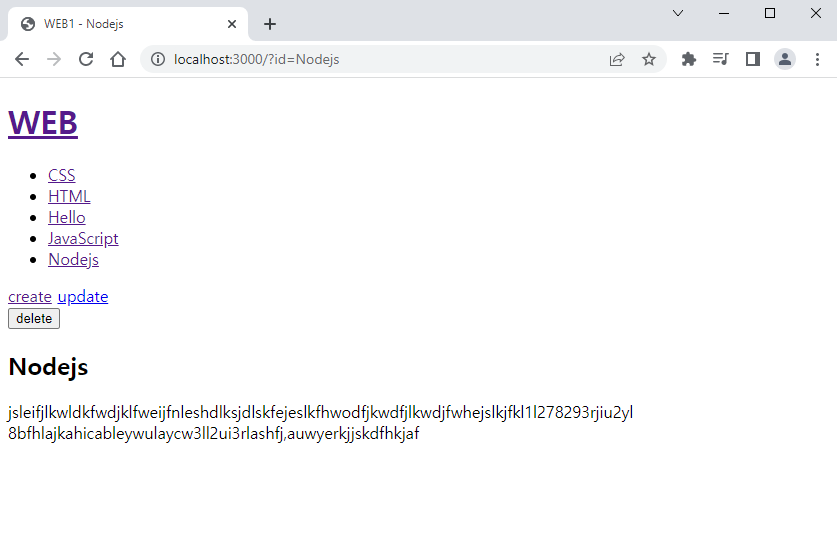

## 🐘

> 가장 좋아하는 부분이니 코끼리 이모티콘을 채택한다!

## 배운 내용

🐘 삭제할 때는 무조건 post 방식을 사용해야 안전하다.

🐘 얘는 delete_process 하나만 있으면 된다.

### 🐘 목표

- 글 삭제

- 글의 내용을 보고 있는 상태에서만 delete 버튼이 나타나야한다.



### 🐘 방법

```js
`
<!doctype html>
<html>
    <head>
        <title>WEB1 - ${title}</title>
        <meta charset="utf-8">
    </head>
    <body>
        <h1><a href="/">WEB</a></h1>
        ${list}
        ${control} //중요!
        ${body}
    </body>
</html>
`
```
html 코드에서 control에 해당하는 내용의 변경이 조금 필요하다.

물론 글의 내용이 보이는 부분에서! update를 만든 부분과 동일하다.

```js
if(mypathname === '/') {
    if(title === undefined) {
        ... //여긴 홈
    } else {
        ... //여기에서 보여야!
    }
}
```

```js
if(mypathname === '/'){
    if(title === undefined) {
        ...
    } else {
        myfs.readdir('./data', function(error, filelist) {
            fs.readFile(`data/${title}`, 'utf8', function(err, description) {
                var list = templateList(filelist);

                var body = `<h2>${title}</h2>${description}`
                //이 부분이 살짝 수정된다.
                var control = `
                    <a href="/create">create</a>  <a href="/update?id=${title}">update</a>
                    <form action="/delete_process" method="post">
                        <input type="hidden" name="id" value="${title}">
                        <input type="submit" value="delete">
                    </form>
                    `
                var template = templateHTML(title, list, body, control);
                response.writeHead(200);
                response.end(template);
            })
        })
    }
    ...
} else if(mypathname === '/create') {
    ...
} else {
    ...
}
```

💡 독특한 점은, form을 사용한다는 것이다. 삭제할 때는 보안을 위해 꼭 post 형태로 보내야한다.

url에 삭제 정보가 드러나면 안 된다는 것.

form action="/delete_process"로 pathname이 변경되었을 테니 마찬가지로 else if를 추가해 준다.

```js
if(mypathname === '/'){
    ...
} else if(mypathname === '/create') {
    ...
} else if(mypathname === '/create_process') {
    ...
} else if(mypathname === '/update') {
    ...
} else if(mypathname === '/update_process') {
    ...
} else if(mypathname === '/delete_process') { //여기
    ...
} else {
    ...
}
```

💡 파일을 삭제하는 새로운 함수를 사용한다.

```js
if(mypathname === '/'){
    ...
} else if(mypathname === '/create') {
    ...
} else if(mypathname === '/create_process') {
    ...
} else if(mypathname === '/update') {
    ...
} else if(mypathname === '/update_process') {
    ...
} else if(mypathname === '/delete_process') {
    var body = '';
    request.on('data', function(data) {
        body += data;
    });
    request.on('end', function() {
        var post = qs.parse(body);
        var id = post.id;
        //unlink 함수를 새롭게 사용
        myfs.unlink(`data/${id}`, function(err) {
            //삭제되었으므로 홈으로 이동
            response.writeHead(302, {Location: `/`});
            response.end(template);
        });
    });
} else {
    ...
}
```

💡 진짜 끝!

[전체소스코드와 수업영상](https://opentutorials.org/course/3332/21142)

## 감상과 질문

🐘 오픈튜토리얼즈 최고!!