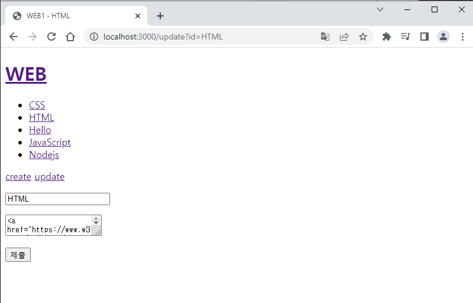

## 🐘

> 가장 좋아하는 부분이니 코끼리 이모티콘을 채택한다!

## 배운 내용

🐘 글을 작성(create)한 것과 동일한 내용의 반복이다!

🐘 url의 pathname에 따라 다른 화면을 보여주고, 제출하면 pathname을 바꾸고, 바뀐 pathname에 대해서는 if문 안에서 데이터를 가공하고...

### 🐘 목표



- 글 수정
    
    - 원본 제목과 글을 표시하여 헷갈리지 않게

- 수정사항 서버에 전송

    - 제목이 변경된 경우를 조심

    - 제목이 변경되면 새로운 제목의 파일을 생성하는 게 아니라 기존 파일의 제목을 변경해야 함.

    - 그러니 기존 파일 제목, 새로운 제목을 모두 저장해 둘 방법을 고민

- 수정사항 저장

### 🐘 방법

html 코드에는 create와 마찬가지로 하이퍼링크 형태의 update가 생성된다.

이때 주의할 것은 home이나 create 화면에서는 보이지 않고, 글 목록에서 글 안에 들어갔을 때 보여야 한다.

html 코드의 create 부분을 변수로 변경하여 때에 따라 다르게 보이도록 한다.

```js
`
<!doctype html>
<html>
    <head>
        <title>WEB1 - ${title}</title>
        <meta charset="utf-8">
    </head>
    <body>
        <h1><a href="/">WEB</a></h1>
        ${list}
        ${control} //중요!
        ${body}
    </body>
</html>
`
```

templateHTML 함수에 control 매개변수가 하나 더 생긴 것이다.

이 함수를 사용하는 다른 코드들도 모두 변경해 주어야 한다.

update가 보여야 하는 구간은 여기 하나다.

```js
if(mypathname === '/') {
    if(title === undefined) {
        ... //여긴 홈
    } else {
        ... //여기에서 보여야!
    }
}
```


1. update를 클릭하면 mypathname은 /update, url은 /update?id={title}로 변경된다.

2. 제출을 클릭하면 mypathname은 /update_process로 변경되고 변경사항이 적용된 페이지가 보이게 된다.

```js
if(mypathname === '/'){
    if(title === undefined) {
        ... //여긴 홈
    } else {
        myfs.readdir('./data', function(error, filelist) {
            fs.readFile(`data/${title}`, 'utf8', function(err, description) {
                var list = templateList(filelist);
                //두가지 변수 추가
                var body = `<h2>${title}</h2>${description}`
                var control = `
                    <a href="/create">create</a>  <a href="/update?id=${title}">update</a>
                    `
                //인자로 전달
                var template = templateHTML(title, list, body, control);
                response.writeHead(200);
                response.end(template);
            })
        })
    }
    ...
} else if(mypathname === '/create') {
    ...
} else {
    ...
}
```

수정 사항을 전송해 주어야 한다. 마찬가지로 form을 사용하는데, 이제 mypathname이 /update로 바뀌었으니 else if 만들어 주기.

```js
if(mypathname === '/'){
    ...
} else if(mypathname === '/create') {
    ...
} else if(mypathname === '/create_process') {
    ...
} else if(mypathname === '/update') { //여기!
    myfs.readdir('./data', function(error, filelist) {
        myfs.readFile(`data/${title}`, 'utf8', function(error, description){
            var list = templateList(filelist);
            var body = `
                <form action="/update_process" method="post">
                    //여기가 중요하다.
                    <input type="hidden" name="id" value="${title}">
                    <p><input type="text" name="title" placeholder="title" value="${title}"></p>
                    <p>
                        <textarea name="description" placeholder="description">${description}</textarea>
                    </p>
                    <p><input type="submit"></p>
                </form>
                `
            //update 링크는 없어도 된다.
            var control = `
                <a href="/create">create</a>  <a href="/update?id=${title}
                `
            var template = teplateHTML(title, list, body, control);
            response.writeHead(200);
            response.end(template);
        });
    });
} else {
    ...
}
```

💡 여기서 중요한 점은 초반에 시사했던 파일 제목이 변경되었을 때이다.

기존 파일명도 기억해야 기존 파일로 찾아가 파일 이름을 변경할 수 있다.

따라서 id라는 name을 가지는 input 태그를 **hidden** 으로 사용자는 안 보이게 만들어서 post 형식으로 보내준다.

💡 이제 form action="/update_process"에 의해 mypathname이 /update_process로 변경되었다.

```js
if(mypathname === '/'){
    ...
} else if(mypathname === '/create') {
    ...
} else if(mypathname === '/create_process') {
    ...
} else if(mypathname === '/update') {
    ...
} else if(mypathname === '/update_process') { //여기
    var body = ''; //데이터들을 합쳐서 저장해 둘 공간. 공백으로 초기화
    request.on('data', function(data) {
        body += data;
    });  //끊긴 데이터를 끝까지 받아 body에 이어서 저장
    request.on('end', function() {
        var post = qs.parse(body); //post로 받은 정보를 저장
        var title = post.title; //받은 title 저장
        var description = post.description; //받은 description 저장
        ...
} else {
    ...
}
```

여기까지는 create_process와 동일하다

```js
if(mypathname === '/'){
    ...
} else if(mypathname === '/create') {
    ...
} else if(mypathname === '/create_process') {
    ...
} else if(mypathname === '/update') {
    ...
} else if(mypathname === '/update_process') {
    var body = '';
    request.on('data', function(data) {
        body += data;
    });
    request.on('end', function() {
        var post = qs.parse(body);
        var title = post.title;
        var description = post.description;
        //수정 전 파일의 이름인 id를 받아온다.
        var id = post.id;
        //rename 함수를 새롭게 사용
        myfs.rename(`data/${id}`, `data/${title}`, function(err){
            //Location 조심! 수정후이므로 id말고 title 사용해야 함.
            response.writeHead(302, {Location: `/?id=${title}`});
            response.end('success');
        });
    });
} else {
    ...
}
```

끝났다.

생각보다 구성이 간단하다.

[전체소스코드와 수업영상](https://opentutorials.org/course/3332/21140)

## 감상과 질문

🐘 근데 학교 강의는 언제.. 다 듣지