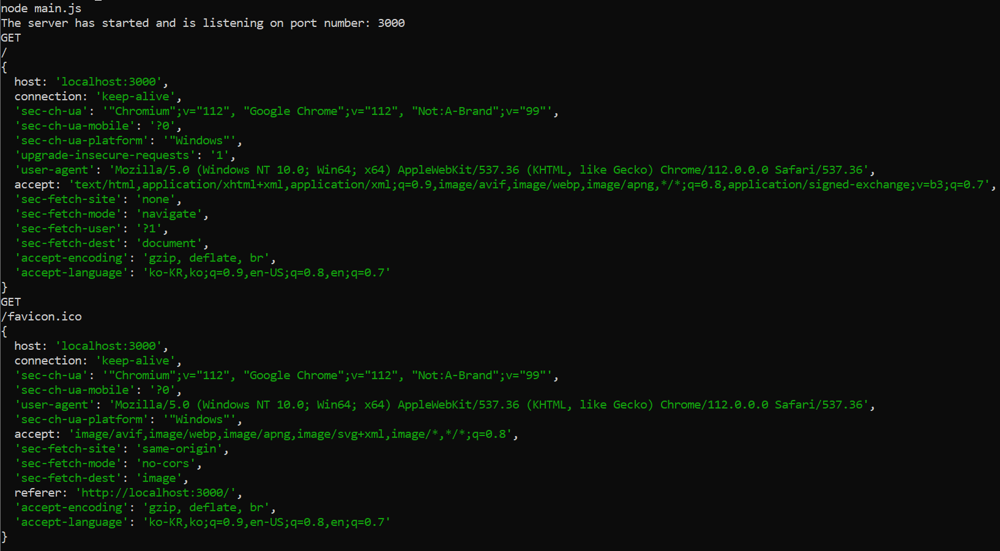
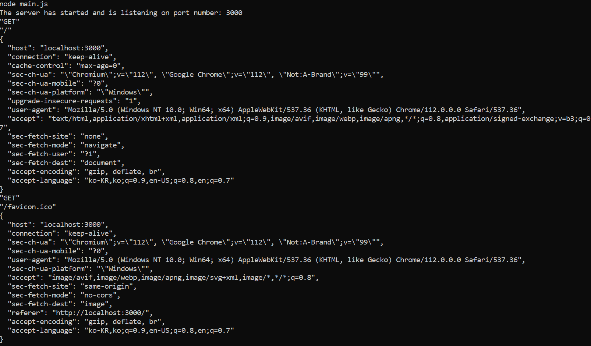

## 자바스크립트 - 객체의 형식

- 배열(Array) vs 객체(Object)

    - 배열
        
        순서가 있는 정보

        순서는 인덱스로 구성

        인덱스를 통해 접근

    - 객체

        순서가 없는 정보

        Property: 키(Key)와 값(Value)으로 이루어진 쌍(Pair)

        키를 통해 접근

    - 선언 및 접근

        배열: 대괄호로 생성, arr[index]로 접근

        객체: 중괄호로 생성, obj.key 또는 obj[key]로 접근

    - 배열과 객체의 구별

        typeof()는 구분 불가, 둘 다 Object라고 뜸. array도 Object의 하나라고 판단해서

        Array.isArray()는 구분 가능, array면 True를 리턴하는 함수.

        ```js
        let arr = [];
        let obj = {};

        typeof(arr);
        typeof(obj);
        typeof(arr) === typeof(obj);

        Array.isArray(arr);
        Array.isArray(obj);

        arr.length //0
        obj.length //undefined
        ```

    - 데이터 순회
        
        배열: 배열의 길이를 활용

        객체: in 키워드를 사용

        ```js
        for(var name in roles) {
            console.log('object => ', name, 'value => ', roles[name]);
        }
        ```
        
        *백틱도 가능*

## 자바스크립트 - 객체(값으로서의 함수)

- 자바스크립트의 함수는 값?
    
    - 대입연산자를 통해 확인

    - 값을 넣어햐 하는 자리에 함수를 대입한 변수 f 사용 가능

        배열에 요소로 삽입

        배열 인덱스 접근을 통해 함수 호출

        객체에 property로 삽입

        객체 접근을 통해 함수 호출

## 자바스크립트 - 객체지향

- 객체지향 접근 방식

    - 코드의 유지보수에 장점

        함수를 객체의 멤버로 추가

        멤버 변수는 this 키워드를 통해 접근

## 자바스크립트 - 화살표함수

- 코드를 간결하고 읽기 좋게 하기 위해 제공

- *JavaScript version 6에 추가된 기능*

```js
let printName = function(name) {
    console.log(`My name is ${name}`);
}
```
⬇
```js
let printName = name => console.log(`My name is ${name}`);
```

- 기본 문법

    ```js
    (param1, param2, ..., paramN) => {statements}
    (param1, param2, ..., paramN) => expression //1
    (param1, param2, ..., paramN) => {return expression} //1과 동일

    (singleParam) => {statements}
    singleParm => {statements}

    () => {statements} //매개변수가 없으면 괄호 필수
    ```

## Node.js 모듈 생성

- Node.js 애플리케이션과 모듈

    - 코드가 커지면 객체만으로는 부족

    - 많은 자바스크립트 파일로 구성

    - 모듈은 코드를 정리하는 가장 큰 도구

    - 체계적이고 효율적인 관리를 위해 모듈을 활용

        모듈: 코드 라이브러리가 들어있는 각 자바스크립트 파일 또는 폴더

        모듈의 활용
        
        module.exports를 통해 외부에서도 참조가 가능하도록 설정(모듈 안에서, exports도 결국 객체임)

        require()를 통해 모듈 불러오기(모듈을 사용하는 쪽에서, 마치 내 자바스크립트 파일에 있는 것처럼 사용)

- 새로운 Node.js 모듈 생성

    - module.exports를 통해 외부에서도 참조가 가능하도록 설정

        expots로 단축해서 사용 가능

        ```js
        let messages = ['a','b'];
        ```
        ```js
        exports.messages = ['a','b'];
        ```
    
    - require()를 통해 모듈 불러오기

        해당 경로에서 messages.js 모듈 참조

        messages.js의 exports 객체의 모든 값/기능을 참조 가능

        ```js
        const messageModule = require("./messages.js");
        messageModule.messages.forEach(m => console.log(m));
        ```

    - npm 활용

        node.js의 패키지 관리자 (패키지: 여러 개의 모듈 포함 가능)

        패키지들의 설치, 제거, 수정에 활용

        ```
        npm install <package>
        npm uninstall <pagkage>
        ```

        --save(-S): 애플리케이션에 종속 모듈로 설치(기본)

        --global(-g): 컴퓨터 상의 전역 패키지로 설치

- Node.js 애플리케이션의 초기화

    - package.json 파일

        프로젝트 관련 정보 저장

        현재 릴리즈 버전, 애플리케이션 이름, 메인 애플리케이션 파일, 의존 패키지 정보 등...

        프로젝트의 루트 레벨에 존재하는 파일
    
    - package.json 파일의 생성

        ```
        npm init
        ```

        ```js
        //package.json
        {
            "name": "simple_server",
            "verson": "1.0.0",
            "description": "An app to share cooking recipes",
            "main": "main.js",
            "scripts": {
                "test": "echo \"Error: no test specified\" && exit 1"
            },
            "author": "",
            "license": "ISC"
        }
        ```

        ```
        npm install cites --save
        ```

        node_modules 디렉토리 생성됨

        ```js
        //package.json
        ...
            "dependencies": {
                "http-status-codes": "^2.2.0"
            }
        }
        ```

        이런 내용들이 추가 됨.

        1. 외부 패키지를 포함한 모든 여러분 프로젝트 콘텐츠를 포함하는 메인 프로젝트 폴더

        2. main.s 파일은 애플리케이션을 구동하는 시작점이 된다.

        3. package.json 파일은 여러분의 특정 애플리케이션과 패키지 종속 관계에 대한 정보와 설정을 포함한다.

        4. node_modules 폴더에는 다운로드 된 모든 외부 패키지가 들어 있다.

    - node_modules 디렉토리(실행에만 필요)

        모든 외부 패키지가 들어있음.

        git으로 소스코드를 관리한다면, .gitignore 파일에 node_modules 디렉토리를 추가하여 git에서 제외

        npm install 명령을 통해 언제든지 필요한 모듈 설치 가능

    - 외부 패키지의 활용

        ```js
        //main.js
        const cities = require("cities");
        let myCity = cities.zip_lookup("10016");
        console.log(myCity);
        ```

## Node.js 에서 웹 서버 만들기

- 웹 서버의 이해

    - 클라이언트(웹 브라우저)와 웹 서버

        HTTP 프로토콜을 통해 서로 통신

        GET: 서버로부터 정보를 요청

        POST: 서버로 정보를 전송

        1. 사용자는 브라우저에 URL을 입력한다.

        2. HTTP 요청이 URL 연관 서버에 전달된다.

        3. 사용자 요청에 응답할 내용을 정하기 위해 물리 서버에서 서버 로직이 실행된다.

        4. HTTP 응답이 HTML, json, 일반 텍스트 또는 다른 포맷으로 사용자에게 전달된다.

        5. 사용자는 보통 HTML 페이지의 형태로 응답을 받고, 이는 브라우저 창에 나타난다.

        웹 서버는 브라우저에 웹 페이지, 이미지 그리고 요청에 따른 다른 리소스들을 전송한다.

- 기본 웹 서버의 생성

    - npm으로 애플리케이션 초기화

        ```
        mkdir simple_server
        cd simple_server
        npm init
        ```

        http-status-code 패키지 설치

        ```
        npm install http-status-codes -S
        ```

    - 애플리케이션 작성

        <script src="https://gist.github.com/ywonchae1/9e5d477c0eb229c2b761bf06e2130ea6.js"></script>

        웹 서버에서 사용할 포트 번호 지정

        *http: 기본 80번*
        
        *https: 기본 443번*

        *웹 서버가 어느 포트에서 기다리고 있는지 알아야 접근 가능, 3000, 8080번 포트는 개발용으로 자주 사용*

        요청과 응다을 매개변수로 갖는 웹 서버 생성

        클라이언트에 전달할 응답 작성

        애플리케이션 서버가 지정한 포트를 수신하도록 설정

    - 콜백(callback)

        - 익명함수로 다른 함수가 종료될 때 자동으로 실행

        - 다른 코드를 실행하기 전에 원 함수의 실행 종료를 기다릴 필요 없음

        *비동기방식으로 실행*

        1. Multiple clients may make a series of requests to the server.

        2. As requests are received by the server, they are processed asynchronously.

        3. The server takes time to process each individual request. A callback may signal when a response is ready.

        4. Responses may not be returned in the order requests are received.

        5. Clients will receive their responses in time relative to request processing time.

        *응답 순서가 다를 수 있음*

    - 웹 서버 실행

    - 웹 브라우저에서 웹 서버의 IP주소/포트번호로 접근

## 수신 데이터 다루기

- 이벤트 리스너를 추가한 간단한 웹서버

    - npm으로 애플리케이션 초기화

    - http-status-code 패키지 설치

    ```js
    const port = 3000,
        http = require("http"),
        httpStatus = require("http-status-codes"),
        app = http.createServer();

    app.on("request", (req, res)  => {
        res.writeHead(httpStatus.OK, {
            "Content-Type": "text/html"
        });

        let responseMessage = "<h1>This will show on the screen.</h1>";
        res.end(responseMessage);
    });

    app.listen(port);
    console.log(`The server has started and is listening on port number: ${port}`);
    ```

    - "request"이벤트가 트리거될 때마다 호출되는 콜백 함수의 등록

        req와 res가 함수에 전달됨

        웹 페이지를 새로고침?

- 요청 데이터의 분석
    
    - req 객체의 속성들

    - *url을 잘 보기! /이라고 나오는데, 주소창에 24.64...을 쳤지만 사실 뒤에 /이 붙은 것과 같고, 외부 IP주소는 호스트네임, 도메인네임이다. 그 뒤의 / 이것이 웹 서버에 도달한 뒤의 경로임

    ```js
    const port = 3000,
        http = require("http"),
        httpStatus = require("http-status-codes"),
        app = http.createServer();

    app.on("request", (req, res)  => {
        //이 부분만 추가
        console.log(req.method);
        console.log(req.url);
        console.log(req.headers);
        //
        res.writeHead(httpStatus.OK, {
            "Content-Type": "text/html"
        });

        let responseMessage = "<h1>This will show on the screen.</h1>";
        res.end(responseMessage);
    });

    app.listen(port);
    console.log(`The server has started and is listening on port number: ${port}`);
    ```

    

    - JSON.stringify() 메소드의 활용

        JSON: JavaScript Object Notation
        
        웹 브라우저와 서버 사이에 데이터를 주고 받을 때 활용하는 데이터 형식

        다수의 프로그램에서 활용

    - JSON.stringify(value, replacer, space)

        자바스크립트 값이나 객체를 JSON 문자열로 변환

        중첩 개체도 알아서 문자열로 변환

        *value 부분에 input 값이 들어가고 이것을 json 문자열로 변환해 준다고 생각*

        ```js
        const port = 3000,
            http = require("http"),
            httpStatus = require("http-status-codes"),
            app = http.createServer();

        const getJSONString = obj => {
            return JSON.stringify(obj, null, 2);
        }

        app.on("request", (req, res)  => {
            console.log(getJSONString(req.method));
            console.log(getJSONString(req.url));
            console.log(getJSONString(req.headers));
            res.writeHead(httpStatus.OK, {
                "Content-Type": "text/html"
            });

            let responseMessage = "<h1>This will show on the screen.</h1>";
            res.end(responseMessage);
        });

        app.listen(port);
        console.log(`The server has started and is listening on port number: ${port}`);
        ```

    

    - 서버에 데이터를 보내는 경우 (POST 요청)

        서버에 HTTP POST 요청으로 전송되는 데이터의 끝이 어디인지를 미리 알지 못함

        데이터 청크로 나눠져서 서버에 도착

        1. Client posts to the server

        2. The data is submitted in multiple manageable chunks.

        3. The server receives each chunk of data as a Buffer object. The chunks need to be stitched together.

        4. The server connects the data in its original form and responds to the client.

        5. The client may receive data back in response to the posted request.

        *청크 단위로 끝날 때까지 일단 다 받아놓아야 함.*

        *다 받아서 모아둔 뒤에 합침*

        req.on("data")
            
        데이터를 수신했을 때 호출될 콜백 함수 등록

        *각각의 이벤트에 따라 콜백 함수를 따로 등록함*

        req.on("end")

        데이터 전송이 완료될 때 호출될 콜백 함수 등록

    ```js
    const port = 3000,
        http = require("http"),
        httpStatus = require("http-status-codes"),
        app = http.createServer();

    const getJSONString = obj => {
        return JSON.stringify(obj, null, 2);
    }

    app.on("request", (req, res)  => {
        var body = [];

        req.on("data", bodyData => {
            body.push(bodyData);
        });

        req.on("end", () => {
            body = Buffer.concat(body).toString();
            console.log(`Request Body Contents: ${body}`);
        });

        res.writeHead(httpStatus.OK, {
            "Content-Type": "text/html"
        });

        let responseMessage = "<h1>This will show on the screen.</h1>";
        res.end(responseMessage);
    });

    app.listen(port);
    console.log(`The server has started and is listening on port number: ${port}`);
    ```

