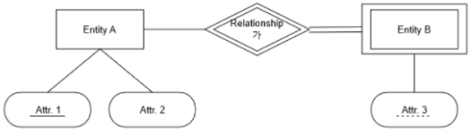
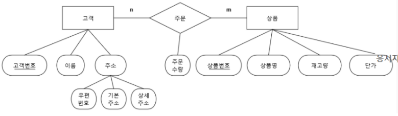

## Quiz1

### 1. Node.js와 관련된 설명으로 옳지 않은 것을 모두 고르시오.

1. 구글 크롬 V8엔진 없이는 서버에서 자바스크립트를 실행시킬 수 없다.

2. Node.js 애플리케이션은 자바스크립트로 작성된다.

3. Node.js 애플리케이션은 웹 브라우저 위에서 동작한다.

4. Node.js는 비동기 방식으로 이벤트를 처리한다.

5. Node.js는 애플리케이션에서 새로운 요청이 있을 때마다 새로운 프로세스/스레드를 생성한다.


### 2. 다음 URL의 각 구성요소와 명칭을 올바르게 짝 지은 것을 모두 고르시오.

https://www.phpbb.com/community/viewtopic.php?f=14&t=2453376

1. https 프로토콜

2. www.phpbb.com 호스트

3. community/viewtopic.php 도메인네임

4. f=14&t=2453376 경로

5. f=14&t=2453376 쿼리스트링

### 3. 프론트엔드와 백엔드에 관한 설명으로 옳지 않은 것을 모두 고르시오.

1. 클라이언트 사이드 코드가 사용자까지 전달되도록 보장하는 것도 백엔드의 역할 중 하나이다.

2. Node.js의 등장으로 자바스크립트를 백엔드에서 활용할 수 있게 되었다.

3. 클라이언트 스크립트를 통해 동적인 웹 페이지 생성이 가능하다.

4. 클라이언트 스크립트도 서버와의 상호 작용이 필수적이다.

5. 웹 개발에서 클라이언트는 일반적으로 웹 브라우저를 의미한다.


### 4. 아래 ERD를 해석한 내용으로 옳지 않은 것을 모두 고르시오.



1. Entity A는 강한개체(Strong Entitiy)이다.

2. Entity A는 Entity B에 종속되는 관계이다.

3. Attr. 3은 Entity B의 기본키이다.

4. Entity A의 모든 인스턴스는 Relationship 가에 반드시 참여해야 한다.

5. Relationship 가는 식별 관계이다.

### 5. 다음 데이터 모델링 중 MySQL이나 OracleDB와 같은 특정 DBMS에 종속되지 않는 모델링을 모두 고른 것은?

ㄱ. 개념적 모델링

ㄴ. 논리적 모델링

ㄷ. 물리적 모델링

1. ㄱ

2. ㄴ

3. ㄷ

4. ㄱ, ㄴ

5. ㄱ, ㄴ, ㄷ

### 6. 아래 ERD를 릴레이션 스키마로 적절하게 변환한 것을 모두 고르시오.



1. 고객(고객번호(PK), 이름, 우편번호, 기본주소, 상세주소)

    주문(고객번호(FK,PK), 상품번호(FK, PK), 주문수량)

    상품(상품번호(PK), 상품명, 재고량, 단가)

2. 고객(고객번호(PK), 이름, 우편번호, 기본주소, 상세주소)

    주문(주문번호(PK), 고객번호(FK), 상품번호(FK), 주문수량)

    상품(상품번호(PK), 상품명, 재고량, 단가)

3. 고객(고객번호(PK), 이름, 주소, 우편번호, 기본주소, 상세주소)

    주문(고객번호(FK), 상품번호(FK), 주문수량)

    상품(상품번호(PK), 상품명, 재고량, 단가)

4. 고객(고객번호, 이름, 우편번호, 주소, 기본주소, 상세주소, 상품번호(FK), 주문수량)

    상품(상품번호, 상품명, 재고량, 단가, 고객번호(FK), 주문수량)

5. 고객(고객번호(PK), 이름, 우편번호, 기본주소, 상세주소, 상품번호(FK), 주문수량)

    상품(상품번호(PK), 상품명, 재고량, 단가, 고객번호(FK), 주문수량)

### 7. ERD-관계데이터 모델 변환 규칙에 대한 설명으로 옳지 않은 것을 모두 고르시오.

1. "복합속성"과 "값의 수를 알 수 없는 다중 값 속성"은 변환 방법이 유사하다.

2. 일대일 관계에서는 개체가 가진 정보 유형에 따라 외래키를 서로 주고 받거나, 둘 중 한 쪽만 받는 방법 모두 가능하다.

3. 일대다 관계에서 1측 개체 릴레이션의 기본키를 n측 개체 릴레이션에 포함시켜 외래키로 지정한다.

4. 약한 개체가 참여하는 일대다 관계는 외래키를 포함해서 기본키를 지정한다.

5. 일대다 관계는 반드시 독립적인 릴레이션으로 변환하지 말고 외래키를 활용해야 한다.

### 8. 트리거에 대한 설명으로 옳지 않은 것을 모두 고르시오.

1. 테이블에 DML SQL문 이벤트가 발생될 때 작동된다.

2. 트리거는 SQL문을 통해 직접 실행이 가능하다.

3. AFTER 트리거는 이벤트가 발생했을 때 해당 작업 이후에 동작한다.

4. DELETE 이벤트에 발동되는 트리거는 TRUNCATE TABLE을 통해 테이블을 삭제할 경우에도 발동된다.

5. 중첩 트리거는 트랜잭션의 일부로 동작하여 중간에 실패가 발생하면 해당 트랜잭션에서 지금까지 진행했던 내 모든 작업이 롤백된다.

### 9. 다음과 같은 SQL 쿼리를 순서대로 실행시켰을 때, 가장 마지막 SQL 쿼리의 결과 값은 무엇인가?

```sql
CREATE TABLE ordertbl
(
    orderNo INT AUTO_INCREMENT PRIMARY KEY,
    userID VARCHAR(5),
    prodName VARCHAR(5),
    orderamount INT
);

CREATE TABLE ordertbl
(
    prodName VARCHAR(5),
    account INT
);

CREATE TABLE ordertbl
(
    deliverNo INT AUTO_INCREMENT PRIMARY KEY,
    prodName VARCHAR(5),
    orderamount INT
);

DELIMITER //
CREATE TRIGGER ordertrg
    AFTER INSERT
    ON ordertbl
    FOR EACH ROW
BEGIN
    UPDATE prodtbl SET account = account - NEW.orderamount
    WHERE prodName = new.prodName;
END //
DELIMITER;

DELIMITER //
CREATE TRIGGER prodtrg
    BEFORE UPDATE
    ON prodtbl
    FOR EACH ROW
BEGIN
    IF NEW.account < 0 THEN
        SIGNAL SQLSTATE '45000'
        SET MESSAGE_TEXT = '재고가 모자랍니다.';
    END IF;
END //
DELIMITER;

DELIMITER //
CREATE TRIGGER prodtrg2
    AFTER UPDATE
    ON prodtbl
    FOR EACH ROW
BEGIN
    DECLARE orderAmount INT;
    SET orderAmount = OLD.account - NEW.account;
    INSERT INTO delivertbl VALUES(NULL, NEW.prodName, orderAmount);
END //
DELIMITER;

INSERT INTO prodtbl VALUES ('사과', 100), ('배', 100), ('귤', 100);

INSERT INTO ordertbl VALUES (NULL, 'SOFIA', '배', 50);
INSERT INTO ordertbl VALUES (NULL, 'EMMA', '사과', 40);
INSERT INTO ordertbl VALUES (NULL, 'JOHN', '배', 20);
INSERT INTO ordertbl(userID, prodName, orderamount) VALUES ('JOHN', '사과', 50);
INSERT INTO ordertbl VALUES (NULL, 'EMMA', '사과', 20);
INSERT INTO ordertbl(userID, prodName, orderamount) VALUES ('EMMA', '배', 40);
INSERT INTO ordertbl VALUES (NULL, 'SOFIA', '귤', 20);

SELECT COUNT(*) FROM ordertbl;
```

1. 4

2. 5

3. 6

4. 7

5. 3

### 10. 스토어드 프로시져와 스토어드 함수에 관한 설명으로 옳지 않은 것을 모두 고르시오.

1. 스토어드 프로시저는 입출력 매개변수를 모두 받을 수 있다.

2. 스토어드 함수는 하나의 결과 값만을 리턴할 수 있다.

3. 스토어드 함수는 SELECT 문장 안에서만 호출할 수 있다.

4. 스토어드 프로시저 안에서는 SELECT 문을 사용할 수 없다.

5. 스토어드 프로시저는 성능 측면에서는 도움이 되지 않는다.