## 🏃 개발 협업을 처음 시작하는 나에게

수강한 강의의 팀프로젝트에서 처음 개발 협업을 시작하게 되었다.

전까지는 깃허브도 쓸 줄 몰랐고 안드로이드스튜디오로 프로젝트를 할 때는 파일을 압축해서 메일로 주고 받으며 대충 만드는 수준이었다.

진짜 할 수 있을까라는 생각도 들고 캄캄하고 막막했지만 뛰어들어보니 어떻게든 방법을 찾게 된다.

한 번 도전했더니 그 다음부터는 하나도 두렵지 않다 항상 처음이 어려운 법 ~

나는 웹 애플리케이션 개발을 시작했다.

## 💬 github를 협업으로 사용할 때는

### 1. .gitignore 파일을 만들어서 올려야 한다.

    이 파일 안에 적혀 있는 경로는 깃허브에 업로드 되지 않는다. 마법처럼

    개발에는 많은 외부 모듈을 사용하게 된다. 파이썬 코딩을 할 때 import numpy를 했던 것처럼, 개발자가 처음부터 모든 걸 코딩하진 않기 때문에 필요한 모듈을 자신의 컴퓨터(로컬)에 설치하게 되는데, 그 모듈의 크기가 만만치 않다.

    다운 받은 모듈은 꼭 .gitignore 파일에 추가하자.

    그것 말고도 업로드에 불필요한 파일의 경로를 기입하고 나서 push를 진행하자.

    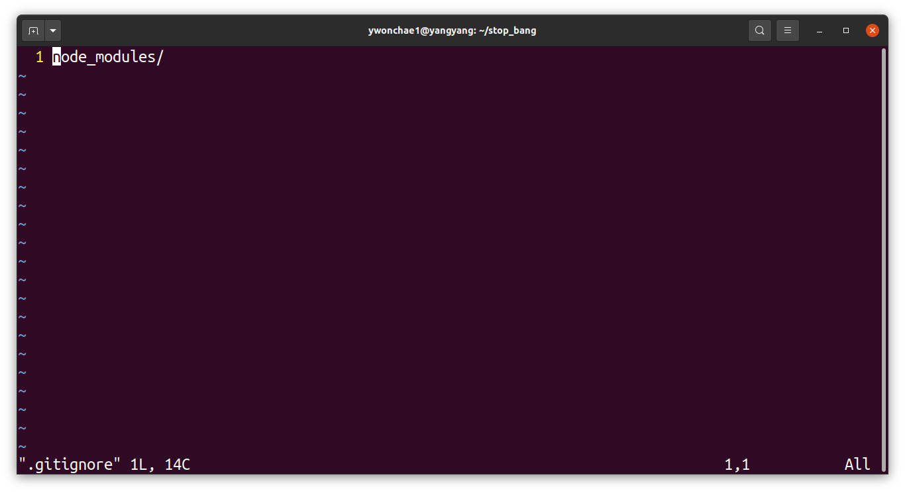

### 2. 공통된 템플릿과 용어, 표기법을 사용하자

    브랜치 이름, 커밋 메시지, 이슈 제목, 이슈 내용, 용어 등등 .. 처음부터 끝까지 하나 하나 정확하게 약속하고 맞추자.

    커밋 메시지는 .gitmessage.txt 파일을 만들어 두면 편하다.

    ```
    vi .gitmessage.txt
    ```

    안에는 결정된 커밋메시지 약속을 주석으로 적어 둔다.

    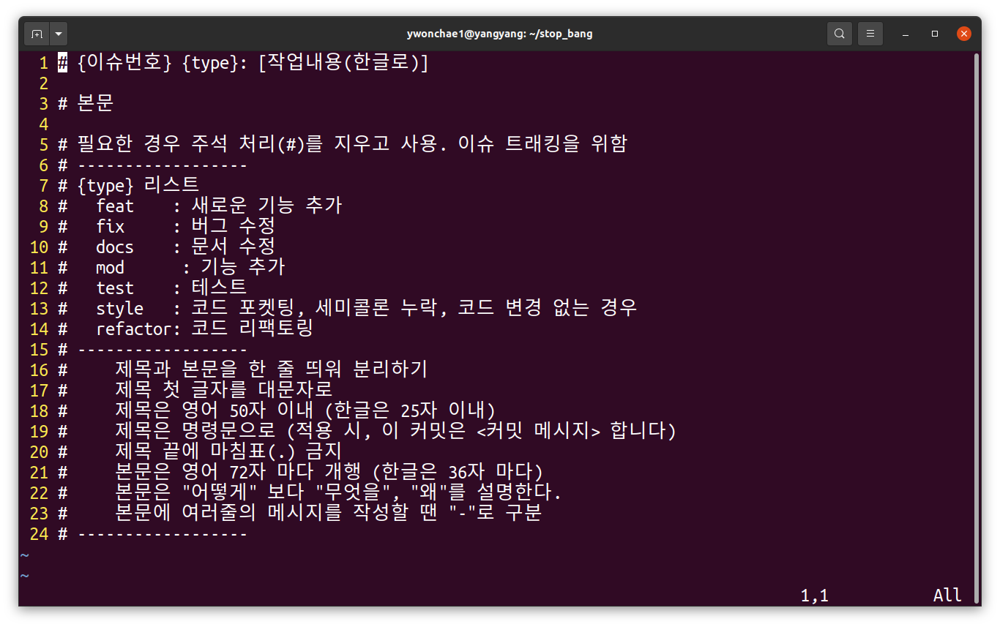

    이 파일이 있으면

    ```
    git commit
    ```

    이 명령을 치면 바로 저 파일이 nano 편집기로 뜬다. (우분투의 경우)

    #을 붙이지 않고 저장하고 나가면 커밋이 완료되고 이후에 push를 하면 된다.

    ```
    git push
    ```

    나는 vi 편집기가 편해서 기본 편집기도 변경해 주었다.

    ```
    git config --global core.editor vi
    ```

    또는

    ```
    git config --global core.editor vim
    ```

    영구적으로 변경하고 싶다면 .bashrc에 다음 내용을 추가한다.

    ```
    vi ~/.bachrc
    ```

    ```
    export VISUAL=vim
    export EDITOR="$VISUAL"
    ```

### 3. Issue로 각자 구현할 기능을 나누자

    Branch에 대한 이해가 필요하다.

    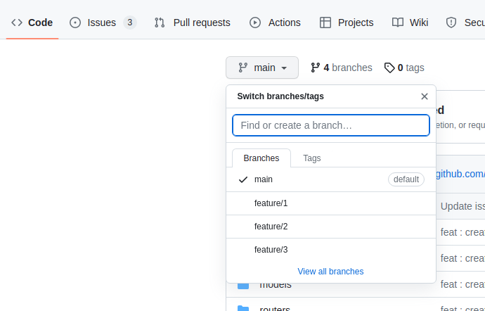
    
    처음에는 main 하나만 있을 텐데, 이 main이라는 브랜치는 조심히 다루어야 한다. 팀원들과 상의 후 확정된 내용만 main 브랜치에 업로드 된다.

    그렇기 때문에 개발 기능마다 또는 사람마다 브랜치를 따로 만들어야 한다.

    각자 기능을 나누어 구현하기 때문에 각자 편하게 개발할 수 있는 방을 따로 따로 만들어 준다고 생각하면 된다.

    브랜치는 Issue를 기반으로 만들 수 있다. 그렇게 하지 않아도 되지만 Issue를 기반으로 만들면 각 기능마다 댓글을 달면서 소통할 수 있기도 하고 체크리스트나 메모를 남길 수도 있어서 여러모로 좋다.

    그래서 Issue를 각자 만들어야 한다.

    Issue를 만들기 전에 템플릿부터 만들어 둔다.

    작성하기 편할 뿐더러 보기에도 좋다.

    

    ✔ 리포지토리에서 setting - general에 들어간다.

    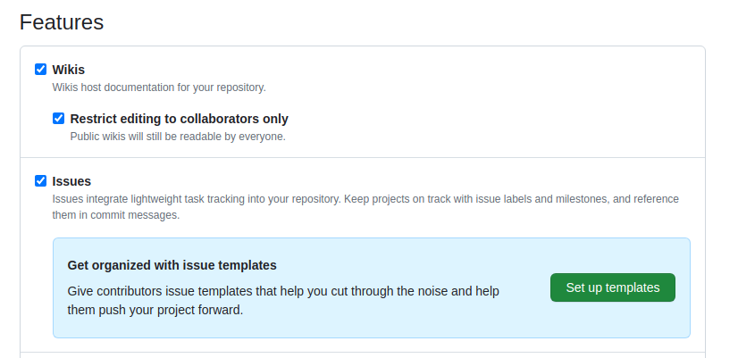

    ✔ 스크롤을 내리면 Issues에서 set up templates라는 버튼을 누른다.

    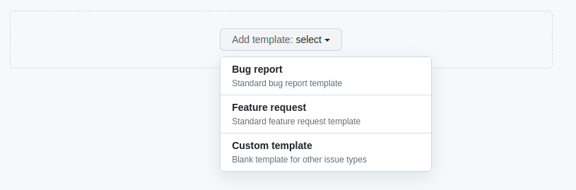

    ✔ custom template를 누른다.

    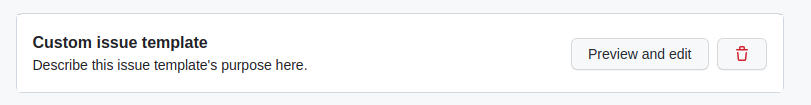

    ✔ preview and edit을 누른다.

    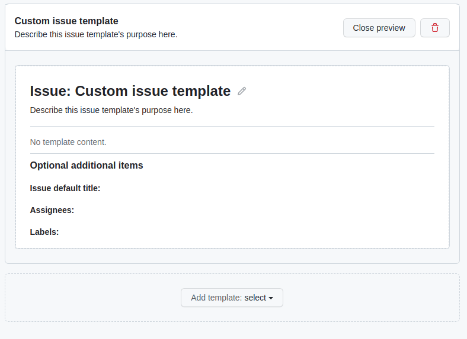

    ✔ 여기서 연필 버튼을 누르면 템플릿을 수정할 수 있다.

    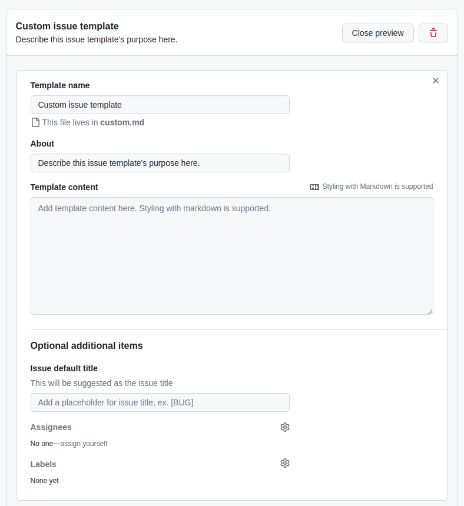

    ✔ 여기서부터는 영어로 적혀있는 대로 따라서 하면 된다. 위에서부터 템플릿의 이름을 정하고, 템플릿을 어디다 쓰는지 적고, 마크다운 문법으로 만들어 둔 템플릿을 기입하고, 이슈의 기본 제목을 정한다.

    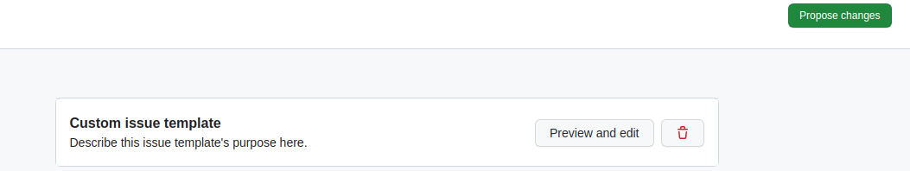

    ✔ 초록색 propose changes 버튼을 누르면 적용이 된다!

    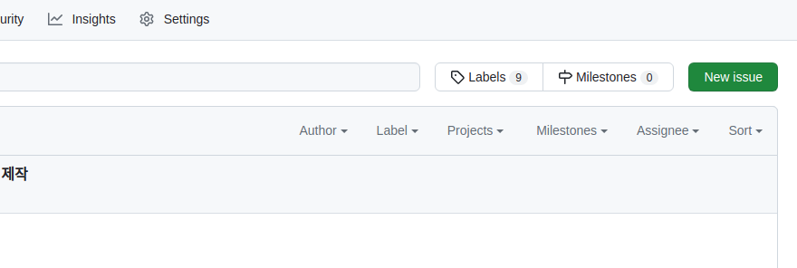

    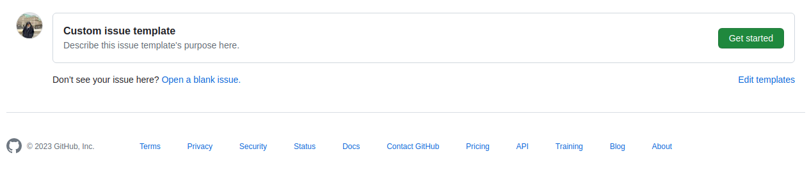

    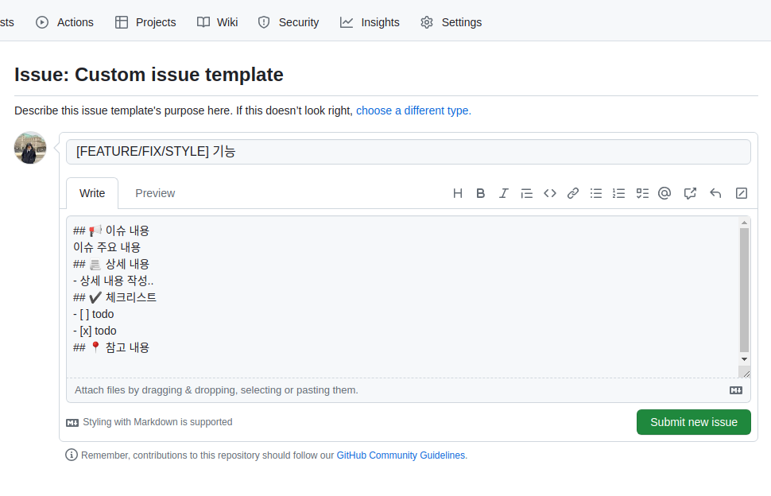

    ✔ 이제 이슈를 만들 때 템플릿을 사용할 수 있다.

4. 이슈 기반 브랜치를 생성한다.

    이슈를 만들었다면 이를 기반으로 한 브랜치를 만들 수 있다.

    이슈와 브랜치가 연결된다.

    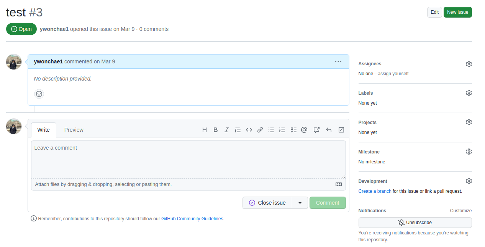

    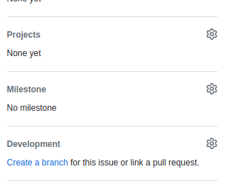

    만든 이슈에 들어가 오른쪽 아래에 create a branch를 누른다.

    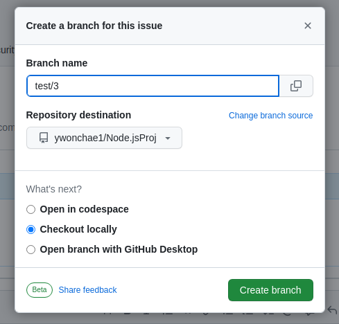

    브랜치의 이름을 미리 팀원들과 약속된 형식에 맞추어 정해준다.

    What's next?에는 그냥 locally를 선택했다. 자신의 상황에 맞추어 선택하면 될 것 같다.

    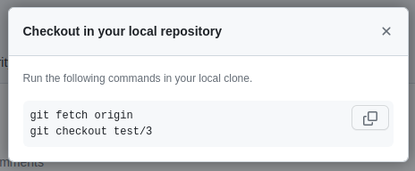

    그러면 나의 로컬 폴더에서 이런 명령어를 실행하면 해당 리포지토리와 연결이 된다.!

    ```
    git fetch origin
    git checkout [브랜치명]
    ```

---

## 재밌는 일들이 무럭 무럭

갑자기 성장하는 기분이다. 이 모든 걸 쉽게 알려 준 우리 팀원들에게 감사하다.