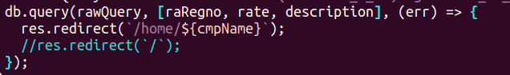
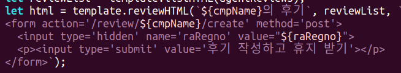
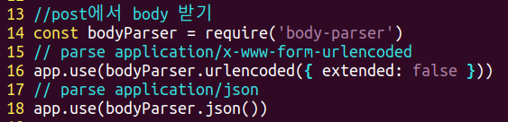
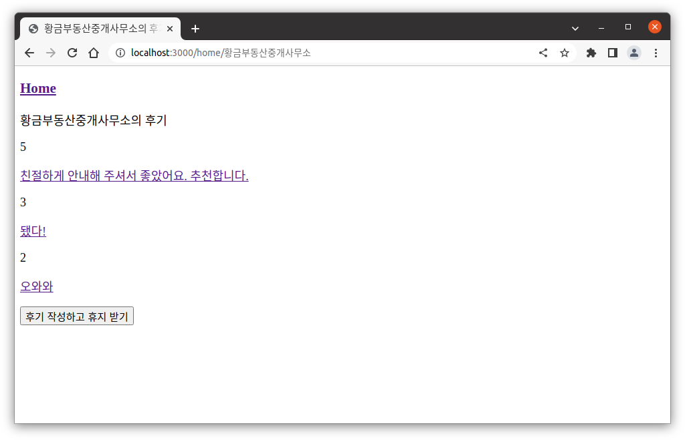
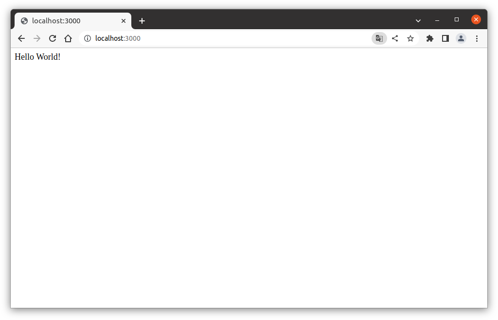
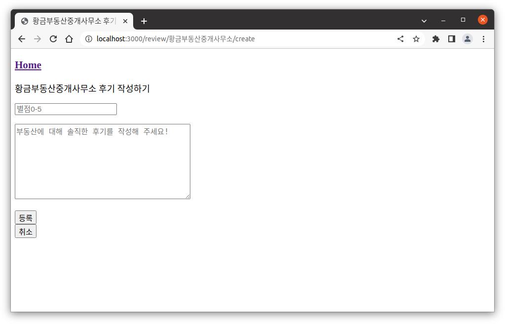
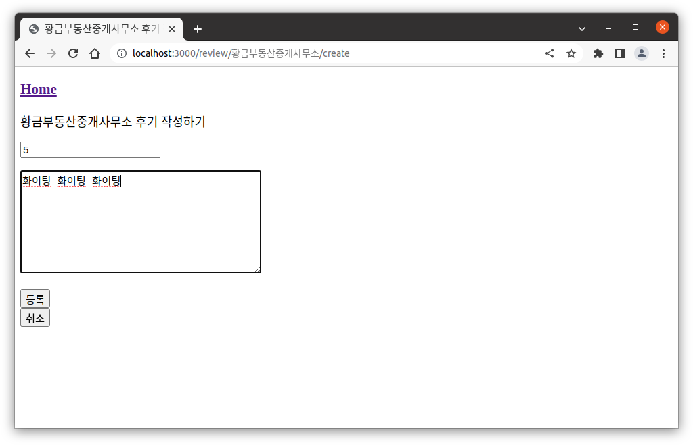
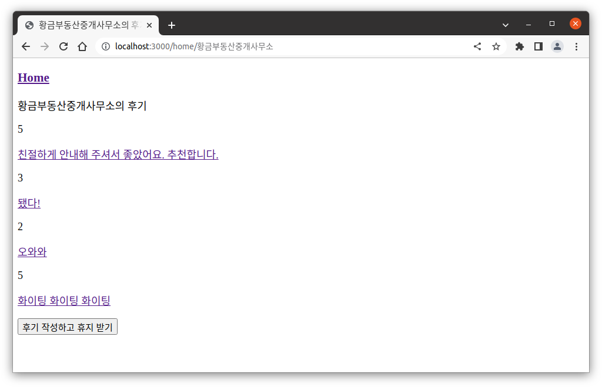

Node.js, express를 사용해 웹페이지를 제작하고 있던 중 문제를 만났다.

## 상황

시멘틱 URL을 사용했다.

버튼 조작에 따른 이동 경로

1. http://localhost:3000/home/:cmp_nm

    1-1. "후기 작성" 버튼 클릭 시 2번으로 이동

2. http://localhost:3000/review/:cmp_nm/create

    2-1. 후기를 작성하고 "등록" 버튼 클릭 시 3번으로 이동

3. http://localhost:3000/review/:cmp_nm/create_process

    3-1. Raw Query로 방금 2번에서 작성된 후기 INSERT 진행

    3-2. 1번으로 redirect

## 문제점

1번에서 2번으로 넘어갈 때 console.log(req.body)를 찍으면 undefined로 나오거나 비어있는 객체 {}로 나왔다.

## 원인 탐색

1. redirect 때문? ❌

    

    처음에는 2번에서 등록 버튼을 눌렀더니 3번을 거쳐 1번으로 가야 하는데, 데이터베이스에도 등록이 안 되고 1번으로도 안 넘어가서 redirect를 의심했으나 아니었다.

2. value='${변수}'에 따옴표를 안 써서? ❌

    

    따옴표는 상관 없었다.

3. method='get'이어서? ⭕

    

    get 방식은 쿼리스트링(시멘틱URL)으로 받은 데이터만 다루기 때문에 body 처럼 큰 요청을 받을 작정이면 post를 써야 하는 것 같다. get으로 바꿨더니 작동하지 않는다.

    하지만 이건 주요 문제가 아니었다. 여전히 undefined

4. body-parser를 안 써서? ⭕🤩

    

    코드 최상단에 body-parser를 적용하면 바로 해결

    다른 코드들도 다 해봤는데 얘만 된다.

    ```js
    var bodyParser = require('body-parser')
    var app = express()

    // parse application/x-www-form-urlencoded
    app.use(bodyParser.urlencoded({ extended: false }))

    // parse application/json
    app.use(bodyParser.json())
    ```

    <https://stackoverflow.com/questions/9177049/express-js-req-body-undefined>

5. 그리고 INSERT문에서 FK인 컬럼에 존재하지 않는 데이터를 집어 넣었더니 INSERT 자체가 거부되기도 하였다.

    user 테이블에서 userId를 review 테이블이 FK로 참조하고 있었는데, userId는 1, 2, 3만 만들어 놓은 상태였고 main.js에서 review 테이블의 userId에 777이라는 값을 INSERT하려고 했었다.

    3으로 바꿔서 돌리니까 잘 된다.

---

## 오늘의 성과

지금 5/8 01:00

어제의 성과인감 ..? 암턴

1. 공인중개사 페이지에서 후기들을 조회할 수 있다.

2. 공인중개사 페이지에서 후기 작성 버튼을 누를 수 있다.

3. 후기 작성 페이지에서 별점과 후기를 기입하고 등록 버튼을 누를 수 있다.

4. 후기 작성 페이지에서 취소 버튼을 누르면 공인중개사 페이지로 redirection

5. 등록 버튼을 누르면 데이터베이스에 저장이 되고 공인중개사 페이지로 redirection, 공인중개사 페이지에서 방금 작성한 후기를 포함한 후기들이 보인다.

- 서울시 공인중개사 데이터 데이터베이스 저장 완료

- 테스트용 계정 3개 생성 완료

- 테스트용 리뷰 3개 생성 완료

- 데이터베이스 쿼리문 수정 및 보완 완료









