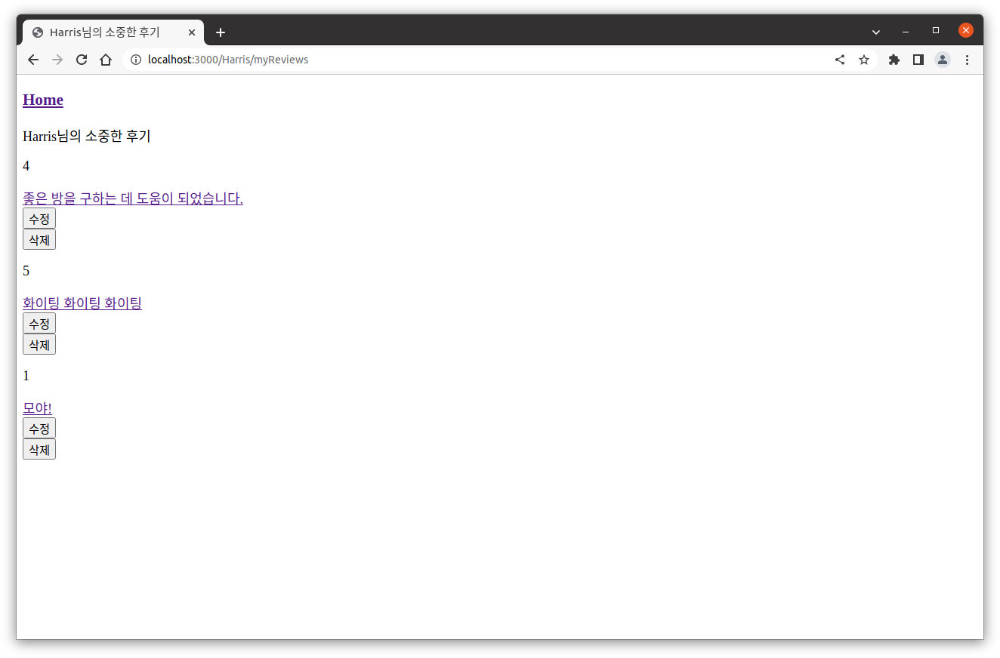
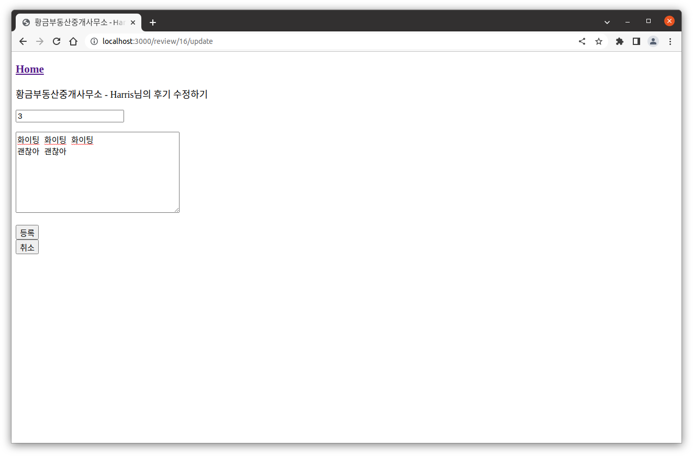
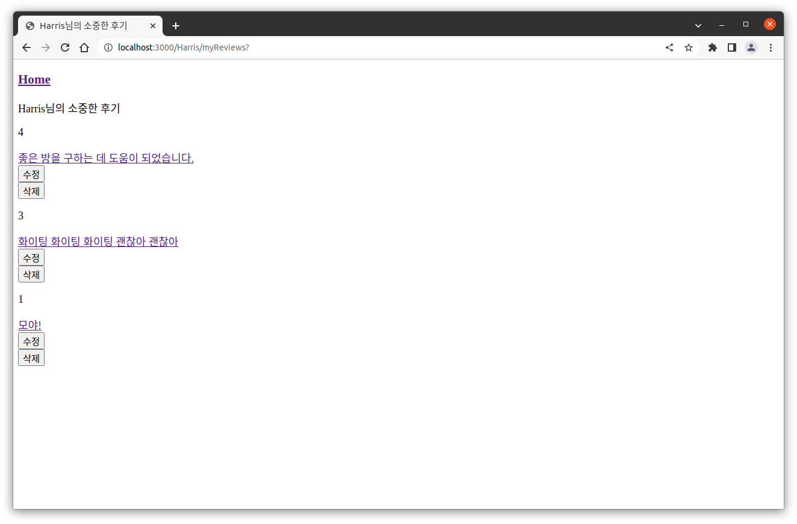
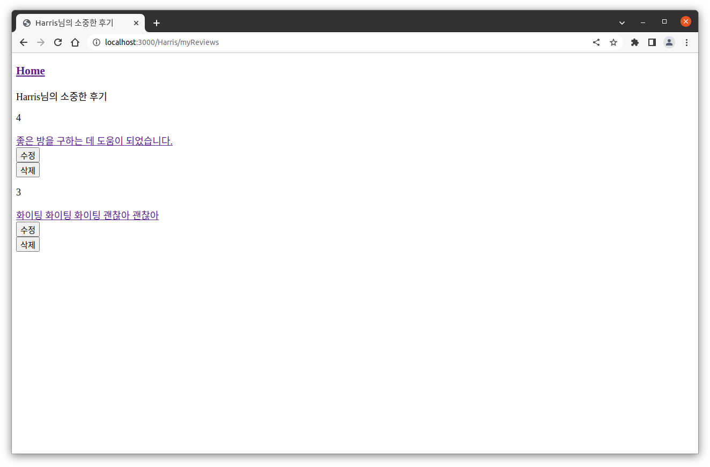

## 오늘의 성과

지금 5/8 11:09

1. 후기, 별점 수정

2. 후기 삭제

- 삭제 기능은 생각을 안 하고 있었는데 순탄하게 진행이 되어서 완료할 수 있었다.

- 전부 다 main.js에 구현되어 있어서 나누는 작업이 필요할 것 같다.

- raw query는 직접 데베 서버에서 쿼리문을 실행해 보고 잘 되는지 확인한 다음에 main 코드에 추가하자.

- 문법이 조금 틀려서 삐끗했을 뿐 뇌로만 raw query를 작성하는 로직은 틀리지 않아서 다행이었다.

- 후기 수정 시에 부동산 이름도 보였으면 좋겠어서 부동산 정보, 후기, 입주민 테이블 세 개를 JOIN 하였다.

path: /[회원아이디]/myReviews

