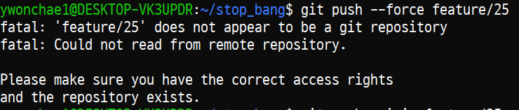
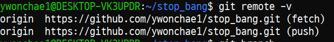

push를 한 뒤에 커밋을 수정해야 하는 상황이다.

강제로 push 해야 하니 브랜치가 나만의 것이 아니라면 조심해야 한다.

## 커밋 제목에 #을 넣고 싶다면

git의 기본 주석인 #을 다른 걸로 변경해 준다.

```
git config --global core.commentChar ";"
```

## 커밋 수정

`git log`로 커밋 기록을 조회한다.

```
git commit --amend //가장 최근의 커밋 수정

git rebase -i HEAD~3 //위에서 3번째 커밋을 한꺼번에 수정
```

두가지 방법이 있다.

rebase의 경우 위 명령어를 입력하면 커밋을 수정할 수 있는 창이 나온다.

pick을 reword로 변경해 주고 :wq 하면 각각 커밋을 변경할 수 있는 창이 하나씩 뜬다.

각각 수정하고 :wq로 저장한다.

수정 사항을 다시 `git log`로 확인한다.

## 강제 push

```
git push --force [브랜치이름]
```

main이 아니라 feature/3 브랜치로 나만 쓰는 다른 브랜치를 사용하고 있어서 걱정 없이 force를 할 수 있었다.

공식적으로는 사용을 지양한다.

여럿이서 함께 사용하는 브랜치라면 모두가 수작업으로 커밋을 수정해줘야 하기 때문이다.

---

5/26 추가

`git push --force feature/25`를 하니 이런 오류가 발생하였다.



```
fatal: 'feature/25' does not appear to be a git repository
fatal: Could not read from remote repository.

Please make sure you have the correct access rights
and the repository exists.
```

찾아보니 `git remote remove` 후 재연결하는 방법들이 많이 나와 있었는데 나는 되지 않았다.

나는 이런 상황이었는데,



```
git push --force origin feature/25
```

라고 하니까 되었다.