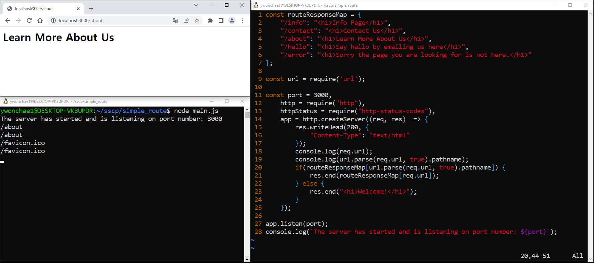
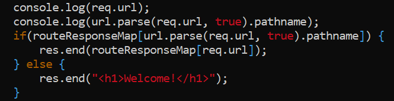

## url path마다 페이지 설정하기

그냥 /about은 되고

이상한 /about?id=%27http%27은 왜 안 되는 거지..?

원래라면 id부터는 쿼리스트링이라 똑같은 페이지가 나와야 했다.

한참을 고민했는데 그냥 내가 코드를 실수로 잘못 적은 것이었다..

`req.url`은 쿼리스트링까지 모든 내용을 담고 있다.

`req.parse(req.url, true).pathname`은 경로인 /about만 담고 있다.

그런데 if문 안에서 routeResponseMap이라는 객체의 키를 `req.url`로 찾고 있었고 그러한 키는 없기 때문에 나오지 않는다 ~

ㅎㅎ