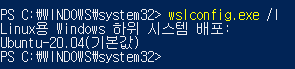

## WSL 완전 삭제

1. Powershell 관리자 권한으로 열기

2. `wslconfig.exe /l` : 현재 설치 버전 확인

    

3. 확인된 Ubuntu-20.04를 기입하여 아래 명령어 실행

    `wslconfig.exe /u Ubuntu-20.04`

    자신의 버전에 따라 마지막 인자는 다르다.

4. 2번으로 잘 삭제가 되었는지 확인

## WSL 설치

5. `wsl --list --online` : 설치 가능한 버전 확인

6. `wsl --install -d [원하는 버전]` : 리스트 중 선택하여 설치

**18.04는 뭔가 오류가 많다 node -v를 했을 때 다음과 같은 오류를 만날 수 있다.**

```
node: /lib/x86_64-linux-gnu/libc.so.6: version `GLIBC_2.28' not found (required by node)
```

계속 새롭게 다시 설치하고 있다.. ㅜ