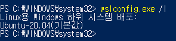

## 🐱‍🏍 WSL 완전 삭제

1. Powershell 관리자 권한으로 열기

2. `wslconfig.exe /l` : 현재 설치 버전 확인

    

3. 확인된 Ubuntu-20.04를 기입하여 아래 명령어 실행

    `wslconfig.exe /u Ubuntu-20.04`

    자신의 버전에 따라 마지막 인자는 다르다.

4. 2번으로 잘 삭제가 되었는지 확인

## 🐱‍🏍 WSL 설치

5. `wsl --list --online` : 설치 가능한 버전 확인

6. `wsl --install -d [원하는 버전]` : 리스트 중 선택하여 설치

**18.04는 뭔가 오류가 많다 node -v를 했을 때 다음과 같은 오류를 만날 수 있다.**

```
node: /lib/x86_64-linux-gnu/libc.so.6: version `GLIBC_2.28' not found (required by node)
```

계속 새롭게 다시 설치하고 있다.. ㅜ

## 🐱‍🏍 Node.js 환경 설정

7. <https://nodejs.org/en/download> 에서 나에게 맞는 버전 다운로드 경로 복사

8. `wget https://nodejs.org/dist/v18.16.0/node-v18.16.0-linux-x64.tar.xz`

9. 압축 해제

    ```
    tar xf nodejs-v18.16.0-linux-x64.tar.xz
    cd node-v18.16.0-linux-x64
    sudo cp -Rvi ./{bin,include,lib,share} /usr/local/
    ```

## 🐱‍🏍 GCP와 연결

10. `ssh-keygen`

11. `cat .ssh/id_rsa.pub` 해당 내용 GCP의 메타데이터에 추가

    끝의 @ 앞에 접속할 계정 이름 적어 놓기

12. `vi ~/.ssh/config`에 다음 내용 적고 저장

    ```
    Host [접속할 GCP IP주소를 대신할 별명]
        HostName [GCP IP 주소]
        User [이름]
    ```

    이름은 어떻든 상관이 없는 것 같다.

## 🐱‍🏍 dotenv 만들기

nodejs와 mysql db를 사용해야 해서 dotenv를 만든다.

1. `npm install dotenv -S`

2. 
    ```
    DB_HOST="[데이터베이스 IP주소]"
    DB_USER="[데이터베이스 사용자]"
    DB_PW="[비밀번호]"
    DB_PORT=[포트번호]
    DB_NAME="[사용할 DB이름]"
    ```

    데이터베이스 포트번호가 기본 3306이라는 거 같은데 나의 데베는 0이라고 떠서 0으로 설정했다.

3. 데이터베이스 포트번호를 모르겠다면?

    해당 데이터베이스 서버로 접속한다.

    `mysql server status` 명령어를 통해 port 부분을 확인한다.