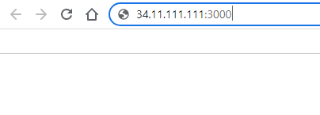
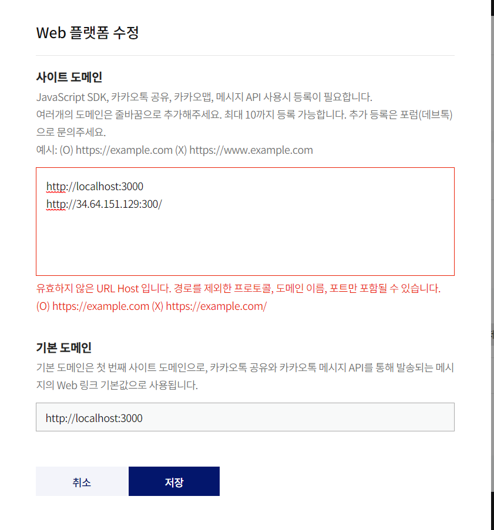
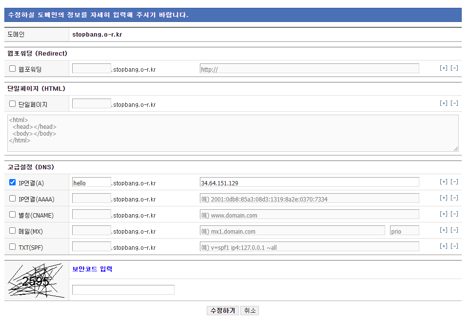
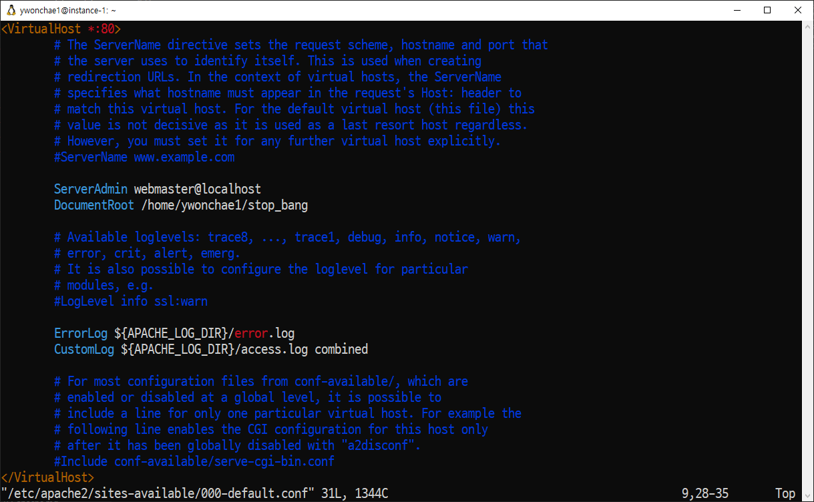
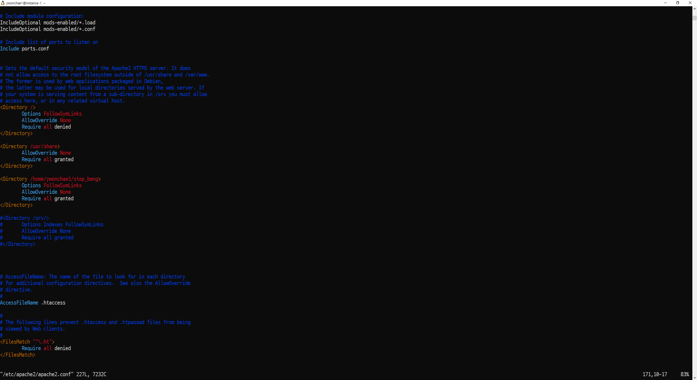
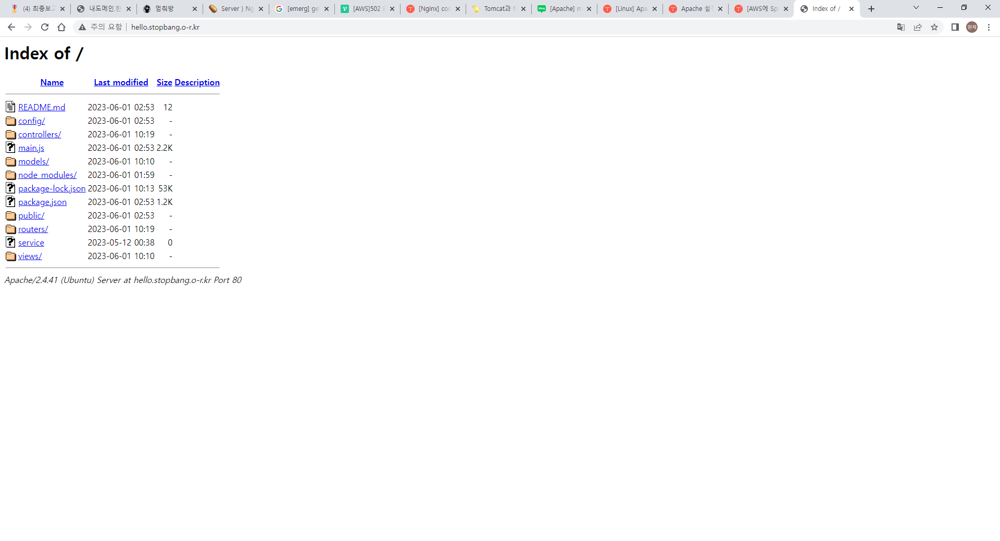
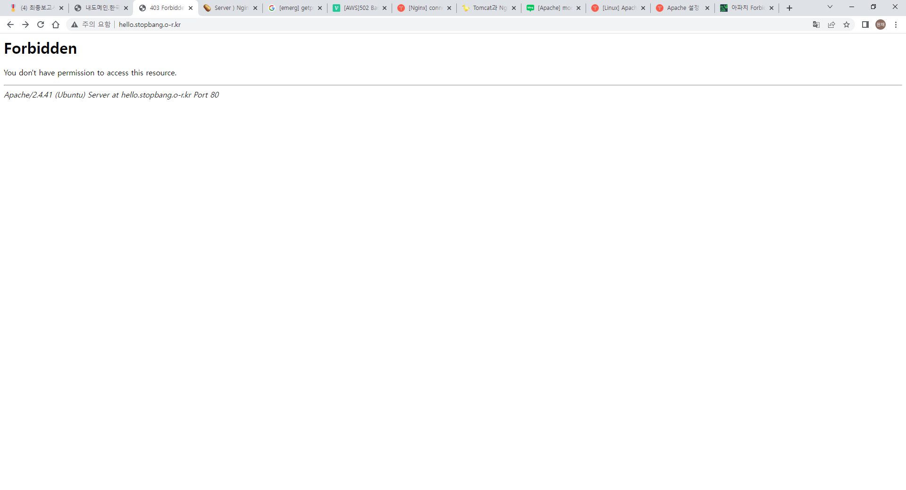
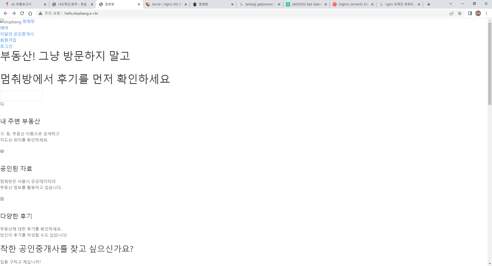

## 🌐 34.64.151.129:3000 대신 hello.stopbang.o-r.kr:3000으로 접속하자


</br>

1. <https://www.naver.com>

2. <http://223.130.195.200>

두 사이트는 모두 네이버로 연결된다. (사진의 나머지 Address도 마찬가지이다.)

원래 서버 주소는 2번인데 알아보기 어려우니까 이름을 붙인 게 1번이고, 그걸 도메인이라고 한다.

이 도메인은 사실 사야 하지만 공부하는 단계에서는 인기 없는 도메인을 무료로 사용할 수 있다.

대표적인 무료 도메인 사이트는 <http://내도메인.한국>이다.

---



우리는 GCP에서 웹서버를 구축한 상태이다.

접속하려면 항상 34.64.151.129:3000를 주소창에 입력해야 했다.



작은 프로젝트라 상관 없을 거라 생각했는데 우리가 사용하는 카카오맵 API에서 도메인 주소가 필요하다는 것을 알게 되었다!

### 🚦 도메인 받기

내도메인.한국에서 stopbang.o-r.kr이라는 도메인을 받았다.



웹포워딩방식은 도메인을 검색하면 바로 IP 주소로 변환이 된다.

그래서 밑의 IP연결로 하였다. stopbang 앞에 뭘 꼭 적어줘야 되었다.

**이제 나의 도메인도 `nslookup hello.stopbang.o-r.kr`을 하면 서버 주소가 감지된다!**

### 🚦 우여곡절

우선 서버에 nginx와 apache가 모두 설치되어있는지 확인한다.

둘 중 하나만 사용해야 문제가 발생하지 않는다.

모두 80포트를 사용하기 때문이라고 한다.

나는 nginx를 지우고 apache를 사용하기로 했다.

```
apt-get remove --purge nginx nginx-full nginx-common
```

위 명령으로 깔끔하게 삭제한다.


이미 34.64.151.129:3000으로 접속이 잘 된다면 위와 같은 디폴트 페이지를 만나지 않을 것 같지만 혹시 이 페이지가 보인다면 프로젝트가 만들어져 있는 폴더가 열려 있지 않아서이다.

apache는 기본적으로 모든 폴더의 접근을 막은 상태에서 허용할 폴더만 열어주는 구조라서 그렇다.

먼저 기본 경로를 변경해 준다.

```
sudo vi /etc/apache2/sites-available/000-default.conf
```



</br>

DocumentRoot 부분을 내가 원하는 디렉토리로 변경해 준다.

```
sudo vi /etc/apache2/apache2.conf
```



</br>

```
<Directory {원하는 디렉토리}>
    Options FollowSymLinks
    AllowOverride None
    Require all granted
</Directory>
```

이 부분을 만들어 주면 된다.

원래는 `Options Indexes FollowSymLinks`였는데 이 상태로 두니 이런 페이지가 나왔다.



</br>

`Indexes`를 빼 주면 잘 된다.

여기서 `Require all granted`는 이 폴더를 열겠다, `Require all denied`는 이 폴더를 막겠다이다.

그래서 첫 `<Directory />`를 보면 `Require all denied`라고 되어 있다.

기본적으로 루트 디렉토리를 막아둔 것이다.

```
sudo service apache2 restart
```

*잊지말고 재시작!!*

재시작을 안 해서 계속 오류가 나고 있기도 했다.

```
sudo vi /var/log/apache2/error.log
```

이 명령어로 발생한 오류를 확인해 볼 수 있다.



</br>

접근불가를 만났다면 잘 된 것이다.



</br>

CSS가 전혀 먹히지 않는 상태라면 라우트도 전혀 먹히지 않을 것이다.

예를 들어 localhost:3000/search 페이지로 들어가면 검색 창이 떠야 하는데 not found가 뜨는 것이다.

우선 저 때는 nginx를 사용하고 있던 중이었고, 3000번 포트로 접속한 상황도 아니어서 그랬던 것 같으나 정확한 이유를 밝혀내지 못했다.

혹시 아는 사람..?😥

---

### 🚦 바보

<http://hello.stopbang.o-r.kr>에 접속하려고 했는데 계속 실패했다.

그건 내가 3000번 포트로 웹페이지를 열어 놓고 3000번 포트로 접속하지 않아서이다......

<http://hello.stopbang.o-r.kr:3000>

이제 잘 된다..... 몇 십분 만에 잡은 게 다행인가!