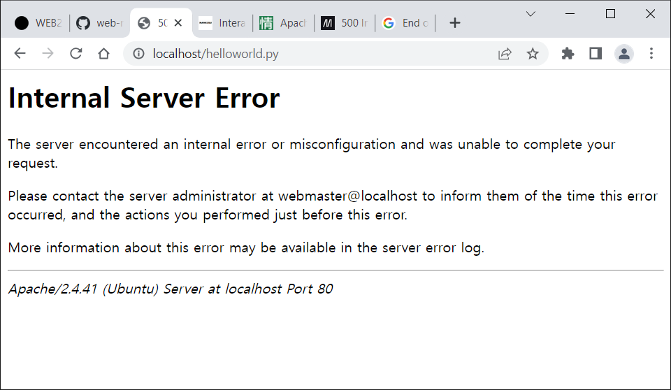
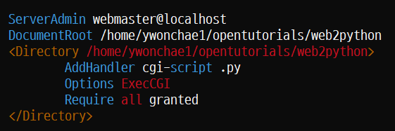
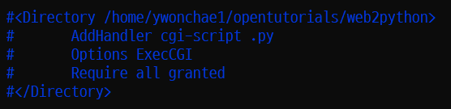
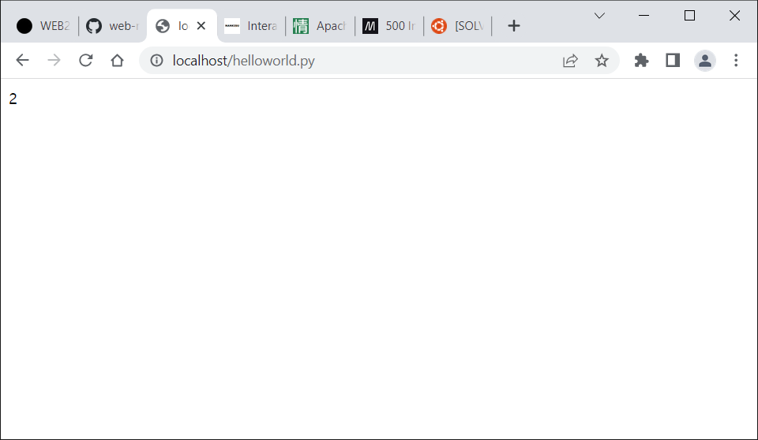

## 🧊 리눅스 파이썬 웹 서버 구축

### 발생한 오류 정리!

1. sudo를 잊지 말자~

    ```
    $ systemctl restart apache2

    Failed to restart apache2.service: Interactive authentication required.
    See system logs and 'systemctl status apache2.service' for details.
    ```

    이 오류를 만났다면 `systemctl` 앞에 `sudo`를 붙였는지 확인..

2. apache 웹서버를 구축하자~

    

    ```
    [Tue Jun 20 21:04:14.781873 2023] [cgid:error] [pid 3303:tid 140449043041344] (2)No such file or directory: AH01241: exec of '/home/ywonchae1/opentutorials/web2python/helloworld.py' failed
    [Tue Jun 20 21:04:14.782661 2023] [cgid:error] [pid 3236:tid 140449015527168] [client ::1:51310] End of script output before headers: helloworld.py
    ```

    

    이런 오류가 발생한다면 이렇게 /etc/apache2/sites/enabled000/default.conf 파일을 수정해준다.

    또 한 가지 점검할 점은 helloworld.py 파일의 권한이 0755인지 확인한다!
    rwxr-xr-x이면 된다~!

    `chmod 0755 helloworld.py`로 권한을 변경할 수 있다.

    또 또 한 가지 점검할 점은 helloworld.py 파일에 다음 윗 두 줄이 들어가 있는지 확인한다!

    ```
    #!/usr/bin/python3
    print("Content-Type: text/html; charset=UTF-8\n")

    print(1 + 1)
    ```

    나는 여기서 usr 앞에 /를 붙이지 않아서... 문제가 발생했다~

    이때 /etc/apache2/apache2.conf 파일은 수정하지 않아도 된다.

    

    