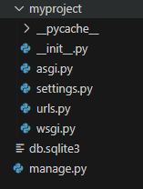
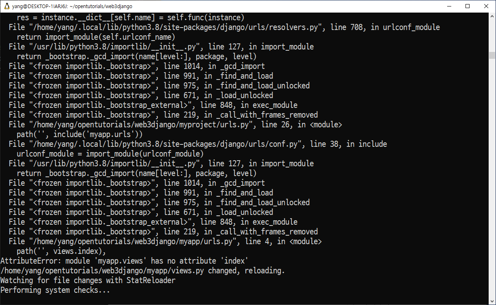
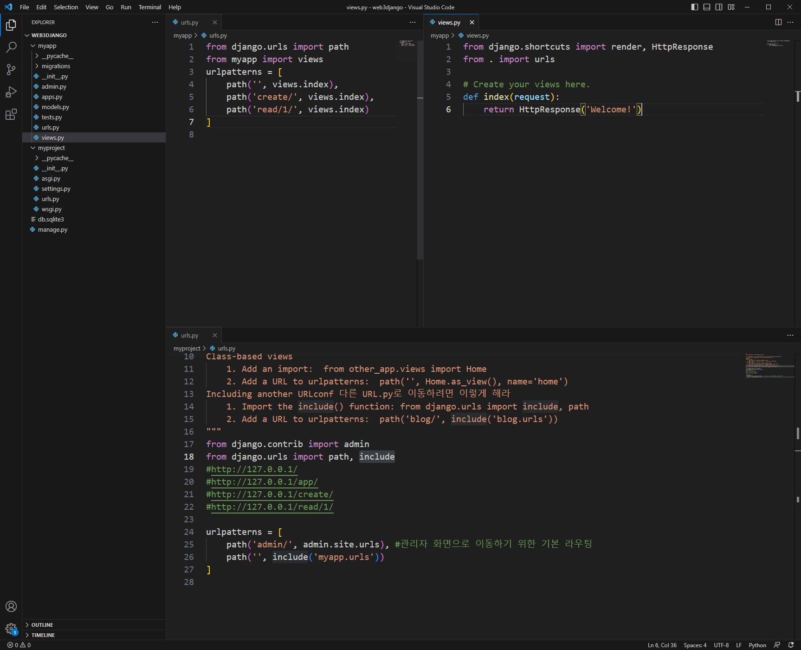
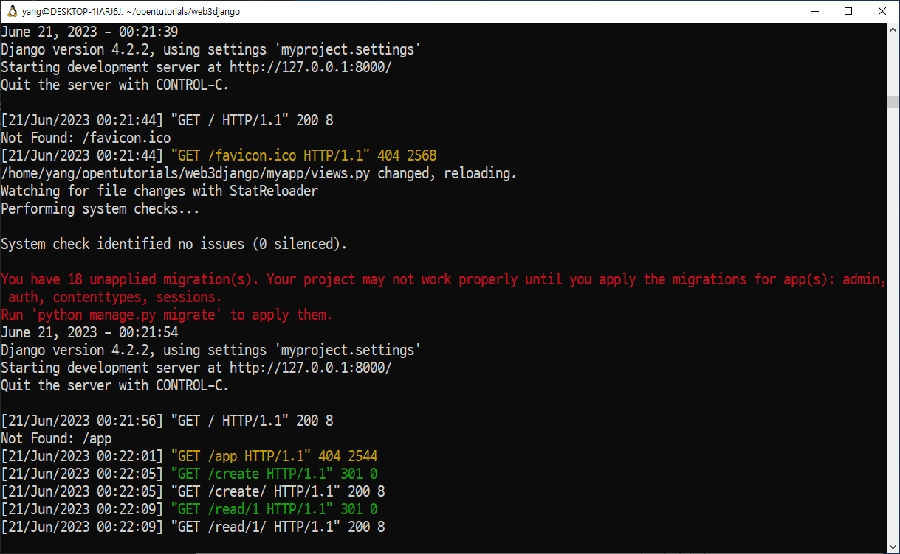
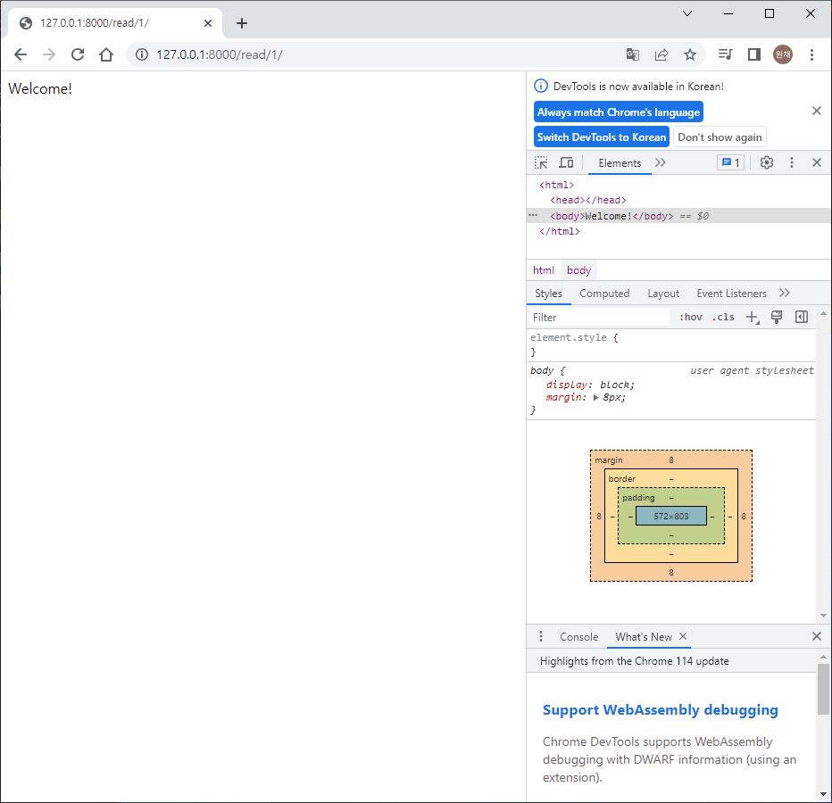
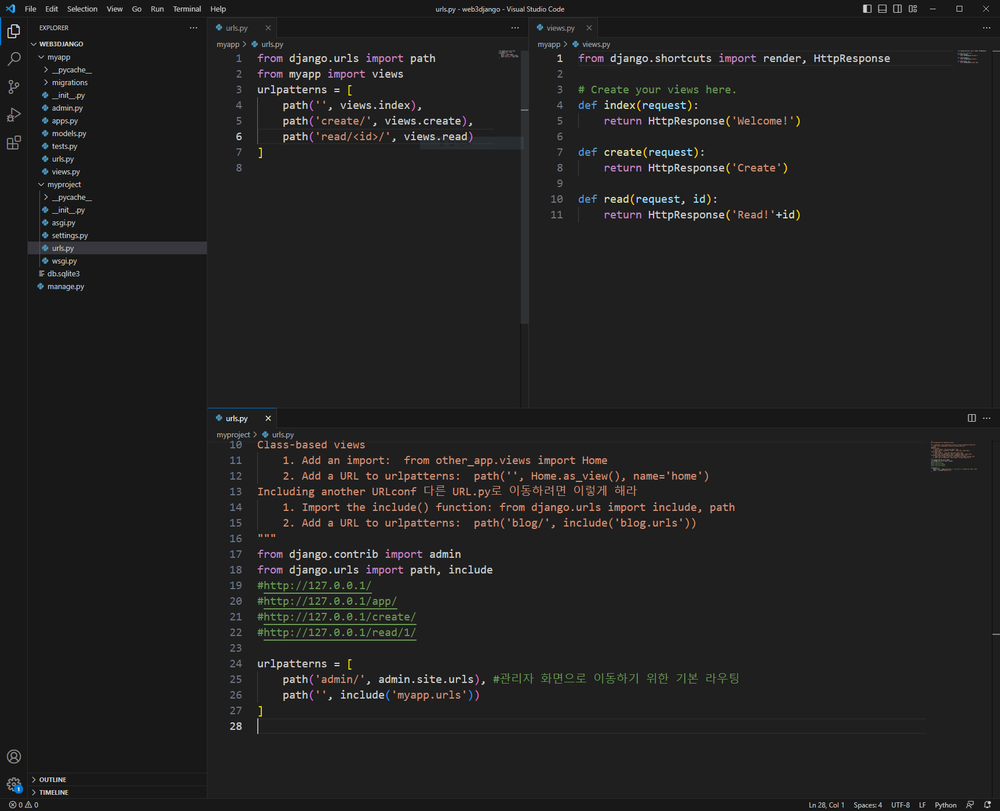

## 🚜 Django 애플리케이션 만들기

1. 설치 `sudo python3 -m pip install django`

2. 폴더 생성

3. django-admin 활용함. 이 명령어로 메뉴얼 확인 가능

4. `django-admin startproject myproject .` myproject라는 이름으로 프로젝트 폴더를 현재 디렉토리에 생성

    

5. `python3 manage.py runserver` 서버 실행

    `python3 manage.py runserver 8080` 포트번호 지정 가능

6. localhost:8000에서 귀여운 로켓 확인

## 🚜 ERROR LOG



```
AttributeError: module 'myapp.views' has no attribute 'index'
```

참고

<https://stackoverflow.com/questions/17880146/django-module-object-has-no-attribute-index>







myapp/views.py에서 `from . import urls` 추가하고 잘 돌아가는 것을 확인

## 하지만 모든 url을 잘 만들어 두면 문제가 안 생긴다..

