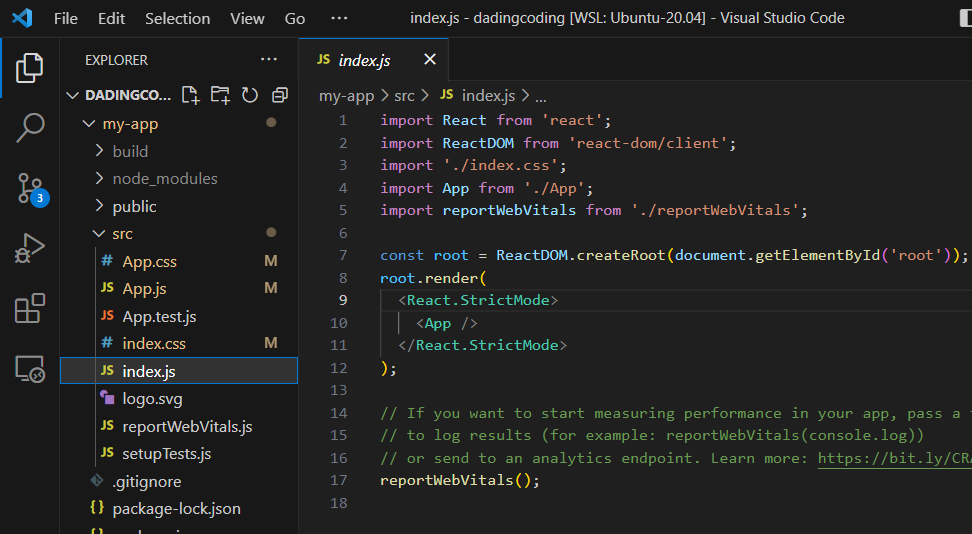
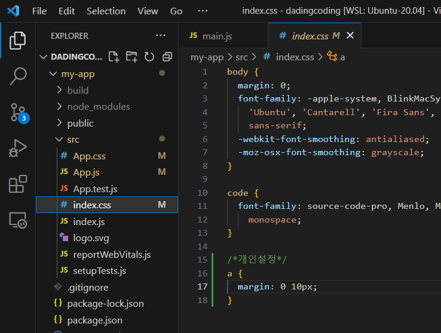
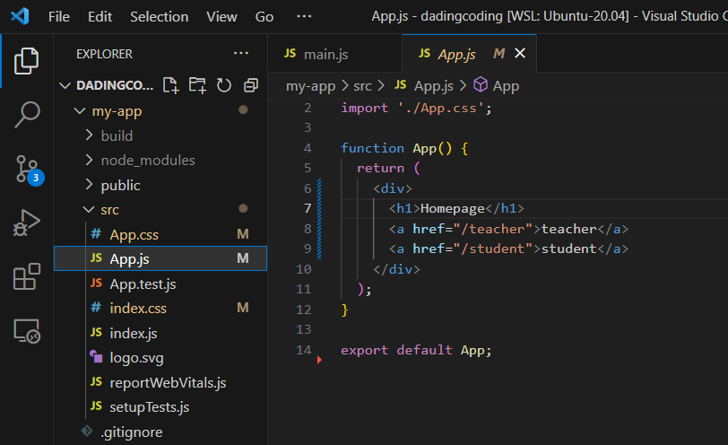
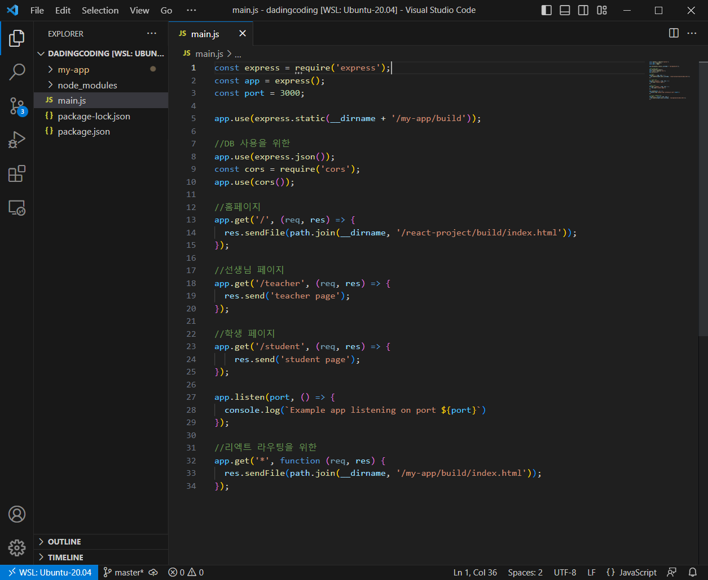

## 🧦 목적

- 나는 Node.js의 Express를 활용해 MVC Architecture를 구현할 수 있다.

- 기존 View 부분을 ejs가 아닌 React로 만들고 싶다.

- Router, Controller, Model 다 Node.js에 남겨두고 딱!!! View만 React가 했으면 좋겠다.

## 🧦 방법

### 기존 Node.js 프로젝트가 완성되어 있다고 가정

아주 간단하게 main.js 페이지에서 Route만 관리하는 소스코드를 만들었다.

- 초반 폴더 구조

```
📂 dadingcoding
├─ main.js
├─ package-lock.json
├─ package.json
└─ 📂 node_modules
```

프로젝트가 커진다면 Router, Controller, Model, (View) 폴더도 있을 것


### 현재디렉토리인 dadingcoding 폴더에서 다음 명령을 수행

Node.js 프로젝트 폴더에 React 프로젝트 폴더를 안에 만들 것이다.

```
npm init react-app my-app //프로젝트 생성
```

`cd my-app` 으로 my-app 폴더로 이동한다.

간단하게 개발을 했다.





Index.js 파일의 /<App /> 컴포넌트를 수정한다.

개인적으로 a태그 CSS도 조금 손 보고..



App.js 파일에서 버튼에 클릭 시 이동할 URL을 정의해 준다. 일단 간단하게 a태그로만 했다.



```
(main.js에 추가)
app.use(express.json());
var cors = require('cors');
app.use(cors());

app.use(express.static(path.join(__dirname, 'react-project/build')));

app.get('/', function (req, res) {
  res.sendFile(path.join(__dirname, '/react-project/build/index.html'));
});

app.get('*', function (req, res) {
  res.sendFile(path.join(__dirname, '/react-project/build/index.html'));
});
```

이제 main.js파일은 React와 연동을 위해 이렇게 변경된다.

React에서 라우팅을 하지 않는다면 마지막 줄들은 적지 않아도 된다.

나는 Node.js에서 라우팅 하는 게 편해서 안 쓸 것 같다!

이렇게 React 프로젝트 개발 후 my-app 폴더에서 다음 명령을 수행

```
npm run build
```

### 웹 서버 실행

main.js 파일이 있는 my-app 폴더의 부모 디렉토리로 나온다.

```
nodemon main.js
```

늘 하듯 실행하면 된다.

## 🧦 정리

React를 완전 ejs 대용으로 사용이 가능하다.

ejs 상에서 버튼을 클릭하면 href를 통해 url이 변경되고 변경된 url에 대해서 Router를 지나 Controller를 지나 Model에서 DB와 뭐시기 뭐시기 하고서 정보를 Controller가 받아서 ejs 뿌려주는 과정 그대로 유지할 수 있다.

여기서 ejs를 React로 바꾸는 것 뿐

ejs에서 지독한 <% %>를 사용하지 않아도 된다는 것이 짱 편하고

마치 어플리케이션처럼 간단한 작업에 새로고침이 필요 없다는 게 장점.. 예를 들면 글 목록의 이동이라던지

사실 React 문법 배우고 이제 Node.js랑 연결하려니까 갑자기 막막하고 두려워서 그냥 ejs 쓸가... 했는데 꾹 참고 해보니 조금만 익숙해지면 굉장히 편할 것 같다. 정말로!!

## 🧦 참고

<https://codingapple.com/unit/nodejs-react-integration/>

<https://yoo11052.tistory.com/148>