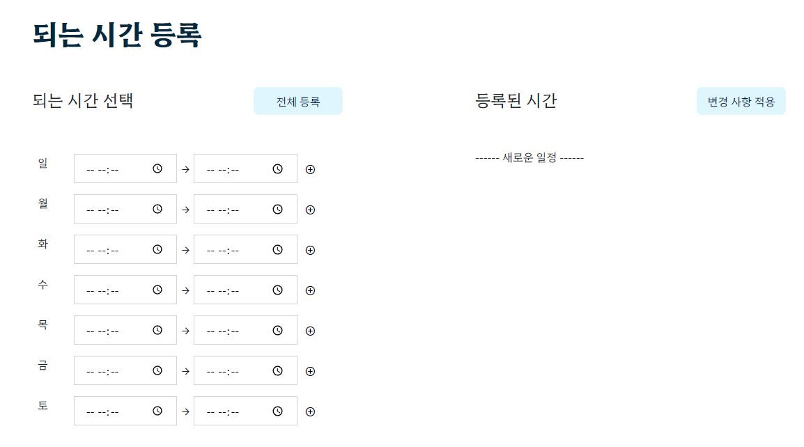
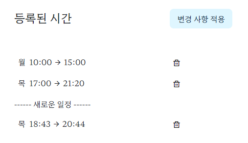
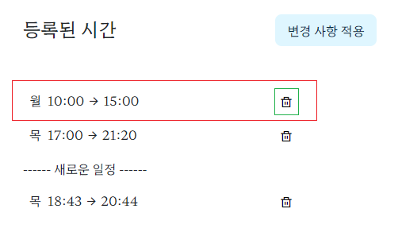
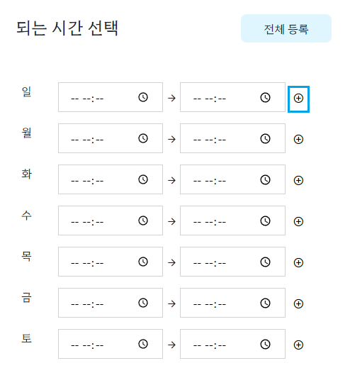

## 🍞 결과물



<https://youtu.be/CUI8A9A6X4Y>

## 🍞 목적

- 회원이 요일 별 되는 시간 일정을 추가하고 삭제하여 DB를 업데이트

- 한 번에 몇 개의 일정이 추가될지, 어떤 것이 삭제될지 모른다

## 🍞 DOM 사용

appointment.js 파일에 코드를 작성하고 이 파일을 ejs에 가져온다.







시간을 선택하고 파란색 추가 버튼을 누르면 빨간색 요소가 -----새로운 일정---- 하단에 추가되는 방식이다.

빨간색 요소의 class name은 delete-item, 초록색 버튼의 class name은 delete인 상황이다.

고민이 필요했던 부분은 초록색 버튼이다.

삭제하는 버튼은 모두 class name이 delete였기 때문에 어떤 걸 삭제한 건지 구분할 필요가 있었다.

## 🍞 해결

```
let deleteButtons = document.querySelectorAll('.delete-item');
```

먼저 querySelectorAll을 사용해 delete-item이라는 클래스명을 가진 모든 요소를 deleteButtons에 대입한다.

지금보니 변수명을 헷갈리게 지은 것 같ㅌ..

그냥 querySelector만 사용하면 가장 첫 번째 요소 하나만 가지고 오게 된다.

delete 클래스가 아니라 delete-item 클래스를 사용한 이유는 빨간 테두리 행 전체가 삭제되어야 하기 때문

```
deleteButtons.forEach((element) => {
	element.querySelector('.delete').addEventListener('click', (target) => {
		element.remove();
	});
});
```

이제 각각의 요소들의 delete라는 클래스명을 가진 요소에 이벤트 리스너를 등록한다.

그래야 각각의 삭제 버튼들이 동작할 수 있다.

이때 element는 deleteButtons 리스트를 순회하며 대입되는 하나의 요소이기 때문에 빨간색 박스 하나씩이 된다.

그러면 delete 버튼이 클릭 되었을 때 element 자체를 삭제하면 된다.

element.remove()를 하게 되면 HTML에서 해당 요소를 제거할 수 있다.

## 참고

<https://velog.io/@blackwidow/9-17>

<https://nature-lee.tistory.com/47>

<https://p-ido.tistory.com/11>

<https://velog.io/@ine5012/Elements-%EC%B6%94%EA%B0%80%EC%82%AD%EC%A0%9C%ED%95%98%EA%B8%B0>

<https://goddino.tistory.com/68>

<https://middleun.tistory.com/2>

<https://cpro95.tistory.com/149>
