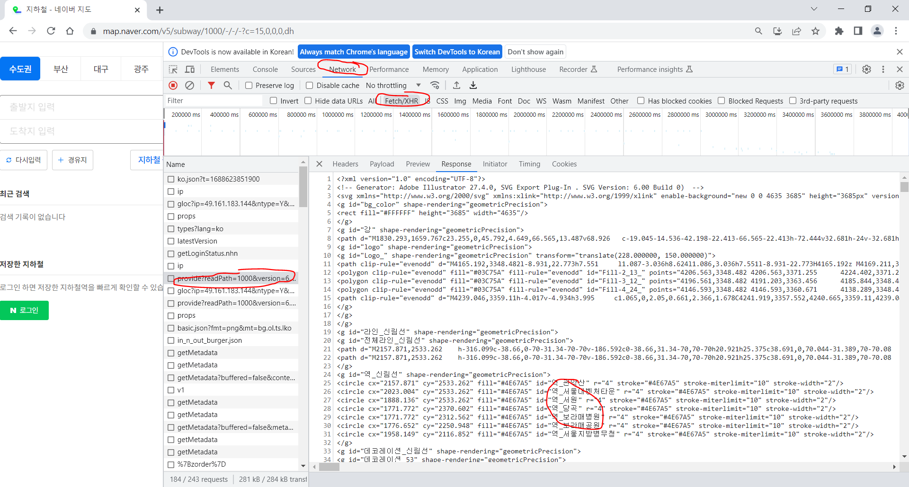
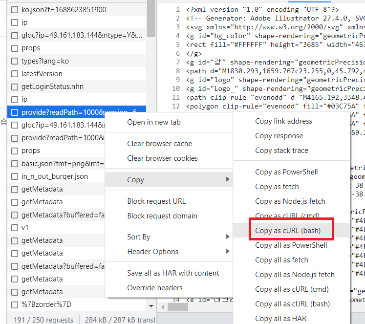

## 🚉 네이버의 지하철 노선도를 크롤링해보자~!

```py
import requests
from bs4 import BeautifulSoup as bs

url = "https://map.naver.com/v5/subway/1000/-/-/-?c=15,0,0,0,dh"

res = requests.get(url)
soup = bs(res.text, "html.parser")

print(soup.select('#역_우이신설선 > circle'))
```

이러면 되는 줄..

결과는 빈 배열 뿐

## 🚉 원인은 CSR

Client Side Rendering

서버는 클라이언트에 기본적인 문서(요청에 따른 css,js 링크만 있는 빈 HTML 파일)만을 전달하고, 

해당 문서에 포함된 script 에서 또 다른 서버에 요청해서 데이터를 가져온다. 

그리고 그렇게 가져온 데이터를 클라이언트 사이드에서 렌더링 해서 보여준다.

그래서 쌩 HTML 파일을 아무리 긁어도 우리가 원하는 건 없다~



찾아내었다!

id가 '역_신림선' 밑의 circle 태그들을 긁어오면 되겠다.

호선 이름은 문자열 포맷팅으로 바꿔주면 되겠다.

## 🚉 해결



<https://curlconverter.com/>

복사해다가 이 사이트에 붙여넣기하면 가져올 수 있는 파이썬 코드가 뿅

```py
import requests
from bs4 import BeautifulSoup as bs

cookies = {
    'NNB': 'T72H4UHHTGVGI',
}

headers = {
    'authority': 'map.naver.com',
    'accept': '*/*',
    'accept-language': 'ko-KR,ko;q=0.9,en-US;q=0.8,en;q=0.7',
    # 'cookie': 'NNB=T72H4UHHTGVGI',
    'referer': 'https://map.naver.com/',
    'sec-ch-ua': '"Not.A/Brand";v="8", "Chromium";v="114", "Google Chrome";v="114"',
    'sec-ch-ua-mobile': '?0',
    'sec-ch-ua-platform': '"Windows"',
    'sec-fetch-dest': 'empty',
    'sec-fetch-mode': 'cors',
    'sec-fetch-site': 'same-origin',
    'user-agent': 'Mozilla/5.0 (Windows NT 10.0; Win64; x64) AppleWebKit/537.36 (KHTML, like Gecko) Chrome/114.0.0.0 Safari/537.36',
}

params = {
    'readPath': '1000',
    'version': '6.36',
    'language': 'ko',
    'style': 'normal',
    'requestFile': 'optimize_web.svg',
    'caller': 'NaverMapPcBetaWeb',
}

response = requests.get('https://map.naver.com/v5/api/subway/provide', params=params, cookies=cookies, headers=headers)
soup = bs(response.text, "html.parser")

print(soup)
```

soup를 출력해 보니 아까 보았던 파일 내용이 쭉 나온다.

soup.select를 사용해서 필요한 역 이름 정보만 가지고 와보자!

```py
#위에 이어서...
subway_list = soup.select('#역_우이신설선 > circle')

print(subway_list)
```

내가 원하는 것은 id가 '역_~~~선'인 태그의 circle 태그 각각이 필요하다. 그런데 이걸 출력해 보니 태그의 text 값이 없고 속성인 id에 접근해야 역 이름을 가져올 수 있다는 것을 알 수 있다!!!

```py
#위 코드를 이렇게 변형...
subway_list = [element.get('id')[2:] for element in soup.select('#역_우이신설선 > circle')]

print(subway_list)
```

뽑아온 데이터를 하나씩 돌면서 id 속성 값을 get 함수로 가져오고, 전부 '역_~~~'으로 시작하니 역_을 빼고 2부터 슬라이싱을 한다.

```
['북한산우이', '솔밭공원', '419민주묘지', '가오리', '화계', '삼양', '삼양사거리', '솔샘', '북한산보국문', '정릉']
```

결과가 아주 이쁘게 잘 나왔다아