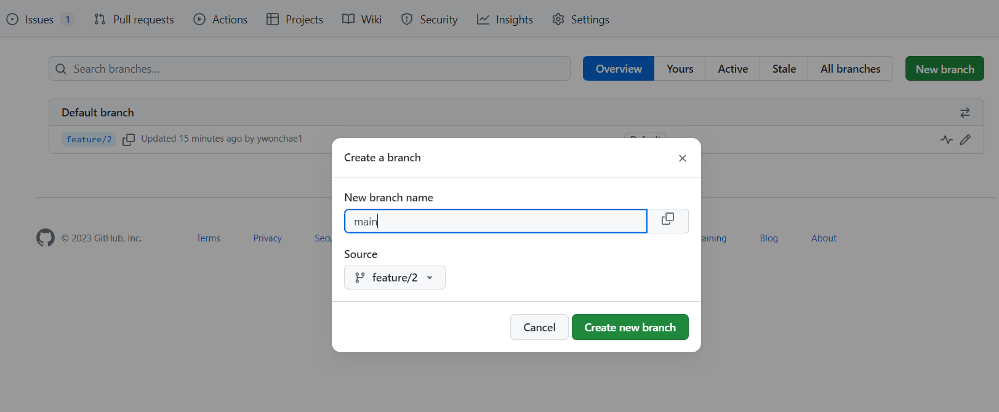
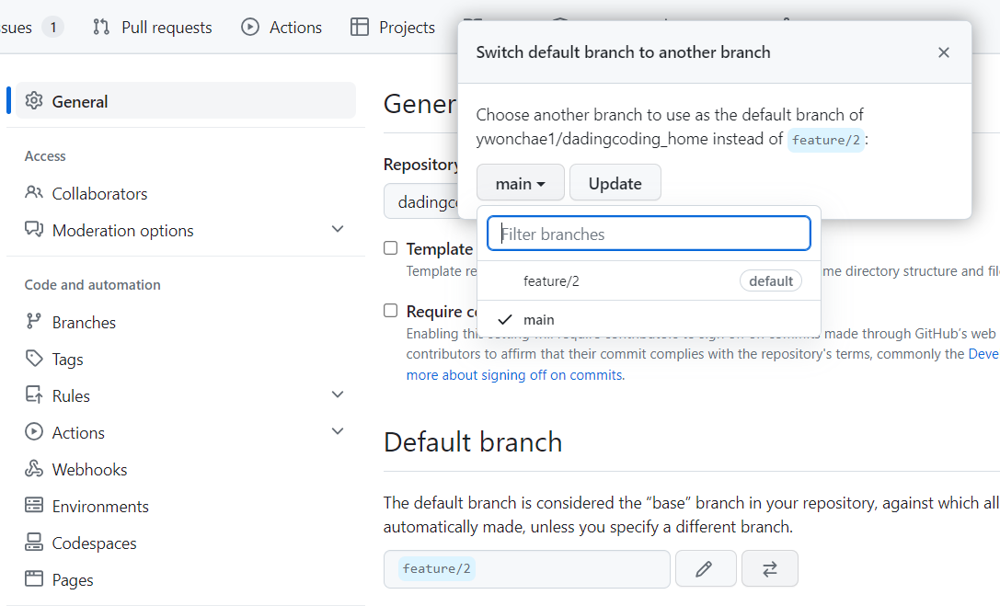
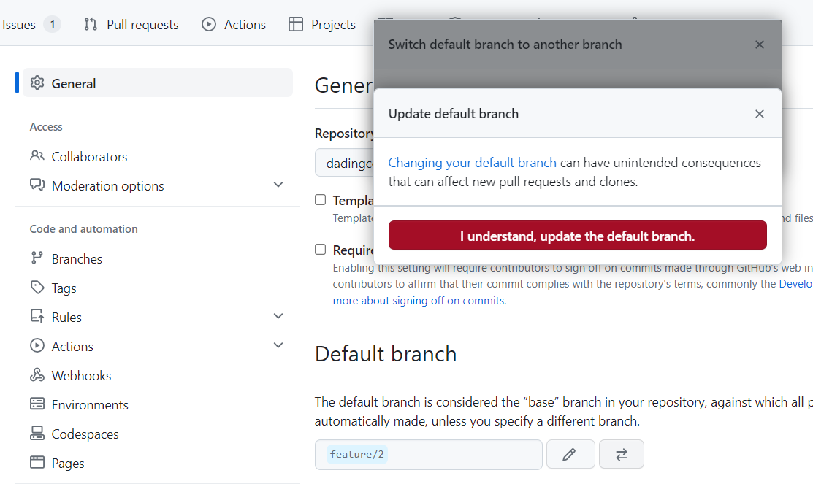

## 🎊 Github에서 무임승차 contributers 모두 제거하기 ^^

아하하하하하

그냥 깔끔한 게 좋을 뿐^^^

모든 커밋을 전부 내 이름으로 바꾼다.

잘 변형하면 부분적으로 변경도 가능할 것 같다.

맨 뒤에 HEAD 부분이 전체를 뜻하는 듯 하다.

```
$ git filter-branch -f --env-filter "GIT_AUTHOR_NAME='원하는 작성자 이름'; GIT_AUTHOR_EMAIL='원하는 작성자 이메일'; GIT_COMMITTER_NAME='원하는 작성자 이름'; GIT_COMMITTER_EMAIL='원하는 작성자 이메일';" HEAD
```

이제 push하고 싶은 브랜치에 강제로 올린다.

```
git push --force --set-upstream origin 브랜치명
```

<https://it-eldorado.tistory.com/145>

참고한 블로그 꼭 가서 읽어보자 진짜 이건 조심해야 되는 명령어다!


## 🎊 문제점.. git log 해쉬가 전부 변경되어서

main에 머지가 안 된다.

나는 분리된 브랜치에 push를 해 버려서 머지가 필요했는데

머지를 하려고 full request를 날리려고 들어가면 `There isn’t anything to compare` 이런 내용이 뜨고 pull을 받아도 everything ok인가 뭔가 아무튼 다 괜찮단다 내가 안 괜찮은데에엑

그래서 main 브랜치를 삭제하고 다시 만들기로 했다.

하지만 main 브랜치가 default이기 때문에 삭제가 안 된다.

1. github에서 settings > general에서 default 브랜치를 아까 강제 push 했던 다른 브랜치로 변경한다.

    경고창이 뜨는데 알겠다고 한다. (아래 사진 참고)

2. main 브랜치를 삭제한다.

3. main 브랜치를 생성한다.

    

    source는 아까 강제로 push 했던 다른 브랜치로 해 주어야 같은 코드로 main에 복제된다.

4. 다시 settings > general로 들어가서 default 브랜치를 main으로 변경한다.

    

    

    경고창에 확인을 누르면 이제 깔끔한 contributors를 볼 수 있다.