## 💾 Socket.IO를 활용한 업무용 채팅 웹 서비스 개발 프로젝트


우리 사랑스러운 팀원들과 ^^ 멋진 프로젝트를 시작했다!!

**Pirot**

- 피로그래밍 동아리(개발 동아리) 활동에 최적화된 단순하고 깔끔한 업무용 채팅 시스템

- 핵심 기능
    
    - 마크다운 문법 채팅

    - 파일, 코드 스니펫 전송

    - 동아리 연락망 구축

    - 채팅 방 게시판과 게시글 공감

    - 익명 단체 채팅 방, 실명 단체 채팅 방, 개인 채팅 방

- 기술 스택

    - Django

    - [python-socketio](https://python-socketio.readthedocs.io/en/latest/index.html)

    - [Python-Markdown](https://python-markdown.github.io/)

    - [Pygments](https://pygments.org/docs/quickstart/#example)

    - [MongoDB](https://www.djongomapper.com/)

    - MySQL


## 💾 채팅 내역을 MongoDB에 따로 저장하자!

시스템을 모바일 어플리케이션까지 확장할 계획을 가지고 있어서 설계를 크게 잡는 중

채팅의 경우 조회에 시간이 오래 걸려서 MongoDB와 같은 NoSQL에 저장한다는 얘기가 많았다.

MySQL만 써봐서 MongoDB의 개념에 대해 이해하기가 참 어려웠는데 생각보다 훨씬 쉬웠다.

**MongoDB는 스키마가 없다**

django에서 데이터를 저장하기 위해 models.py를 설계하는데 MongoDB에 저장할 계획이라면 굳이 이게 필요가 없다

Node.js를 써봤다면 model.js 파일에서 db와 연결하고 sql 쿼리를 돌리는 것과 같이 사용하면 된다.

## 💾 MySQL 서버, MongoDB 서버 인스턴스 생성

AWS E2C 서버를 만든다.

MongoDB 서버가 트래픽이 많아질 것을 예상하여 MongoDB 서버를 분리한다.

물론 그때는 서버 자체를 값비싼 서버로 이사해야 한다.

GCP도 동일하다.

<https://us-east-1.console.aws.amazon.com/ec2/home?region=us-east-1#LaunchInstances:>


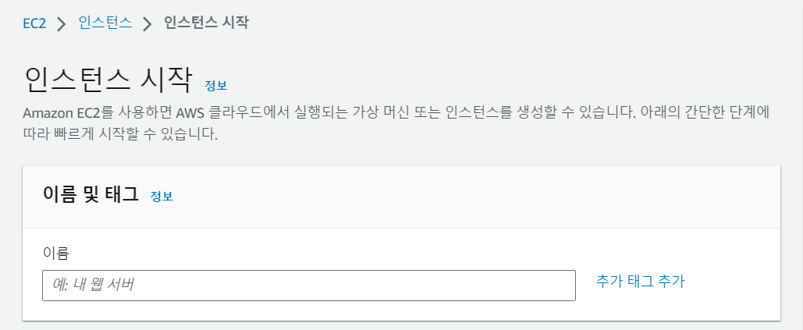

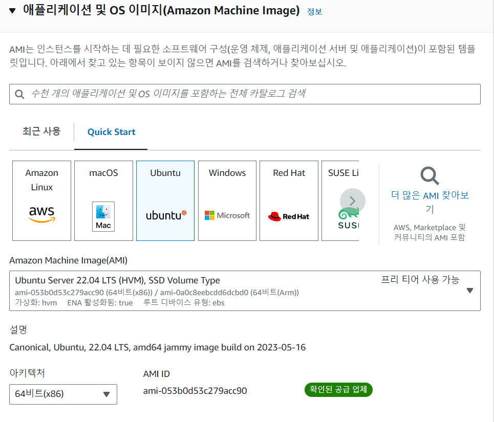

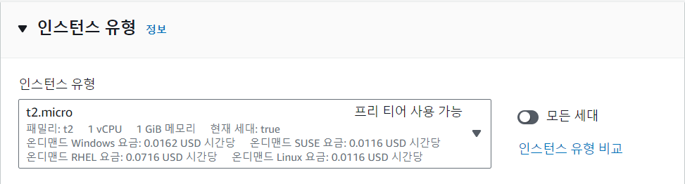


키 페어를 생성하는 게 편하다.

이름은 상관 없다. 유형은 RSA 파일 형식은 .pem이 편하던데.. 내가 리눅스만 써서 그런 걸지도

암튼 이 파일이 있으면 윈도우 cmd에서 지금 생성하고 있는 서버에 ssh 원격 접속을 쉽게 할 수 있다.

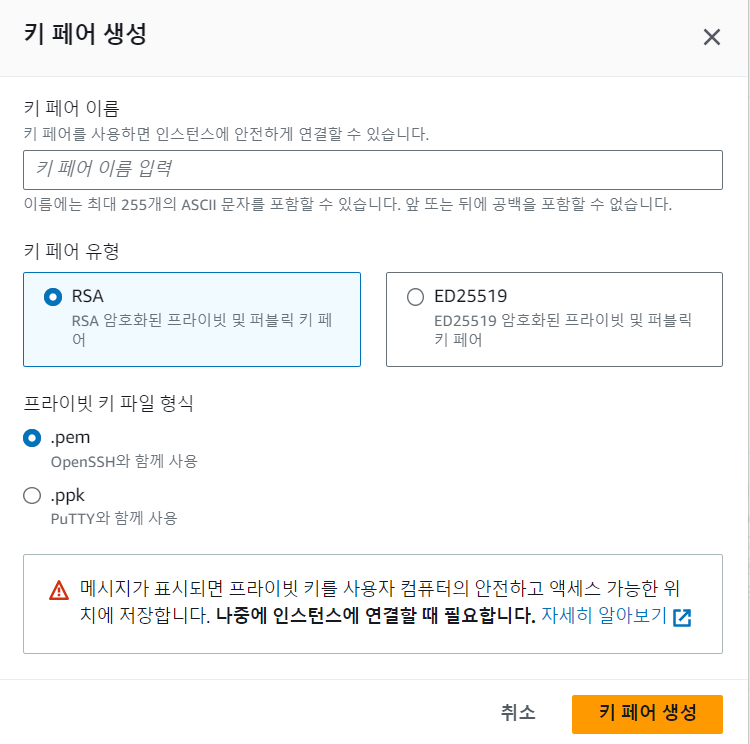

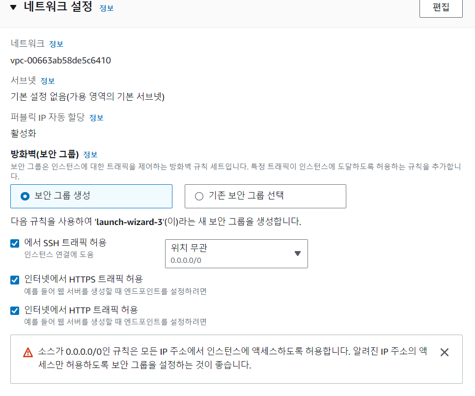

Http 허용해주고 인스턴스 시작을 누르면 저멀리 아마존 어딘가에 나의 서버 컴퓨터가 하나 생긴다.

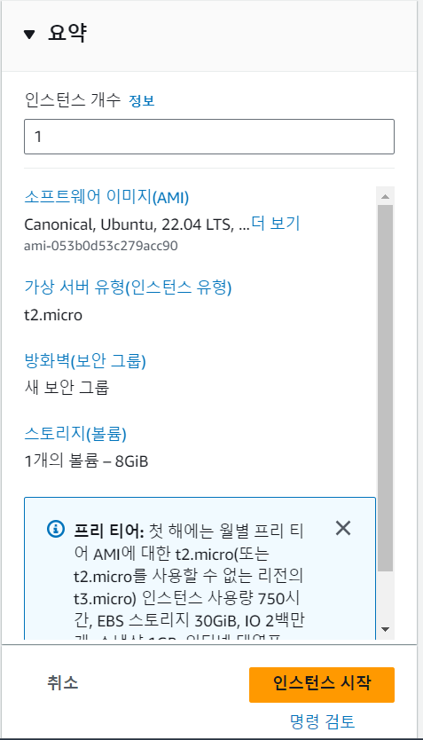

MySQL 서버와 MongoDB 서버를 따로 만들 거니까 이렇게 두 개 만들면 된다

보통의 작은 프로젝트는 MySQL 서버 하나면 충분하다

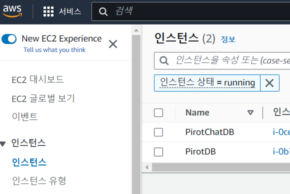

## 💾 MySQL 설치

MySQL 서버를 선택하고 연결을 누른 뒤 SSH 클라이언트를 선택하면 연결할 수 있는 명령어를 확인할 수 있다.

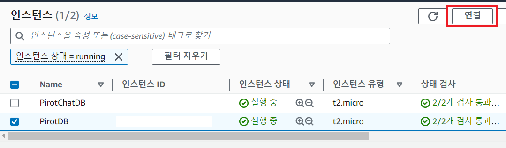

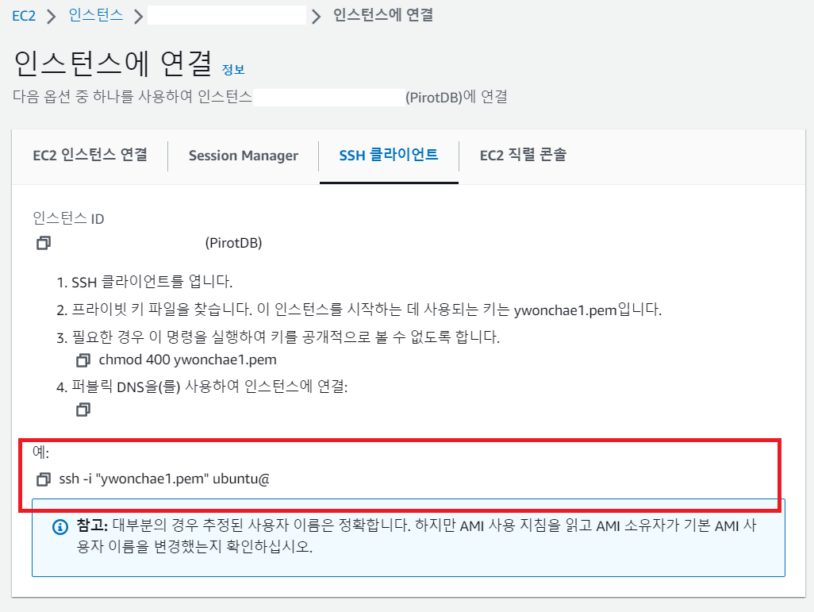

복사하고 윈도우에서 cmd를 켠다. 맥도 명령어는 똑같다.

다만 주의할 점은 내가 현재 있는 디렉토리에 아까 발급 받았던 pem 키가 있어야 한다. 아니면 ssh 명령어에 경로를 잘 적어 주거나

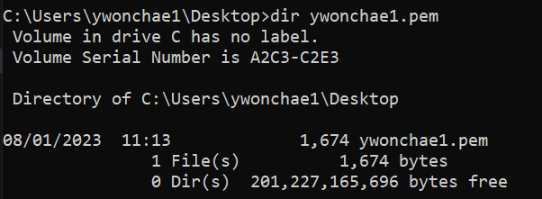

있는지 확인했다면 아까 복사했던 명령어를 붙여넣기만 하면 연결이 된다.

서버 컴퓨터에 원격 접속을 완료 했으니 이제부터는 리눅스 명령어를 사용해야 한다 왜냐면 리눅스 컴퓨터로 들어왔으니께 ,,

> MySQL 설치하기

```
sudo apt update
sudo apt install mysql-server
sudo systemctl start mysql
sudo systemctl enable mysql
sudo mysql
mysql> ALTER USER 'root'@'localhost' IDENTIFIED
WITH mysql_native_password by 'root계정비밀번호적기';

sudo mysql_secure_installation
VALIDATE PASSWORD ➔ N
New password
Re-enter new password
Remove anonymous users ➔ N
Disallow root login remotely ➔ Y
Remove test database and access to it ➔ Y
Reload privilege tables ➔ Y

mysql> ALTER USER 'root'@'localhost' IDENTIFIED WITH
mysql_native_password BY 'root계정비밀번호바꾸고싶으면쓰는명령어';
mysql> CREATE USER '내계정이름'@'%' IDENTIFIED WITH
mysql_native_password BY '내계정비밀번호';
mysql> GRANT ALL ON *.* TO '내계정이름'@'%' WITH GRANT
OPTION;
mysql> exit
```

mysql-server를 설치하고, 계정을 만들어서 계정에 외부 접속 허용(%)과 전체 DB 접근 권한(\*.\*)을 허용해 주는 과정이다

## 💾 MongoDB 설치

참고 공식 문서

<https://www.mongodb.com/docs/manual/tutorial/install-mongodb-on-ubuntu/>

마찬가지로 MongoDB서버로 만들어 놓은 인스턴스에 ssh 원격 접속을 한다

Ubuntu 버전에 따라 list파일을 생성

```
echo "deb [ arch=amd64,arm64 signed-by=/usr/share/keyrings/mongodb-server-6.0.gpg ] https://repo.mongodb.org/apt/ubuntu jammy/mongodb-org/6.0 multiverse" | sudo tee /etc/apt/sources.list.d/mongodb-org-6.0.list
```

apt update 후 패키지 설치

```
sudo apt-get update
sudo apt-get install -y mongodb-org
```

MongoDB 시작하기

```
sudo systemctl start mongod
sudo systemctl status mongod
sudo systemctl enable mongod
```

필요할 때 MongoDB 재시작하기

뭔가 안 된다 싶을 땐 항상 재시작을 잊지 말자

```
sudo systemctl restart mongod
```

필요할 때 MongoDB 멈추기

```
sudo systemctl stop mongod
```

MongoDB 접속하기

MongoDB에서 사용하는 명령어를 쓸 수 있다.

```
mongosh
```

MySQL에서의 database, table, row 개념이

MongoDB에서는 db, collection, document 라고 생각하면 된다

하지만 MongoDB는 틀이 없고 유연하다

자주 쓰는 MongoDB 명령어

|명령어|용도|
|---|---|
|show dbs|DB 목록 조회|
|db|현재 사용 중인 DB 확인|
|db.dropDatabase()|현재 DB 삭제|
|show collections|현재 DB의 collections 확인|
|db.createCollection("[collection_name]")|collection 생성|
|db.[collection_name].drop()|collection 삭제|
|db.{collection_name}.find()|collection 내 모든 documents 확인|
|db.[collection_name].find([query], [projection])|특정 document 확인|
|db.[collection_name].insertOne([document])|단일 document 삽입|
|db.[collection_name].insertMany([document_list])|다중 document 삽입|
|db.[collection_name].updateOne([filter], [update], [options])|단일 document 수정|
|db.[collection_name].updateMany([filter], [update], [options])|다중 document 수정|
|db.[collection_name].replaceOne([filter], [update], [options])|document 대체|
|db.[collection_name].deleteOne([filter])|단일 document 삭제|
|db.[collection_name].deleteMany([filter])|다중 document 삭제|


## 💾 Django와 MySQL서버, MongoDB서버 연결

Django는 늘 쓰던 대로 ORM을 쓰면 된다

DBMS만 MySQL로 바뀌는 것 뿐이다

MySQL에서는 다음과 같이 database만 생성해 주면 Django ORM에서 알아서 테이블과 데이터를 생성한다.

```
mysql> CREATE DATABASE <나의데이터베이스이름>
```

Django 프로젝트를 열자~!

우리의 프로젝트는 이렇게 구성되어 있다

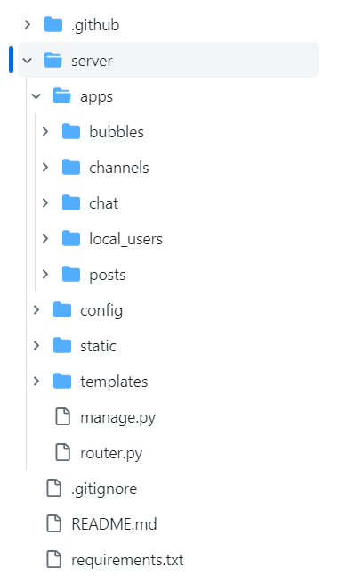

서버에 대한 정보가 github로 빠져나가면 위험하기 때문에 .env 파일로 따로 관리하고 이 파일은 .gitignore 파일에 추가하여 깃허브에 올라가지 않도록 한다

.env는 .gitignore 파일과 같은 위치에 생성한다

.env 파일 내용
```
DEBUG=on

MYSQL_DBNAME=<DB이름>
MYSQL_USERNAME=<DB사용자이름>
MYSQL_PASSWD=<DB사용자비밀번호>
MYSQL_HOST=<DB서버외부IP주소>
MYSQL_PORT=<DB서버포트번호 기본3306>

MONGO_DBNAME=<MongoDB이름>
MONGO_USERNAME=<MongoDB사용자이름>
MONGO_PASSWD=<MongoDB사용자비밀번호>
MONGO_HOST=<MongoDB서버외부IP주소>
MONGO_PORT=<MongoDB서버포트번호 기본27017>
```

이것을 settings.py파일에서 사용하게 된다

## 💾 settings.py 파일 설정

Django에서 settings.py 파일을 연다

```py
import environ

# Build paths inside the project like this: BASE_DIR / 'subdir'.
BASE_DIR = Path(__file__).resolve().parent.parent

env = environ.Env(
    # set casting, default value
    DEBUG=(bool, False)
)
# reading .env file
environ.Env.read_env(BASE_DIR / '../.env')

MYSQL_DBNAME=env('MYSQL_DBNAME')
MYSQL_USERNAME=env('MYSQL_USERNAME')
MYSQL_PASSWD=env('MYSQL_PASSWD')
MYSQL_HOST=env('MYSQL_HOST')
MYSQL_PORT=env('MYSQL_PORT')

MONGO_DBNAME=env('MONGO_DBNAME')
MONGO_USERNAME=env('MONGO_USERNAME')
MONGO_PASSWD=env('MONGO_PASSWD')
MONGO_HOST=env('MONGO_HOST')
MONGO_PORT=int(env('MONGO_PORT'))
```

왜인지 모르겠으나 MONGO_PORT에는 int로 변환이 필요하다. 안 그러면 PORT가 정수여야 한다는 오류를 만난다

```
TypeError: port must be an instance of int
```

read_env의 인자로도 .env의 위치를 정확히 주어야 한다

import environ을 하면 vscode에서는 경고 밑줄이 그어지는데 무시했다

이렇게 settings.py에서 변수를 지정해 주었다 이렇게 하면 다른 파일에서도 MONGO_DBNAME~ 등등 이런 변수들을 settings.py파일만 import 하면 사용할 수 있게 된다!

MongoDB와 연결할 때 이 작업이 필요하기 때문에 미리 다 선언해 놓는다

```py
DATABASES = {
    'default': {
        'ENGINE': 'django.db.backends.mysql',
        'NAME': MYSQL_DBNAME,
        'USER': MYSQL_USERNAME,
        'PASSWORD': MYSQL_PASSWD,
        'HOST': MYSQL_HOST,
        'PORT': MYSQL_PORT,
    },
    'chatdb': {
        'ENGINE': 'djongo',
        'ENFORCE_SCHEMA': False,
        'LOGGING': {
            'version': 1,
            'loggers': {
                'djongo': {
                    'level': 'DEBUG',
                    'propogate': False,                        
                }
            },
         },
        'NAME': MONGO_DBNAME,
        'CLIENT': {
            'host': MONGO_HOST,
            'port': MONGO_PORT,
            'username': MONGO_USERNAME,
            'password': MONGO_PASSWD,
            'authSource': 'admin',
            'authMechanism': 'SCRAM-SHA-1'
        },
    }
}

DATABASE_ROUTERS = [
    # 'router.BubbleRouter',
]
```

DATABASE 부분은 이렇게 지정한다.

MySQL이 제일 많이 차지하고 있으니까 default로 지정하고 MongoDB는 따로 지정한다.

migrate 할 때 해당 models.py의 DB 설계 사항이 MySQL의 설계인지 MongoDB의 설계인지 알려줘야 한다

그럴 때 router.py 파일이 필요하다.

하지만 나는 mongodb.py 파일에서 직접 MongoDB 서버에 데이터를 CRUD 할 것이기 때문에 필요하지 않다

즉 admin 페이지에서 채팅 내용을 확인할 수 없다는 것

models.py에 DB 구조를 설계하지 않고 migrate하지 않을 거니까!

만약 admin 페이지에서 보여주고 싶다면 router.py 파일이 필요하다

그런데 해보니 admin 페이지에서 데이터를 create를 할 때 문제가 발생해서 그냥 안 하는 게 깔끔한 것 같다

그래도 router.py파일과 참고 문서

<https://docs.djangoproject.com/en/4.2/topics/db/multi-db/>

<https://woolbro.tistory.com/82>

```py
class BubbleRouter:
    # app Name
    route_app_labels = {'bubbles'}
    db_name = 'chatdb'

    def db_for_read(self, model, **hints):
        """
        Attempts to read logs and others models go to primary_db.
        """
        if model._meta.app_label in self.route_app_labels:
            return self.db_name
        return None

    def db_for_write(self, model, **hints):
        """
        Attempts to write logs and others models go to primary_db.
        """
        if model._meta.app_label in self.route_app_labels:
            return self.db_name
        return None

    def allow_relation(self, obj1, obj2, **hints):
        """
        Allow relations if a model in the obj1 or obj2 apps is
        involved.
        """
        if (
                obj1._meta.app_label in self.route_app_labels or
                obj2._meta.app_label in self.route_app_labels
        ):
            return True
        return None

    def allow_migrate(self, db, app_label, model_name=None, **hints):
        """
        Make sure the auth and contenttypes apps only appear in the
        'primary_db' database.
        """
        if app_label in self.route_app_labels:
            return self.db_name
        return None
```

## 💾 bubbles app에서 mongodb.py 파일 생성

MongoDB와 관련된 app을 따로 분리하였다.

mongodb.py 파일을 models.py 파일의 위치와 같은 위치에 새롭게 생성한다.

```py
from pymongo import MongoClient
import datetime
from django.conf import settings

# MongoDB와 원격 연결
client = MongoClient(getattr(settings, 'MONGO_HOST', None), getattr(settings, 'MONGO_PORT', None))
db = client.pirotchatdb

# collection 생성
bubble_collection = db.bubble

def test():
    bubble = {
        "user": "Mike",
        "room": "b123",
        "content": 'hello mongo',
        "is_delete": 0,
        "read_cnt": 2,
        "created_at": datetime.datetime.now(tz=datetime.timezone.utc),
        "updated_at": datetime.datetime.now(tz=datetime.timezone.utc),
    }

    bubble_id = bubble_collection.insert_one(bubble).inserted_id
    print(bubble_id)
```

간단하게 동작하는 이 test 함수는

bubble document를 생성하고 이를 bubble_collection에 추가한다

settings.py 파일에서 변수를 가져올 때는 getattr()함수를 사용한다

inserted_id를 통해 방금 추가한 데이터의 id를 가져올 수 있다

MongoDB도 Django의 SQLite처럼 자동으로 부여되는 id가 있다

결과 값을 찍어보니 UUID 개념에 가까운 것 같다

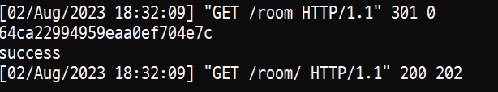

이 함수를 view에서 호출하면 되겠지?

## 💾 chat app에서 mongodb.py 함수 호출

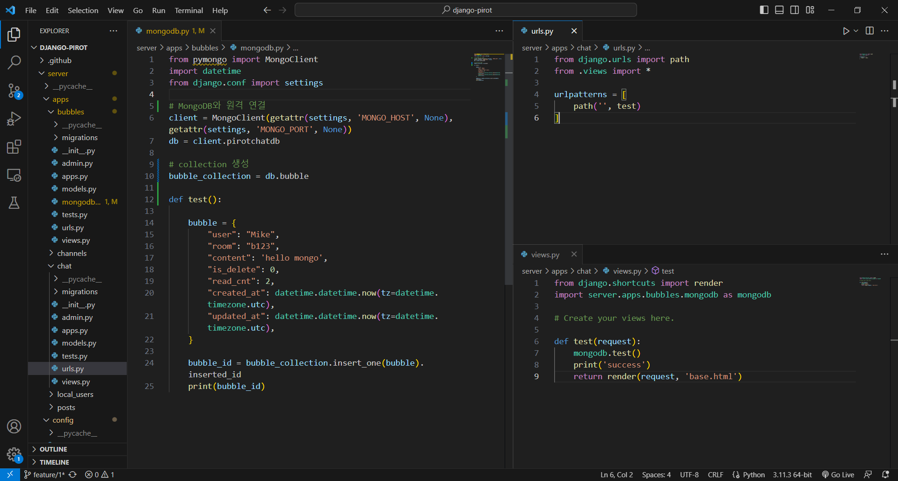

chat app의 urls.py에서 라우터를 등록한다

`localhost:8000/room/` 에 접속하면 chat app의 views.py test 함수가 실행된다

chat app의 views.py에서는 bubbles app의 mongodb에 있는 test 함수를 호출하고자 한다

호출이 완료되면 콘솔에 success 문자열이 찍히고 base.html을 렌더링해주도록 구성하였다

콘솔 결과를 보면 성공적으로 이루어졌다는 것을 알 수 있고


MongoDB 서버에 원격 접속해서 DB를 확인해 보면 데이터가 잘 들어가 있는 것을 확인할 수 있다

콘솔은 잘 찍히는데 아무리 봐도 안 보인다면 시스템 재시작

```
sudo systemctl restart mongod
```

```
test> show dbs
READ__ME_TO_RECOVER_YOUR_DATA   40.00 KiB
admin                          180.00 KiB
config                         108.00 KiB
local                            8.00 KiB
pirotchatdb                     72.00 KiB
test> use pirotchatdb
switched to db pirotchatdb
pirotchatdb> show collections
bubble
pirotchatdb> db.bubble.find()
[
  {
    _id: ObjectId("64c9d16cd4e0b9eff3fd4ac0"),
    user: 'Mike',
    room: 'b123',
    content: 'hello mongo',
    is_delete: 0,
    read_cnt: 2,
    created_at: ISODate("2023-08-02T03:45:48.680Z"),
    updated_at: ISODate("2023-08-02T03:45:48.680Z")
  },
```