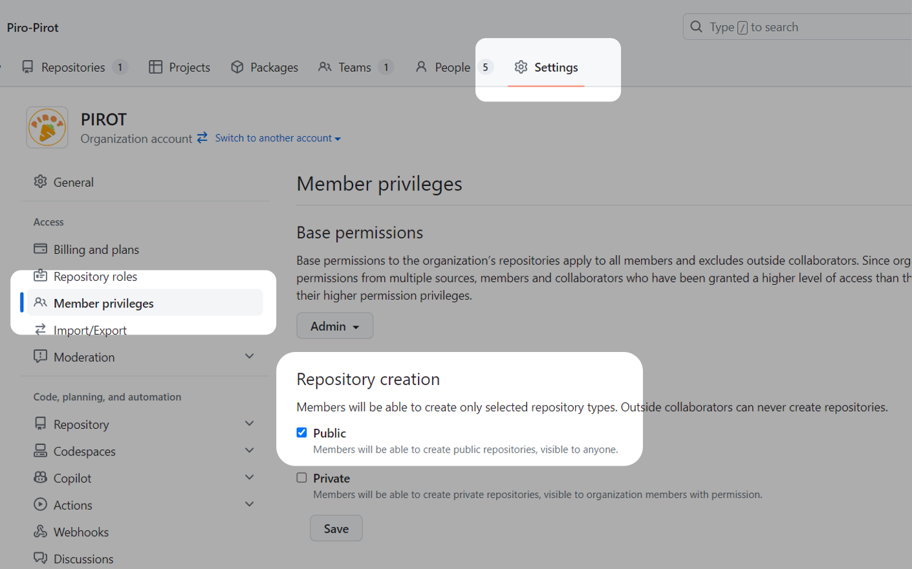
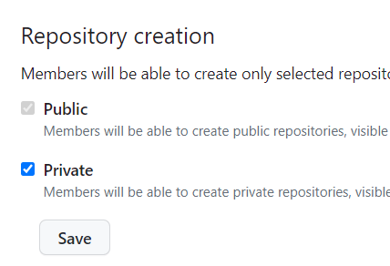
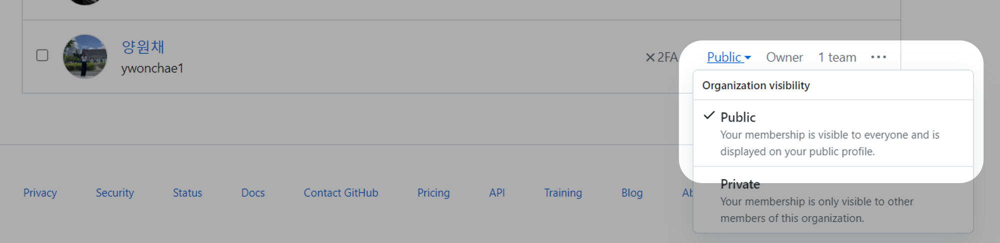

## 👁‍🗨 자랑스러운 우리 팀플을 공개하자 ~!

귀여운데 자랑스럽기까지 한 팀플을 내 프로필에 공개해보자

Organization의 설정에 들어가서 Repository creation을 Public으로 바꾼 뒤 Save 버튼을 누른다.

설정은 Organization의 Owner 권한이 있는 사람만 접근할 수 있다.

만약 Public이 회색칠 되어 있다면 Private를 한 번 눌러서 꺼준 뒤에 Save 버튼을 누르면 된다.

그 다음엔 설정 옆에 있는 People로 들어간다. Organization visibility를 Public으로 변경한다.

끝!