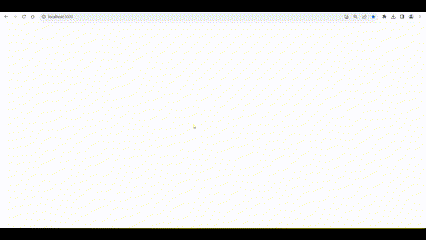
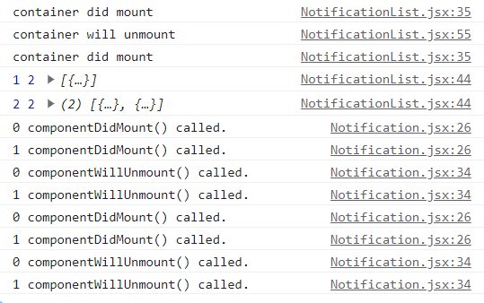
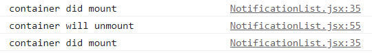

## 💙 리액트의 생명주기와 생명주기 함수

리액트 컴포넌트는 생명주기를 가진다.

Mount(출생) -> Update(인생) -> Unmount(사망)

각 생명주기마다 생명주기 함수가 있고 생명 주기 때 호출된다.

componentDidMount() -> componentDidUpdate() -> componentWillUnmount()

componentWillUnmount()의 경우 Unmount 되기 전에 호출 된다. 죽으면 함수를 실행할 수 없으니까

## 💙 간단한 알림 서비스

교재에 나와 있는 실습 코드에는 NotificationList.jsx의 componentWillUnmount() 함수가 빠져 있다.

아래는 확실한 코드

<https://github.com/soaple/first-met-react-practice-v18/blob/master/src/chapter_06/NotificationList.jsx>

그런데 빠져 있던 경우 의아한 현상이 일어나 분석을 시도..

## 💙 문제상황

원래 의도대로라면 1초마다 하나씩 데이터가 추가되어야 한다.


하지만 교재 코드대로 componentWillUnmount() 함수를 빼고 실행시켰더니 두 개씩 추가되는 문제가 생겼다. await도 써 보고 별 걸 해보았지만 방법을 찾지 못했다.



## 💙 해결 과정

console.log를 다 찍어 보았다.

> 하나씩 추가되는 결과(이하 결과Y)

```
container did mount
NotificationList.jsx:51 container will unmount
NotificationList.jsx:31 container did mount
NotificationList.jsx:40 1 3 [{…}]
Notification.jsx:26 0 componentDidMount() called.
Notification.jsx:34 0 componentWillUnmount() called.
Notification.jsx:26 0 componentDidMount() called.
3Notification.jsx:30 0 componentDidUpdate() called.
NotificationList.jsx:40 2 3 (2) [{…}, {…}]
Notification.jsx:30 0 componentDidUpdate() called.
Notification.jsx:26 1 componentDidMount() called.
Notification.jsx:34 1 componentWillUnmount() called.
Notification.jsx:26 1 componentDidMount() called.
Notification.jsx:30 0 componentDidUpdate() called.
Notification.jsx:30 1 componentDidUpdate() called.
Notification.jsx:30 0 componentDidUpdate() called.
Notification.jsx:30 1 componentDidUpdate() called.
Notification.jsx:30 0 componentDidUpdate() called.
Notification.jsx:30 1 componentDidUpdate() called.
NotificationList.jsx:40 3 3 (3) [{…}, {…}, {…}]
Notification.jsx:30 0 componentDidUpdate() called.
Notification.jsx:30 1 componentDidUpdate() called.
Notification.jsx:26 2 componentDidMount() called.
Notification.jsx:34 2 componentWillUnmount() called.
Notification.jsx:26 2 componentDidMount() called.
Notification.jsx:30 0 componentDidUpdate() called.
Notification.jsx:30 1 componentDidUpdate() called.
Notification.jsx:30 2 componentDidUpdate() called.
Notification.jsx:30 0 componentDidUpdate() called.
Notification.jsx:30 1 componentDidUpdate() called.
Notification.jsx:30 2 componentDidUpdate() called.
Notification.jsx:30 0 componentDidUpdate() called.
Notification.jsx:30 1 componentDidUpdate() called.
Notification.jsx:30 2 componentDidUpdate() called.
Notification.jsx:34 0 componentWillUnmount() called.
Notification.jsx:34 1 componentWillUnmount() called.
Notification.jsx:34 2 componentWillUnmount() called.
```

> 두 개씩 추가되는 결과(이하 결과N)

```
container did mount
NotificationList.jsx:55 container will unmount
NotificationList.jsx:35 container did mount
NotificationList.jsx:44 1 4 [{…}]
NotificationList.jsx:44 2 4 (2) [{…}, {…}]
Notification.jsx:26 0 componentDidMount() called.
Notification.jsx:26 1 componentDidMount() called.
Notification.jsx:34 0 componentWillUnmount() called.
Notification.jsx:34 1 componentWillUnmount() called.
Notification.jsx:26 0 componentDidMount() called.
Notification.jsx:26 1 componentDidMount() called.
Notification.jsx:30 0 componentDidUpdate() called.
Notification.jsx:30 1 componentDidUpdate() called.
Notification.jsx:30 0 componentDidUpdate() called.
Notification.jsx:30 1 componentDidUpdate() called.
Notification.jsx:30 0 componentDidUpdate() called.
Notification.jsx:30 1 componentDidUpdate() called.
NotificationList.jsx:44 3 4 (3) [{…}, {…}, {…}]
NotificationList.jsx:44 4 4 (4) [{…}, {…}, {…}, {…}]
Notification.jsx:30 0 componentDidUpdate() called.
Notification.jsx:30 1 componentDidUpdate() called.
Notification.jsx:26 2 componentDidMount() called.
Notification.jsx:26 3 componentDidMount() called.
Notification.jsx:34 2 componentWillUnmount() called.
Notification.jsx:34 3 componentWillUnmount() called.
Notification.jsx:26 2 componentDidMount() called.
Notification.jsx:26 3 componentDidMount() called.
Notification.jsx:30 0 componentDidUpdate() called.
Notification.jsx:30 1 componentDidUpdate() called.
Notification.jsx:30 2 componentDidUpdate() called.
Notification.jsx:30 3 componentDidUpdate() called.
Notification.jsx:30 0 componentDidUpdate() called.
Notification.jsx:30 1 componentDidUpdate() called.
Notification.jsx:30 2 componentDidUpdate() called.
Notification.jsx:30 3 componentDidUpdate() called.
Notification.jsx:30 0 componentDidUpdate() called.
Notification.jsx:30 1 componentDidUpdate() called.
Notification.jsx:30 2 componentDidUpdate() called.
Notification.jsx:30 3 componentDidUpdate() called.
Notification.jsx:34 0 componentWillUnmount() called.
Notification.jsx:34 1 componentWillUnmount() called.
Notification.jsx:34 2 componentWillUnmount() called.
Notification.jsx:34 3 componentWillUnmount() called.
```

**분석!!**

```
3Notification.jsx:30 0 componentDidUpdate() called.
```

결과Y에 보면 componentDidUpdate() 콘솔 앞에 3이 붙어 있는 것이 있다.

이 console이 세 번 연속으로 찍히면 앞에 숫자가 늘어나는 형태로 찍히는데, 이건 내가 setInterval을 3000으로 주어서 그렇다.

마찬가지로 결과Y와 결과N에서는 다음과 같이,

```
Notification.jsx:30 0 componentDidUpdate() called.
Notification.jsx:30 1 componentDidUpdate() called.
Notification.jsx:30 2 componentDidUpdate() called.

Notification.jsx:30 0 componentDidUpdate() called.
Notification.jsx:30 1 componentDidUpdate() called.
Notification.jsx:30 2 componentDidUpdate() called.

Notification.jsx:30 0 componentDidUpdate() called.
Notification.jsx:30 1 componentDidUpdate() called.
Notification.jsx:30 2 componentDidUpdate() called.

Notification.jsx:34 0 componentWillUnmount() called.
Notification.jsx:34 1 componentWillUnmount() called.
Notification.jsx:34 2 componentWillUnmount() called.
```

componentDidUpdate()가 세 번 쌍으로 찍히는 것 또한 setInterval을 3000으로 주어서 그렇다.

(componentWillUnmount()가 한 번씩인 것은 로그를 뱉고 죽었기 때문이다.)

그렇다는 것은 setInterval의 콜백함수가 실행될 때마다 component들은 Update의 과정을 거친다는 뜻이 된다.

그럼 결과 코드를 간단하게 setInterval을 1000을 주어 줄이고 추가되어야 할 알림도 두 개로 줄인 다음에 다시 한번 보자.

> 결과Y


```
NotificationList.jsx:35 container did mount
NotificationList.jsx:55 container will unmount
NotificationList.jsx:35 container did mount
NotificationList.jsx:44 1 2 [{…}]
Notification.jsx:26 0 componentDidMount() called.
Notification.jsx:34 0 componentWillUnmount() called.
Notification.jsx:26 0 componentDidMount() called.
Notification.jsx:30 0 componentDidUpdate() called.
NotificationList.jsx:44 2 2 (2) [{…}, {…}]
Notification.jsx:30 0 componentDidUpdate() called.
Notification.jsx:26 1 componentDidMount() called.
Notification.jsx:34 1 componentWillUnmount() called.
Notification.jsx:26 1 componentDidMount() called.
Notification.jsx:30 0 componentDidUpdate() called.
Notification.jsx:30 1 componentDidUpdate() called.
Notification.jsx:34 0 componentWillUnmount() called.
Notification.jsx:34 1 componentWillUnmount() called.
```

> 결과N



```
container did mount
NotificationList.jsx:55 container will unmount
NotificationList.jsx:35 container did mount
NotificationList.jsx:44 1 2 [{…}]
NotificationList.jsx:44 2 2 (2) [{…}, {…}]
Notification.jsx:26 0 componentDidMount() called.
Notification.jsx:26 1 componentDidMount() called.
Notification.jsx:34 0 componentWillUnmount() called.
Notification.jsx:34 1 componentWillUnmount() called.
Notification.jsx:26 0 componentDidMount() called.
Notification.jsx:26 1 componentDidMount() called.
Notification.jsx:30 0 componentDidUpdate() called.
Notification.jsx:30 1 componentDidUpdate() called.
Notification.jsx:34 0 componentWillUnmount() called.
Notification.jsx:34 1 componentWillUnmount() called.
```

두 결과를 비교해 보면 NotificationList.jsx 파일의 44번째 console.log가 Notification.jsx의 console.log보다 빨리 찍히는 경우 문제가 발생한다.

또 차이점은 0이 찍힌 개수이다. 임의로 id값도 찍히게 해서 어떤 컴포넌트의 생명주기 함수인지 구분되도록 코드가 구성되어 있는데 결과Y의 0은 총 7개인 반면 결과N의 0은 총 5개 뿐이다.

## 💙 결론 도출

확실한 건 NotificationList.jsx에서 componentWillUnmount() 함수의 유무에 따라 실행 결과가 달라진다는 점

그렇다면 componentWillUnmount()에 집중해서 콘솔을 분석

결과Y와 결과N 모두 첫 세 줄이 의문스럽다.



이건 NotificationList 클래스가 처음에 mount 되었다가 unmount 되었다가 다시 mount 된다는 뜻이다.

그런데 componentWillUnmount() 함수가 없으면 어떨까?

componentWillUnmount()의 기본 동작이 작동할 것이다.

그런데 내가 빠뜨린 코드는 다음과 같다.

```js
componentWillUnmount() {
    console.log('container will unmount');
    if (timer) {
        clearInterval(timer);
    }
}
```

우리가 오버라이딩한 componentWillUnmount() 코드에는 timer가 존재한다면 clearInterval()을 하는 코드가 있다.

이 코드는 timer를 중단시키는 역할을 한다.

즉 내가 생각했을 때..

처음에 기본적으로 mount가 되므로 timer가 시작되고 말았다. 그런데 unmount되었을 때 timer를 중단시키지 않아 그 timer는 계속 돌아가고 있다.

그 뒤에 또다시 mount가 되므로 timer가 다시 시작되었다. 그러므로 현시점 timer가 두 개 함께 돌아가고 있는 상황이 된다... 였다.

그러다보니 이미 1초가 지나면 동시에 가상 dom이 업데이트 되기 때문에 두 개씩 추가되는 것이 아닐까..

여기서 질문?? unmount가 되었을 때 객체가 죽었으니 timer도 초기화되는 것이 아닌지?

그것은 아니다. 왜냐하면 timer는 전역으로 선언되었기 때문이다..

```js
let timer; // 여기에 timer가 있다

class NotificationList extends React.Component {
    constructor(props) {
        super(props);

        this.state = {
            notifications: [],
        }
    }

    componentDidMount() {
        console.log('container did mount');
        const { notifications } = this.state;
        timer = setInterval(async () => {
            if(notifications.length < reservedNotifications.length) {
                const index = notifications.length;
                notifications.push(reservedNotifications[index]);
                this.setState({
                    notifications: notifications,
                });
                console.log(notifications.length, reservedNotifications.length, notifications);
            } else {
                this.setState({
                    notifications: []
                });
                clearInterval(timer);
            }
        }, 1000);
    }

    componentWillUnmount() {
        console.log('container will unmount');

        // 이 부분이 꼭 필요
        if (timer) {
            clearInterval(timer);
        }
    }

    render() {
        return (
            <div>
                {this.state.notifications.map((notification) => {
                    return (
                        <Notification
                            key={notification.id}
                            id={notification.id}
                            message={notification.message}
                        />
                    )
                })}
            </div>
        );
    }
}
```