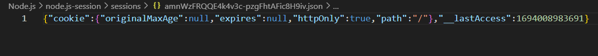
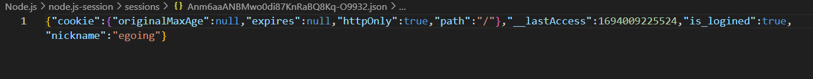

session-file-store에서 redirect를 바로 사용하는 경우 세션 정보가 파일시스템에 저장되기 전에 redirect가 먼저 실행되어 세션 정보가 파일에 저장되지 않는다.

```js
router.post('/login_process', function(request, response) {
    const post = request.body;
    const email = post.email;
    const password = post.pwd;
    if(email === authData.email && password === authData.password) {
        request.session.is_logined = true; // 저장되지 않음
        request.session.nickname = authData.nickname; // 저장되지 않음
        response.redirect('/');
    } else {
        response.send('Who?');
    }
});
```



따라서 redirect를 사용해야 하는 경우 아래와 같이 request.session.save()를 통해 콜백 함수로 redirect를 사용해야 한다.

```js
router.post('/login_process', function(request, response) {
    const post = request.body;
    const email = post.email;
    const password = post.pwd;
    if(email === authData.email && password === authData.password) {
        request.session.is_logined = true;
        request.session.nickname = authData.nickname;
        request.session.save(function() {
            response.redirect('/');
        })
    } else {
        response.send('Who?');
    }
});
```



파일에서 is_logined와 nickname을 확인할 수 있다.

해결하는 과정에서 이전 코드와 비교를 해 보았다. 잘 됐던 코드에서는 redirect가 아니라 send를 썼었다. send를 사용해서 돌려 봤더니 저장이 잘 되었다.

```js
app.get('/', function (req, res, next) {
    console.log(req.session);
    if(req.session.num === undefined) {
        req.session.num = 1;
    } else {
        req.session.num += 1;
    }
  res.send(`Views: ${req.session.num}`)
})
```

```js
router.post('/login_process', function(request, response) {
    const post = request.body;
    const email = post.email;
    const password = post.pwd;
    if(email === authData.email && password === authData.password) {
        request.session.is_logined = true; // 저장됨
        request.session.nickname = authData.nickname; // 저장됨
        response.send('Hello');
    } else {
        response.send('Who?');
    }
});
```

그렇다면 render가 문제이다.. 교재에서는 render를 그냥 사용해도 잘 된다고 나와 있는데 고새 업데이트가 된 것일까?