되도록이면 파이어베이스 같은 편한 툴을 사용하지 않고 직접 구현하는 것을 선호하였으나 알림 기능은 대체로 파이어베이스를 사용하는 모양..

프로젝트 기한이 얼마 남지 않은 상황이라 레퍼런스가 많은 FCM(Firebase Cloud Messaging)을 선택할 수 밖에 없었다.

- [파이어베이스](https://firebase.google.com/)에 접속하여 프로젝트를 생성한다.

  구글 애널리틱스는 어차피 등록해야 하므로 미리 해둔다.

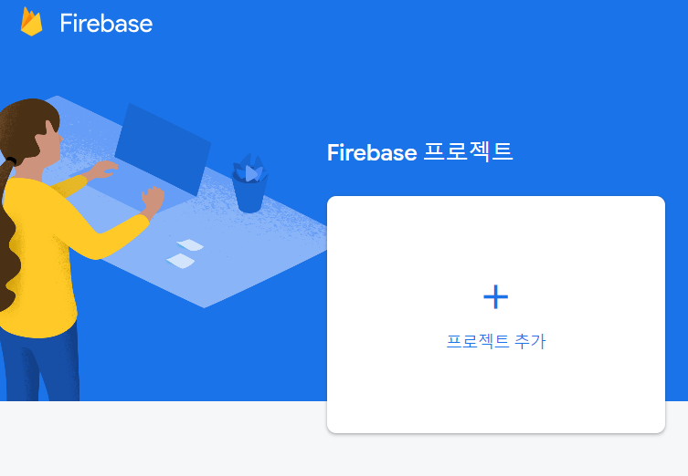
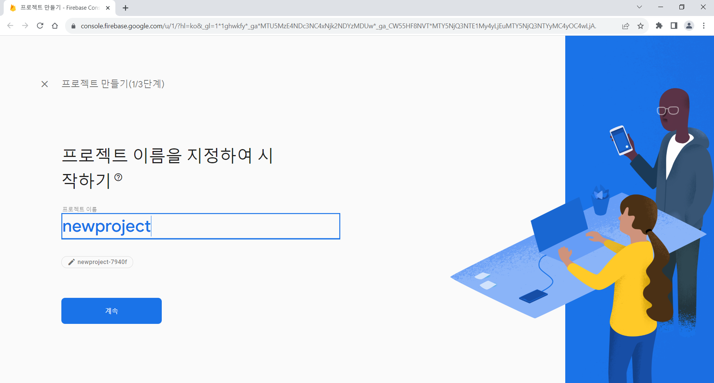
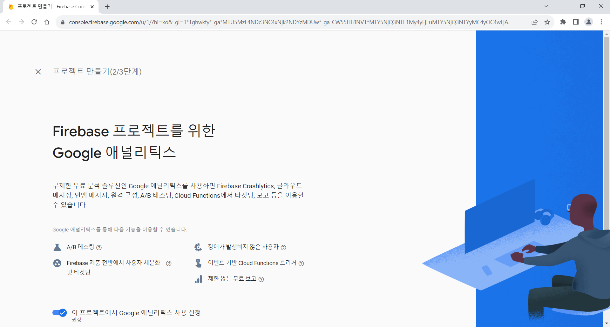


- 프로젝트에 android App을 추가한다.

  Android 패키지 이름에는 처음 RN 프로젝트를 생성할 때 썼던 폴더 이름 앞에 com.을 붙이면 된다.

  `npx react-native init newapp` 으로 만든 경우 `com.newapp`

  또는 app.json에서 이름을 확인할 수 있다.

  하단 선택사항은 하지 않아도 된다.

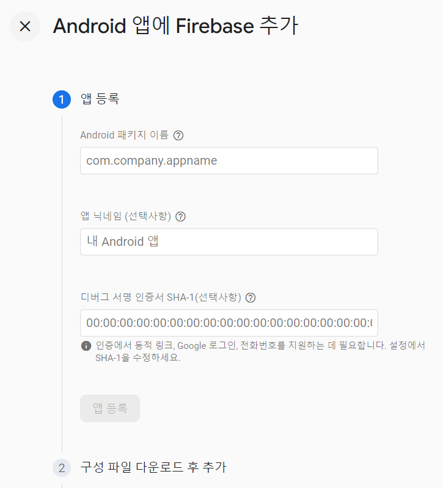
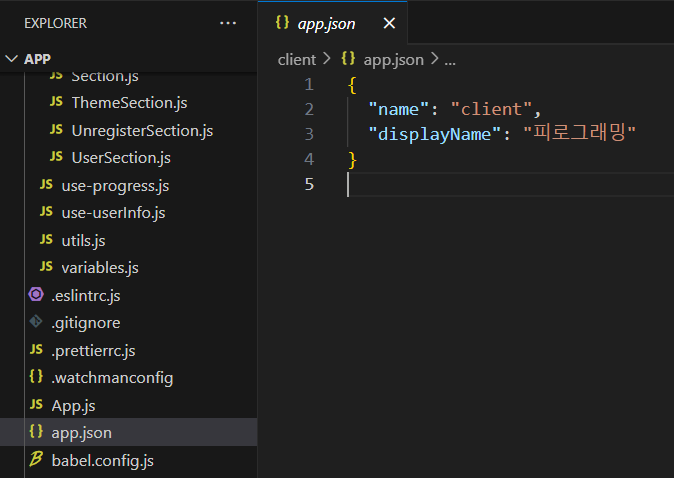

- 나오는 파일을 안내된 위치에 저장한다. 이미 있을 건데 덮어 씌우면 된다.

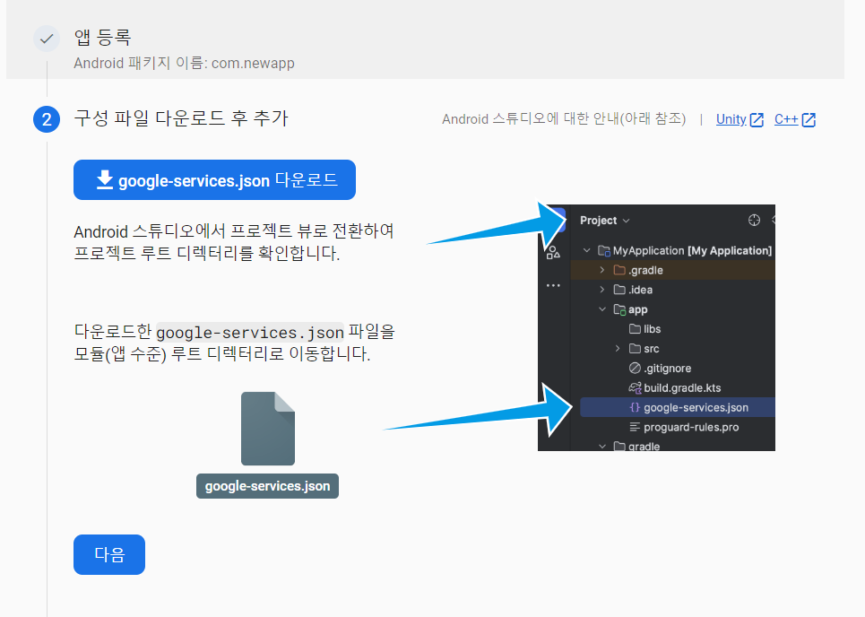

- 그 다음 안내대로 했더니 잘 안되었다.
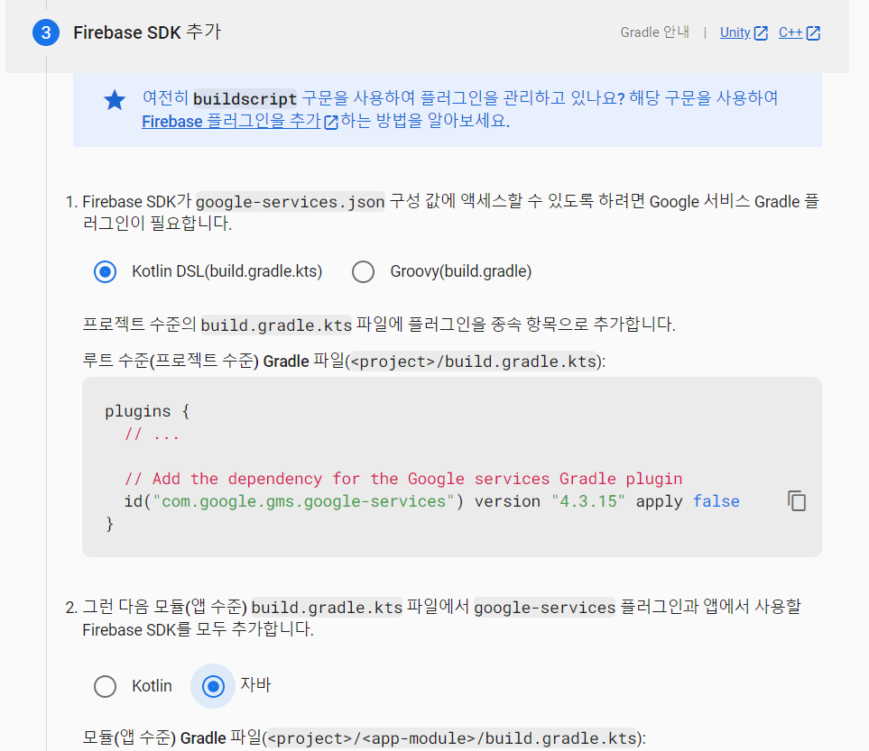

**RN 프로젝트 폴더 안에 있는 android 폴더 안에 build.gradle 파일이 두 개 있다.**

**하나는 android 폴더 기준 최상단, 하나는 android/app/src 밑에 있다.**

**전자가 프로젝트 수준, 후자가 앱 수준이다.**


내가 수정한 build.gradle

- 프로젝트 수준

```java
// Top-level build file where you can add configuration options common to all sub-projects/modules.

buildscript {
    ext {
        buildToolsVersion = "33.0.0"
        minSdkVersion = 21
        compileSdkVersion = 33
        targetSdkVersion = 33

        // We use NDK 23 which has both M1 support and is the side-by-side NDK version from AGP.
        ndkVersion = "23.1.7779620"
    }
    repositories {
        google()
        mavenCentral()
    }
    dependencies {
        classpath("com.android.tools.build:gradle")
        classpath("com.facebook.react:react-native-gradle-plugin")
        classpath 'com.google.gms:google-services:4.3.15' // 추가
    }
}
```

- 앱 수준

```java
apply plugin: "com.android.application"
apply plugin: "com.facebook.react"

/* 주석... */

react {
  /* 주석... */
}

/* 주석... */

def enableProguardInReleaseBuilds = false

/* 주석... */

def jscFlavor = 'org.webkit:android-jsc:+'

android {
    ndkVersion rootProject.ext.ndkVersion

    compileSdkVersion rootProject.ext.compileSdkVersion

    namespace "com.client"
    defaultConfig {
        applicationId "com.client"
        minSdkVersion rootProject.ext.minSdkVersion
        targetSdkVersion rootProject.ext.targetSdkVersion
        versionCode 1
        versionName "1.0"
    }
    signingConfigs {
        debug {
            storeFile file('debug.keystore')
            storePassword 'android'
            keyAlias 'androiddebugkey'
            keyPassword 'android'
        }
    }
    buildTypes {
        debug {
            signingConfig signingConfigs.debug
        }
        release {
            /* 주석... */
            signingConfig signingConfigs.debug
            minifyEnabled enableProguardInReleaseBuilds
            proguardFiles getDefaultProguardFile("proguard-android.txt"), "proguard-rules.pro"
        }
    }
}

dependencies {
    /* 주석... */
    implementation("com.facebook.react:react-android")

    debugImplementation("com.facebook.flipper:flipper:${FLIPPER_VERSION}")
    debugImplementation("com.facebook.flipper:flipper-network-plugin:${FLIPPER_VERSION}") {
        exclude group:'com.squareup.okhttp3', module:'okhttp'
    }

    debugImplementation("com.facebook.flipper:flipper-fresco-plugin:${FLIPPER_VERSION}")
    if (hermesEnabled.toBoolean()) {
        implementation("com.facebook.react:hermes-android")
    } else {
        implementation jscFlavor
    }

    // 추가!!!
    // Import the Firebase BoM
    implementation(platform("com.google.firebase:firebase-bom:32.3.1"))
    implementation 'com.google.firebase:firebase-messaging'
    implementation 'com.google.firebase:firebase-analytics'
    
    // 위 세 줄을 쓰거나 아래 두 줄을 쓰거나
    // Add the dependencies for the Firebase Cloud Messaging and Analytics libraries
    // When NOT using the BoM, you must specify versions in Firebase library dependencies 중요한 설명!
    // implementation 'com.google.firebase:firebase-messaging:23.1.2'
    // implementation 'com.google.firebase:firebase-analytics:21.3.0'
}

apply from: file("../../node_modules/@react-native-community/cli-platform-android/native_modules.gradle"); applyNativeModulesAppBuildGradle(project)
apply from: "../../node_modules/react-native-vector-icons/fonts.gradle"
apply plugin: 'com.google.gms.google-services' // 추가
apply plugin: 'com.android.application' // 추가
```

## 딱 이것만 해주면 오케이!!!

이제 android 폴더를 건드릴 일은 없다!!

문서에 보면 android studio 프로젝트의 java 기준 코드가 많은데 매니페스트니 뭐니 건드리지 않아도 된다. 건드리다가 오히려 망가졌다!

이제부터 신경 쓸 문서는 [ReactNativeFirebase](https://rnfirebase.io/)! 문서가 아주 친절해서 그대로 따라하면 잘 된다.

[이 문서](https://rnfirebase.io/)와 [이 문서](https://rnfirebase.io/messaging/usage)를 왔다리 갔다리 하면서 참고한다.

- 필요한 모듈을 RN 프로젝트에 설치 우리는 cloud messaging도 사용할 거니까 두 개 설치

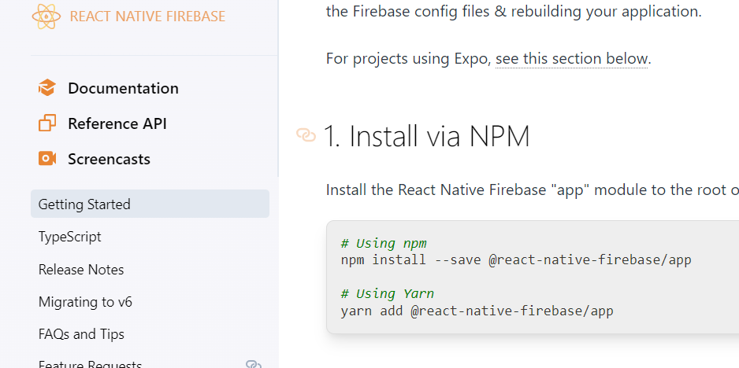
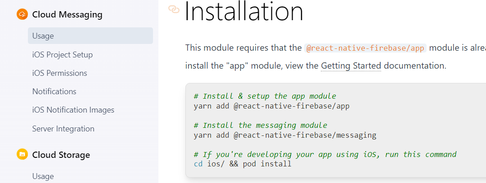

```
npm install --save @react-native-firebase/app
npm install --save @react-native-firebase/messaging
```

- 아래 두 가지를 참고하여 코드 작성 forground message는 앱이 켜져 있을 때 알림, background & quit message는 앱이 꺼져있거나 백그라운드에서 실행 중일 때 알림에 대한 설정이다.

- forground 코드는 App.js 파일에서 App 함수의 시작점에, backgound & quit 코드는 Index.js 파일에서 AppRegistry.registerComponent 위에 작성한다.
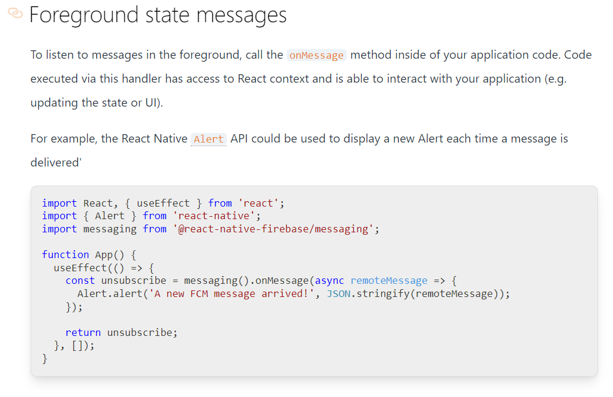
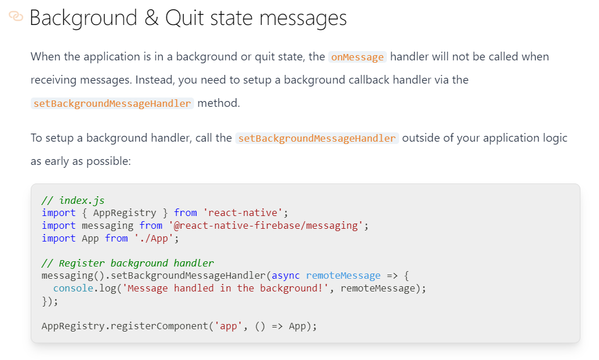

- 안드로이드 API가 33 이상인 경우에는 알림에 대한 권한 허용이 필요하다.

  코드를 App.js의 App 함수 시작 점에 추가한다.

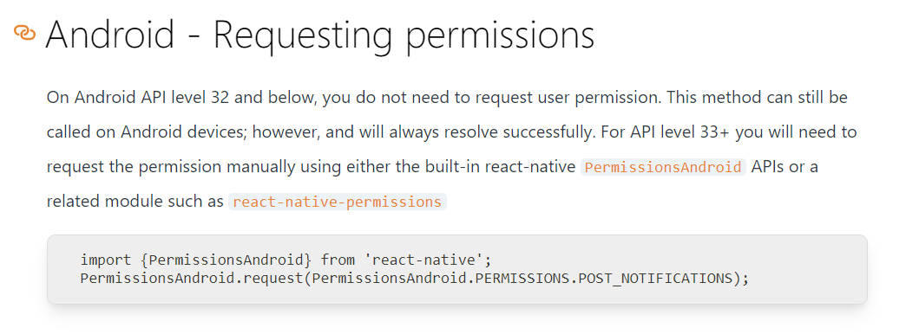

```js
// App.js
...
import messaging from '@react-native-firebase/messaging';

export default function App() {
  PermissionsAndroid.request(PermissionsAndroid.PERMISSIONS.POST_NOTIFICATIONS);
 
  useEffect(() => {
    getFcmToken();
    const unsubscribe = messaging().onMessage(async remoteMessage => {
      console.log('[Remote Message] ', JSON.stringify(remoteMessage));
      // Alert.alert('A new FCM message arrived!', JSON.stringify(remoteMessage));
    });
    return unsubscribe;
  }, []);

  return ( ...
```

```js
// index.js
...
import messaging from '@react-native-firebase/messaging';

messaging().setBackgroundMessageHandler(async (remoteMessage) => {
  console.log('Message handled in the background!', remoteMessage);
});

AppRegistry.registerComponent(appName, () => App);
```

FCM은 연결된 각각의 기기마다 token이 생성된다. 에뮬레이터의 토큰을 알아와서 테스트 알림을 보내보자.

토큰을 알아오는 코드는 App.js 파일에 추가한다.

```js
// App.js
...
import messaging from '@react-native-firebase/messaging';

const Stack = createNativeStackNavigator();

export default function App() {
  PermissionsAndroid.request(PermissionsAndroid.PERMISSIONS.POST_NOTIFICATIONS);

  // 추가!
  const getFcmToken = async () => {
    const fcmToken = await messaging().getToken();
    console.log('[FCM Token] ', fcmToken);
  };
 
  useEffect(() => {
    getFcmToken();
    const unsubscribe = messaging().onMessage(async remoteMessage => {
      console.log('[Remote Message] ', JSON.stringify(remoteMessage));
      // Alert.alert('A new FCM message arrived!', JSON.stringify(remoteMessage));
    });
    return unsubscribe;
  }, []);

  return (...
```

앱을 실행시키고 token을 확인한다. 복사한 다음에 firebase로 돌아온다.

- 첫 번째 캠페인 만들기 또는 새 캠페인을 눌러 캠페인을 생성한다.

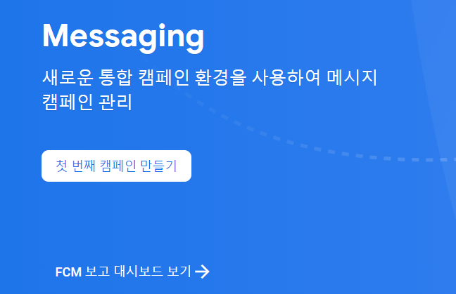

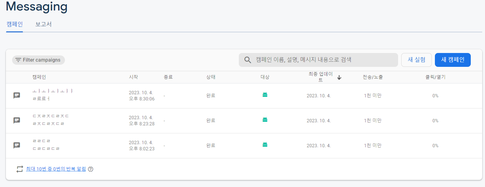

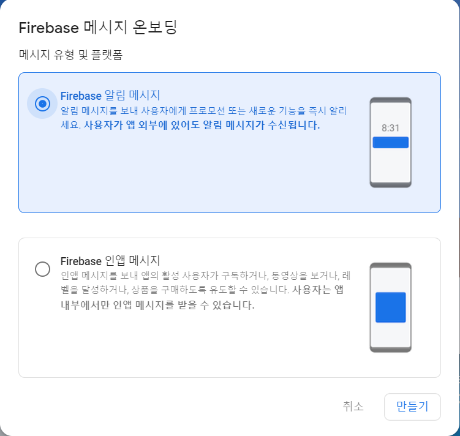

- 알림을 작성하고 테스트 메시지 전송을 누른다.

  나오는 팝업 창에 아까 복사했던 에뮬레이터의 token을 붙여넣고 테스트를 해본다.

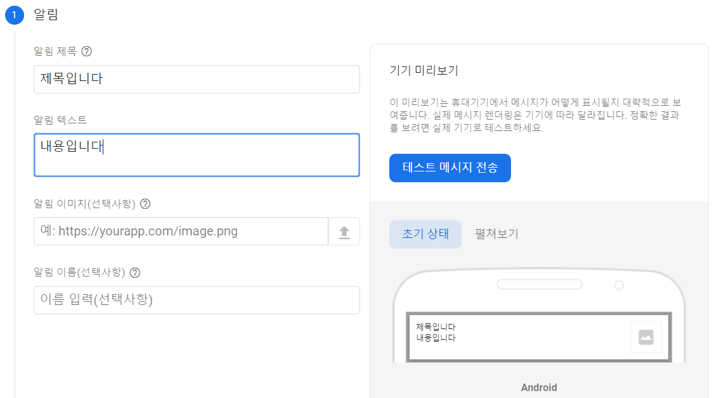

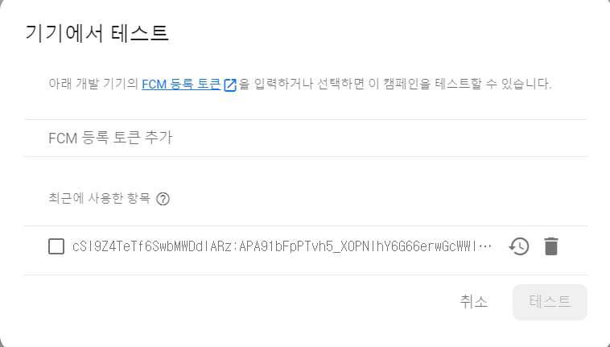

프로젝트 콘솔에 로그가 잘 찍히면 된다. 앱이 실행 중일 때, 백그라운드에 있을 때, 꺼져 있을 때 모두 테스트 해본다.

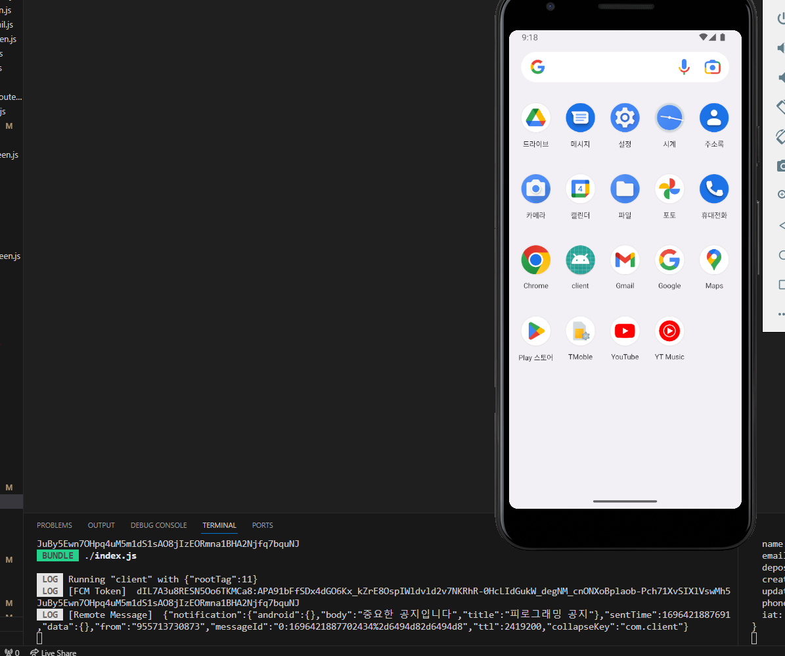

---

이제 알림을 이렇게 파이어베이스에 접속에서 보내지 말고 서버 코드에서 직접 보내 보자.

[파이어베이스 공식 문서1](https://firebase.google.com/docs/cloud-messaging/auth-server?hl=ko&authuser=1)과 [파이어베이스 공식 문서2](https://firebase.google.com/docs/cloud-messaging/send-message?hl=ko&authuser=1)를 참고한다.

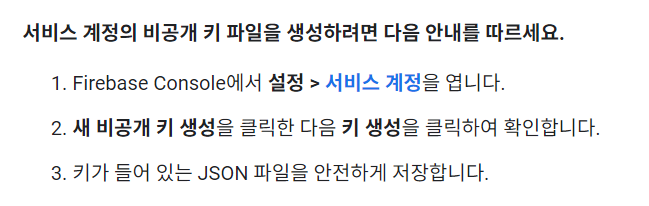

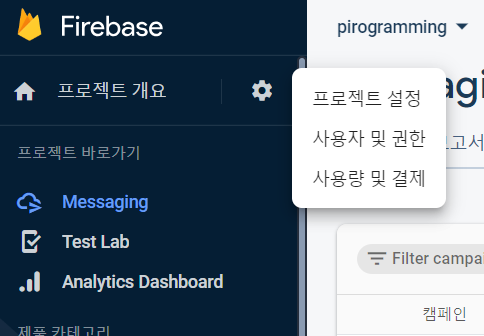

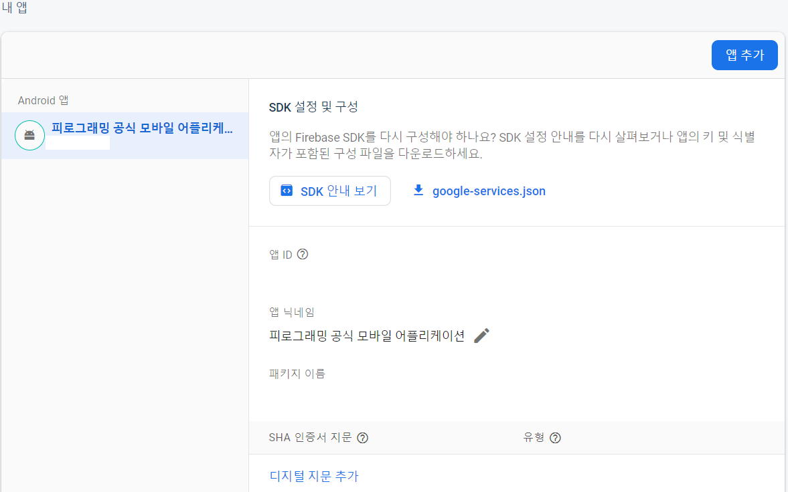

이미 키를 생성해서 이렇게 뜨는데 아래로 스크롤 하다 보면 나오는 새 비공개 키 생성을 눌러 json 파일을 node.js 서버 폴더에 둔다.

위치는 크게 상관 없으나

**깃허브에 올라가면 안 되므로** .gitignore에 해당 json 파일을 추가한다.

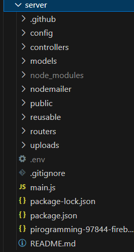

fcm과 관련된 함수가 몇 개 생길 것 같으므로 router, controller, model로 분리한다.

1. 핸드폰 앱(클라이언트)에서 공지 글을 '작성 완료' 버튼을 누른다.

2. Node.js 서버에게 `/api/post/create` 경로로 작성된 공지글의 내용을 body에 담아 요청을 보낸다.

3. Node.js 서버로부터 create가 잘 되었다는 응답을 받으면 `/api/fcm/push` 경로로 작성된 공지글의 내용과 작성자 본인 핸드폰의 fcm token을 body에 담아 요청을 보낸다.

4. Node.js 서버는 DB에 저장된 fcm token들을 조회하여 가져온다. 그 중 작성자의 fcm token을 제외한 다른 모든 token들(앱이 설치된 다른 핸드폰)에 알림을 보낸다.

5. 이렇게 동작하려면 앱이 설치되고 실행되는 즉시 각각의 핸드폰이 자신의 fcm token을 서버에게 보내주고, 서버는 각 fcm token을 DB에 저장해야 한다.

6. 앱을 설치 했다가 삭제하는 경우에는 fcm token이 갱신되고, 이전 fcm token이 무의미해지므로 쓰레기 token이 DB에 쌓이지 않도록 사용자들이 앱에 접속할 때마다 서버는 요청을 받아 DB의 token 정보를 update하여 관리할 필요가 있다.

==> push 함수와 saveToken 함수 두 개로 구성한다.

```js
// main.js
...
const admin = require("firebase-admin");

const serviceAccount = require("./[다운 받고 gitignore에 추가한 json파일 경로]");

admin.initializeApp({
  credential: admin.credential.cert(serviceAccount)
});
...

const fcmRouter = require('./routers/fcmRouter.js');
app.use('/api/fcm', fcmRouter);

app.listen(port, () => {
  console.log(`Example app listening on port ${port}`);
});
```

```js
// fcmRouter.js
const express = require('express');
const router = express.Router();
const fcmController = require('../controllers/fcmController.js');

router.post('/push', fcmController.push);
router.post('/saveToken', fcmController.saveToken);

module.exports = router;
```

```js
// fcmController.js
const fcmModel = require("../models/fcmModel");

const admin = require("firebase-admin");

module.exports = {
  push: async(req, res) => {
    const tokens = await fcmModel.getTokens();
    let tokenList = [];
    tokens.forEach((token) => {
      tokenList.push(token.token);
    });
    // 나를 제외한 기기들에게 알림
    const idx = tokenList.indexOf(req.body.myToken);
    if (idx > -1) tokenList.splice(idx, 1);
    
    if(tokenList.length) {
      const message = {
        notification: {
          title: req.body.title,
          body: req.body.body
        },
        tokens: tokenList
      };
    
      // Send a message to devices subscribed to the provided topic.
      admin.messaging().sendEachForMulticast(message)
        .then((response) => {
          // Response is a message ID string.
          console.log('Successfully sent message:', response);
        })
        .catch((error) => {
          console.log('Error sending message:', error);
        });
    } else {
      res.json({});
    }
  },
  saveToken: async (req, res) => {
    const token = req.body.token;
    console.log(token);
    await fcmModel.saveToken(token);
    res.json({result: true});
  }
}
```

```js
// fcmModel.js
const db = require('../config/db.js');

module.exports = {
  saveToken: async (token) => {
    // Token이 있으면 update
    const searchToken = 'SELECT * FROM DeviceToken WHERE token=?;';
    const tokenHere = await db.query(searchToken, [token]);
    if(tokenHere[0].length) {
      const updateToken = 'UPDATE DeviceToken SET updated_at=NOW() WHERE token=?;';
      const result = await db.query(updateToken, [token]);
      console.log(result);
      return result[0];
    }
    const query = 'INSERT INTO DeviceToken(token) VALUES(?);';
    const result = await db.query(query, [token]);
    console.log(result);

    return result[0];
  },
  getTokens: async () => {
    const query = 'SELECT token FROM DeviceToken;';
    const result = await db.query(query);

    return result[0];
  }
}
```

DeviceToken 테이블은 다음과 같이 구성되어 있다.

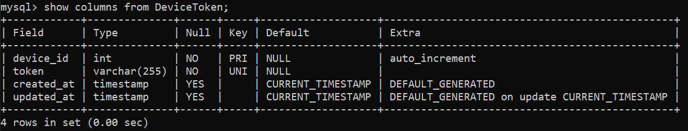

지금 생각해 보니 우리는 기수 별로 알림을 보내는 기능이 필요해서 token과 함께 기수 정보를 저장해야 할 것 같다.

getTokens 함수에서 WHERE level=? 구문만 추가하면 적절한 코드가 될 듯 필요한 변수 넘겨 주고

이제 다시 RN 클라이언트 코드로 넘어와서 이 API를 호출하는 fetch 로직을 작성해야 한다.

알림과 기기 토큰을 서버에 전송하는 fetch 요청은 자주 사용될 것 같으므로 utils.js에 따로 분리해 둔다.

pushNoti에는 보낸 사람에게는 알림이 전송되지 않았으면 좋겠으므로 본인의 token을 가져와서 함께 서버에 보내준다.

fetchPost 함수 또한 자주 사용해서 utils.js에 만들어둔 함수이다. fetchPost 함수는 안에서 fetch를 한다.


함수를 버튼과 연결한다.

공지글 '작성 완료' 버튼을 눌렀을 때 실행되는 함수에 pushNoti 함수를 연결한다.

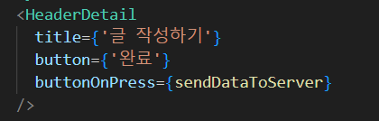

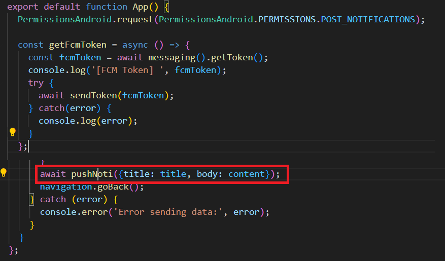

마찬가지로 글 삭제, 글 수정 버튼을 눌렀을 때도 pushNoti 함수를 연결한다.

또한 어플이 실행될 때 서버에 자신의 fcm token을 전달해 주어야 하므로 App.js 파일에서 saveToken 함수를 실행시켜 준다.

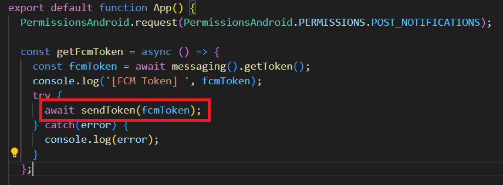

완료!

## 💦 발생한 어려움

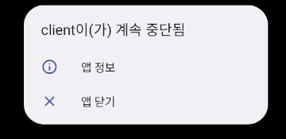

자꾸 꺼짐 ;;;

Android Manifest에서 다음 코드를 지우니 해결

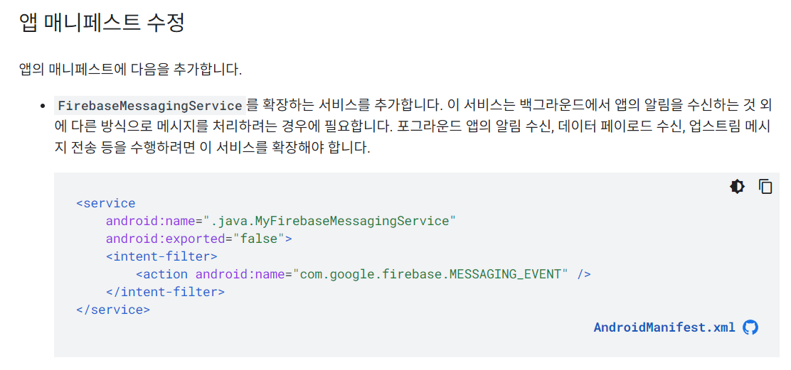

공식 문서에 있던 건데 ... RN이라서 좀 다른 건지 근데 또 My가 앞에 붙은 걸 보니 내가 뭔갈 더 설정해 주어야 하는 건가?

어떻게 알게 되었냐하면

로그도 없이 앱이 꺼져 버리니까 원인을 한참 못 찾다가

**자고 일어나서** 다시 시도

Android Studio를 켜고 rn프로젝트 안의 android 폴더를 열어 줌

여기서 build 진행

Android Studio 바닥 쪽에 log cat 이라고 있는데 그 로그를 복사해서 지피티에게 문의..

```
FATAL EXCEPTION: main
                                                                                                    Process: com.client, PID: 29651
                                                                                                    java.lang.RuntimeException: Unable to create service com.client.java.MyFirebaseMessagingService: java.lang.ClassNotFoundException: Didn't find class "com.client.java.MyFirebaseMessagingService" on path: DexPathList[[zip file "/data/app/~~ANrpfIjjkYJpGQEzn1K9ZA==/com.client-TisyzPYUYJnf2C2lvt_2JQ==/base.apk"],nativeLibraryDirectories=[/data/app/~~ANrpfIjjkYJpGQEzn1K9ZA==/com.client-TisyzPYUYJnf2C2lvt_2JQ==/lib/x86_64, /data/app/~~ANrpfIjjkYJpGQEzn1K9ZA==/com.client-TisyzPYUYJnf2C2lvt_2JQ==/base.apk!/lib/x86_64, /system/lib64, /system_ext/lib64]]
                                                                                                    	at android.app.ActivityThread.handleCreateService(ActivityThread.java:4498)
                                                                                                    	at android.app.ActivityThread.-$$Nest$mhandleCreateService(Unknown Source:0)
                                                                                                    	at android.app.ActivityThread$H.handleMessage(ActivityThread.java:2161)
                                                                                                    	at android.os.Handler.dispatchMessage(Handler.java:106)
                                                                                                    	at android.os.Looper.loopOnce(Looper.java:201)
                                                                                                    	at android.os.Looper.loop(Looper.java:288)
                                                                                                    	at android.app.ActivityThread.main(ActivityThread.java:7872)
                                                                                                    	at java.lang.reflect.Method.invoke(Native Method)
                                                                                                    	at com.android.internal.os.RuntimeInit$MethodAndArgsCaller.run(RuntimeInit.java:548)
                                                                                                    	at com.android.internal.os.ZygoteInit.main(ZygoteInit.java:936)
                                                                                                    Caused by: java.lang.ClassNotFoundException: Didn't find class "com.client.java.MyFirebaseMessagingService" on path: DexPathList[[zip file "/data/app/~~ANrpfIjjkYJpGQEzn1K9ZA==/com.client-TisyzPYUYJnf2C2lvt_2JQ==/base.apk"],nativeLibraryDirectories=[/data/app/~~ANrpfIjjkYJpGQEzn1K9ZA==/com.client-TisyzPYUYJnf2C2lvt_2JQ==/lib/x86_64, /data/app/~~ANrpfIjjkYJpGQEzn1K9ZA==/com.client-TisyzPYUYJnf2C2lvt_2JQ==/base.apk!/lib/x86_64, /system/lib64, /system_ext/lib64]]
                                                                                                    	at dalvik.system.BaseDexClassLoader.findClass(BaseDexClassLoader.java:259)
                                                                                                    	at java.lang.ClassLoader.loadClass(ClassLoader.java:379)
                                                                                                    	at java.lang.ClassLoader.loadClass(ClassLoader.java:312)
                                                                                                    	at android.app.AppComponentFactory.instantiateService(AppComponentFactory.java:129)
                                                                                                    	at androidx.core.app.CoreComponentFactory.instantiateService(CoreComponentFactory.java:75)
                                                                                                    	at android.app.ActivityThread.handleCreateService(ActivityThread.java:4467)
                                                                                                    	at android.app.ActivityThread.-$$Nest$mhandleCreateService(Unknown Source:0) 
                                                                                                    	at android.app.ActivityThread$H.handleMessage(ActivityThread.java:2161) 
                                                                                                    	at android.os.Handler.dispatchMessage(Handler.java:106) 
                                                                                                    	at android.os.Looper.loopOnce(Looper.java:201) 
                                                                                                    	at android.os.Looper.loop(Looper.java:288) 
                                                                                                    	at android.app.ActivityThread.main(ActivityThread.java:7872) 
                                                                                                    	at java.lang.reflect.Method.invoke(Native Method) 
                                                                                                    	at com.android.internal.os.RuntimeInit$MethodAndArgsCaller.run(RuntimeInit.java:548) 
                                                                                                    	at com.android.internal.os.ZygoteInit.main(ZygoteInit.java:936)
```

```
주어진 로그를 보면 앱이 실행 중에 MyFirebaseMessagingService 클래스를 찾지 못해 발생하는 ClassNotFoundException 오류가 발생하고 있습니다. 이 오류는 Firebase Cloud Messaging의 서비스 클래스를 찾을 수 없는 문제로 보입니다.

문제를 해결하기 위해 다음 단계를 시도할 수 있습니다:

클래스 이름 확인: MyFirebaseMessagingService 클래스의 이름이 정확하게 일치하는지 확인하세요. 대소문자와 패키지 이름을 정확하게 일치시켜야 합니다.

패키지 이름 확인: MyFirebaseMessagingService 클래스의 패키지 이름이 정확하게 설정되었는지 확인하세요. Manifest 파일과 Java 파일에서 패키지 이름이 일치해야 합니다.

빌드 및 Clean: Android Studio 또는 Gradle에서 프로젝트를 다시 빌드하고, "Clean Project" 작업을 수행하여 빌드 캐시를 지우고 다시 빌드하세요.

불필요한 파일 삭제: 불필요한 클래스 파일 또는 리소스 파일이 프로젝트 내에 남아있지 않는지 확인하세요. 종종 이러한 파일이 문제의 원인이 됩니다.

멀티 모듈 구성 확인: 프로젝트가 멀티 모듈을 사용하는 경우, 모듈 간의 의존성이 올바르게 설정되었는지 확인하세요.

앱 패키지 이름 확인: AndroidManifest.xml 파일에서 앱의 패키지 이름이 정확하게 설정되었는지 확인하세요.

Gradle 의존성 확인: Gradle 파일에서 Firebase 관련 의존성이 올바르게 설정되었는지 확인하세요. 필요한 라이브러리와 버전을 사용 중인지 확인하세요.

Firebase 서비스 등록: Firebase Console에서 앱의 서비스와 인증 설정이 정확하게 구성되었는지 확인하세요.

Android Studio 업데이트: Android Studio를 최신 버전으로 업데이트하고, Gradle 플러그인과 빌드 도구도 업데이트하세요.

프로젝트 재구성: 경우에 따라 프로젝트를 삭제하고 다시 생성하거나, 안드로이드 스튜디오 설정 폴더를 삭제하고 다시 시작하는 것이 도움이 될 수 있습니다.

위의 단계를 따라 시도하면 문제를 해결할 수 있을 것입니다. 그럼에도 불구하고 문제가 해결되지 않으면 추가적인 정보나 코드 스니펫을 제공하면 더 구체적인 지원을 제공할 수 있습니다.
```

지우니까 되더라..

## 📚 Reference

⏬ 최고 도움 많이 되었습니다!!! 감사합니다

https://velog.io/@kwonh/ReactNative-%ED%91%B8%EC%89%AC%EC%95%8C%EB%A6%BC-%EA%B3%B5%EC%8B%9D%EB%AC%B8%EC%84%9C-%EB%94%B0%EB%9D%BC%ED%95%98%EA%B8%B0-Firebase-Cloud-Messaging-react-native-firebase-notification-%EC%95%88%EB%93%9C%EB%A1%9C%EC%9D%B4%EB%93%9C#cloud-messaging-%EC%9D%B4%ED%95%B4%ED%95%98%EA%B8%B0

https://velog.io/@mywonhyuni/%EA%B8%B0%EB%8A%A5%EA%B5%AC%ED%98%84RN-firebase%EB%A5%BC-%EC%9D%B4%EC%9A%A9%ED%95%9C-Push-notification-%EB%A7%8C%EB%93%A4%EA%B8%B0#1-android--app--buildgradle-%EC%B6%94%EA%B0%80-%ED%95%AD%EB%AA%A9

https://velog.io/@ddowoo/react-native-%ED%91%B8%EC%8B%9C%EC%95%8C%EB%A6%BC-%EA%B5%AC%ED%98%84-firebase-notifee

https://falsy.me/react-native%EC%97%90%EC%84%9C-fcm%EC%9D%84-%ED%86%B5%ED%95%9C-%EC%95%8C%EB%A6%BC-%EC%88%98%EC%8B%A0%ED%95%98%EA%B8%B0android/

https://honeystorage.tistory.com/255

https://honeystorage.tistory.com/306