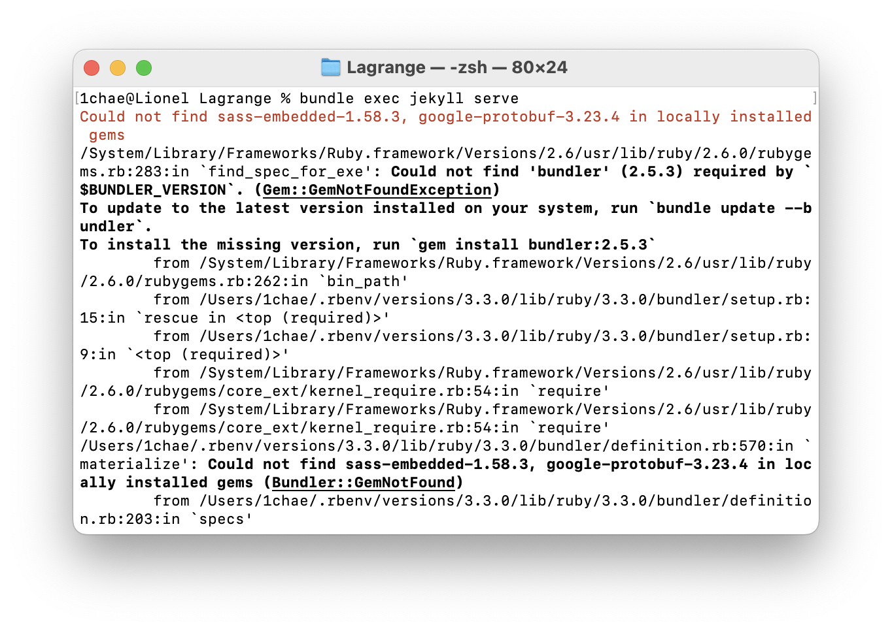
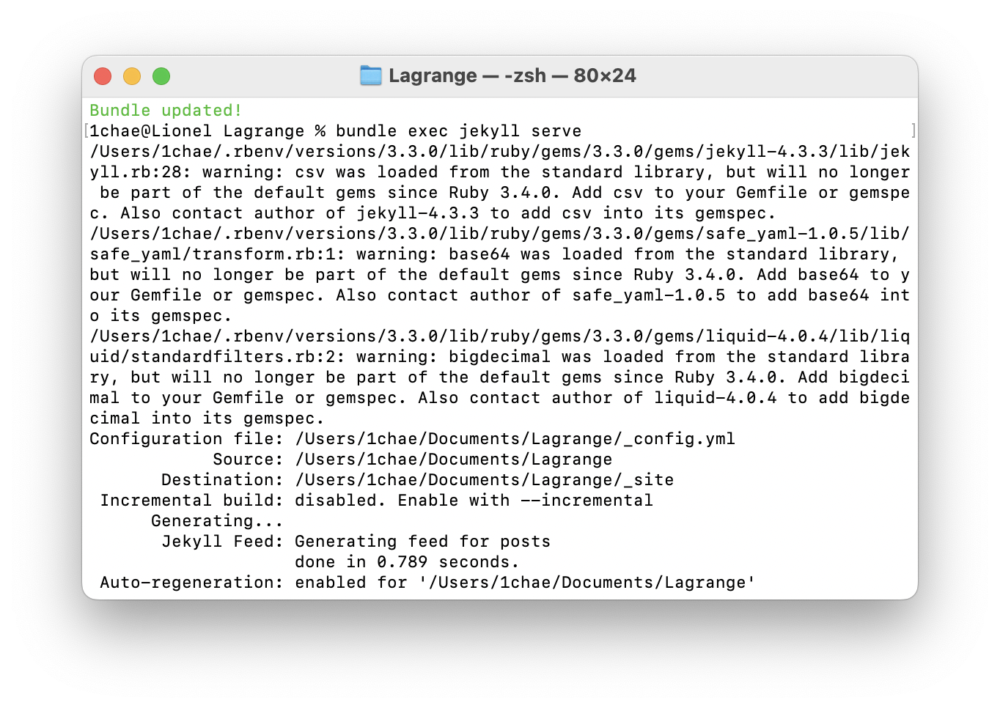

## 블로그 재정비 해야지.. 해야지

하다가 드디어 건드리게 되었다!

다시 한번 깔끔한 테마를 찾아 나섰고 탈바꿈하였다.

변경할 테마와 기존 테마의 디렉토리 구조를 비교하면서 데이터를 덮어 씌우는 방식으로 테마를 적용했다.

그리고 항상 글은 깃헙에 push 후에 확인을 했었는데, 로컬에서 jekyll 서버를 띄우고 확인할 수 있다는 것을 새롭게 알게 되었다.

그 과정에서 발생한 🆘 ERROR 🆘

```sh
jekyll -v
/System/Library/Frameworks/Ruby.framework/Versions/2.6/usr/lib/ruby/2.6.0/rubygems/core_ext/kernel_require.rb:54:in `require': cannot load such file -- google/protobuf_c (LoadError)
```

이 에러가 계속 발생하였는데, 아무리 검색을 해 보아도 결과가 나오지 않았다.

이럴 때는 ruby와 jekyll에 대해 기본적으로 이해할 필요가 있겠다 싶어 조금 찾아 보니 [좋은 글](https://codecamper.me/blog/122/)을 발견하게 되었다.

ruby 버전이 낮아서 생긴 문제였다.

```sh
rbenv install -l
```

위 명령어를 통해 사용 가능한 버전을 확인했고, 이 중 가장 높은 3.3.0으로 바꾸었다.

```sh
rbenv install
rbenv global 3.3.0
```

이렇게 하였는데도 `rbenv -v`의 결과가 3.3.0이 아니어서 다음 처리를 해 주었다.

```sh
rbenv init
# Load rbenv automatically by appending
# the following to ~/.zshrc:

eval "$(rbenv init - zsh)"
```

rbenv init 명령어를 입력했을 때 나온 결과에 따라 ~/.zshrc에 마지막 줄을 추가하여 주었고 터미널을 껐다가 다시 켜니 잘 적용이 되었다.

그 뒤 다시 서버를 켜기 위해 `bundle exec jekyll serve` 명령을 실행하자 다음과 같은 오류를 발견했다



오류 로그에 나와 있는 대로

```sh
bundle update --bundler
```

를 실행하였다.

그리고 또 `Liquid Exception: Liquid syntax error (line 178): Unknown tag 'extends' in ...` 이라는 오류도 만났다

이건 장고 템플릿 문법과 liquid라는 문법이 충돌한 것 같은데, [이 블로그](https://devyuseon.github.io/github%20blog/liquid-syntax-error-unknown-tag/)를 통해 해결할 수 있었다.



### 성공~