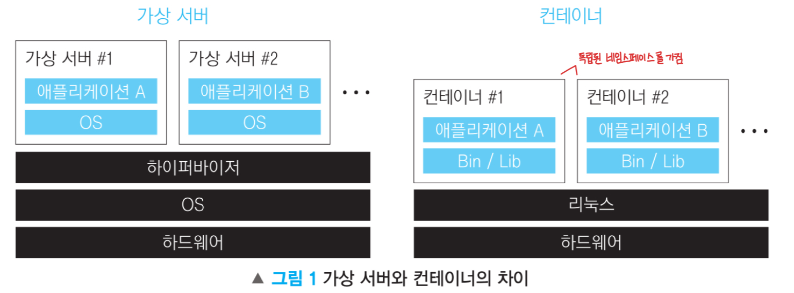
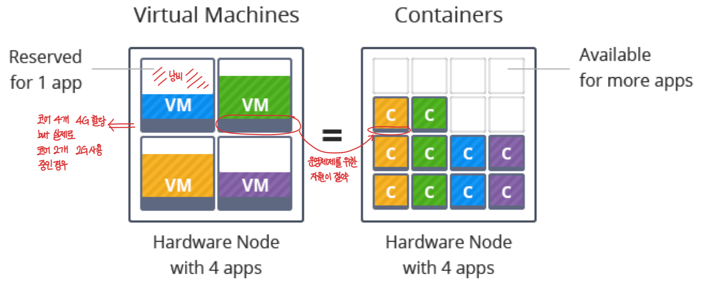
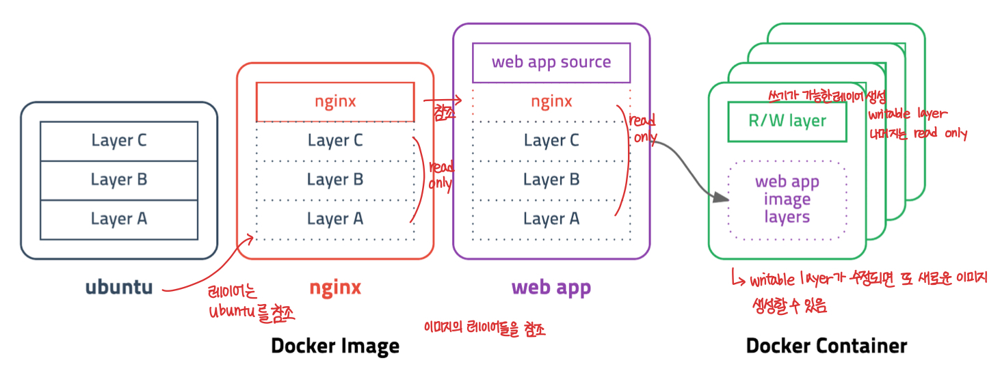
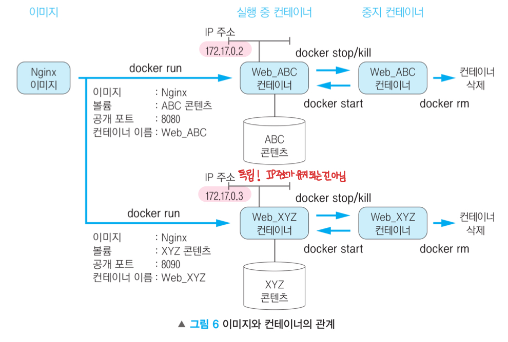

## 가상화 (Virtualization)
하드웨어에 종속된 리소스를 추상화
운영체제에서 가상화를 많이 사용함
- Process
- CPU Scheduling
- Virtual Memory
- Paging
- Swapping

## 서버를 가상화 하자.
서버 한 대의 성능이 향상되면서 하나의 서버에 하나의 앱만 구동하기에는 리소스가 아까워졌다.

*서버 가상화의 장점*
- 장애 고립 (Isolation)
    
    특정 어플리케이션이나 OS의 장애가 시스템 전체에 전파되어 운영에 영향을 미치는 것을 방지
- 보안 강화

    서버의 계정이 여러 개일 때 다른 계정의 홈디렉토리에 접근이 가능함
    
    서버 가상화로 분리하게 되면 원천 차단!
- 신속한 자원 제공 및 백업

    migration에 적합

*문제점*
- 성능 오버헤드

    시스템 자원 할당을 위해 Hypervisor를 거쳐야 하기 때문에 가상화 없이 사용할 때(Bare Metal)에 비해 부가적인 시간이 필요
- 자원 낭비

    멀티 부팅을 한다고 생각하면 된다. 디스크 파티셔닝 후에 돌이킬 수 없는 것과 같음
- 거대한 이미지 사이즈

    OS까지 분리하여 각각 부팅되므로 이미지 사이즈 비대해짐

    로드밸런싱과 같은 작업들에 있어서 서버 migration이 잦음
- 느린 시작 시간

    Host OS 이외에도 각각 Guest OS를 부팅해야 함

## 서버 가상화를 개선하자. 컨테이너 기술!

컨테이너는 운영체제 수준의 가상화이다.
> 서버 가상화는 하드웨어 수준의 가상화

리눅스 커널의 네임스페이스(Namespace)와 컨트롤 그룹(Control Group)이라는 기술을 기반으로 함

*컨테이너의 장점*
- 인프라의 사용률 향상 및 빠른 기동 시간

    Guest OS가 없기 때문에 일반적인 프로세스 실행과 차이가 거의 없다.

    
- **불변 실행 환경** (Immutable Infrastructure)

    개발 프로젝트에는 여러 오픈소스 프레임워크를 함께 사용하게 된다.
    
    오픈소스 프로젝트는 빈번하게 수정, 보완이 일어나 버전이 자주 변경되는데, 컨테이너는 앱에 필요한 라이브러리, 의존성 등을 모두 포함하고 있기 때문에 종속성으로 인한 문제를 배제할 수 있다.

    원하는 컨테이너를 조합하여 시스템을 구성할 수 있다.

    개발 환경과 운영 환경의 차이를 줄일 수 있다.

## Docker 개념
2013년 Go 언어로 개발
Container 관련 기술 중 거의 표준

## Docker 아키텍쳐
### 클라이언트/서버 모델
Docker 데몬(서버)과 Docker 클라이언트로 이루어져 있음

> 이 이미지는 도커를 서너 번 사용하고 나서 다시 화살표 따라 읽어보면 이해가 더 잘 된다.

### Docker Daemon
서버 역할
클라이언트에서 docker로 시작하는 커멘드(명령어)를 입력 받아, Docker 오브젝트인 이미지, 컨테이너, 볼륨, 네트워크 등을 관리
네트워크를 통한 요청도 받을 수 있다. ☞ 이게 쿠버네티스와 연관이 있는 것 같다!

### Docker Client
컨테이너 조작을 위한 CLI 클라이언트. 입력된 명령어를 데몬에게 전달하는 역할

### Docker Image
컨테이너를 올리기 위한 실행 파일, 설정 파일의 묶음
하나의 이미지는 여러 레이어의 조합으로 이루어진다.
유니온 파일 시스템(UnionFS)에 의존

Read-Only Layer와 Writable Layer로 구성되어 있다.
Dockerfile에 명시된 스크립트에 따라 빌드된 결과물이다.
각 이미지는 `레포지토리:태그`로 구성되어 있다.

### Docker Container
`docker run` 명령어를 통해 이미지는 컨테이너로 변환되어 하나의 **인스턴스**가 된다.
IP 주소를 가지는 하나의 독립된 서버처럼 동작한다.

서버 안에 서버가 있다고 생각하면 쉽다!

### Docker Registry
이미지를 업로드해 보관하고 공유하는 장소
github와 비슷하다.
나의 Docker hub의 레지스트리는 나의 게정 이름으로 시작한다. `ywonchae1/proj...`

## IaC (Infrastructure as Code)
배포 동작에 필요한 모든 내용을 코드로 작성하는 것 ☞ 도커를 사용하게 되면 자연스레 가능해진다!

> 다음 시간에는 Docker 실습을 해보자~