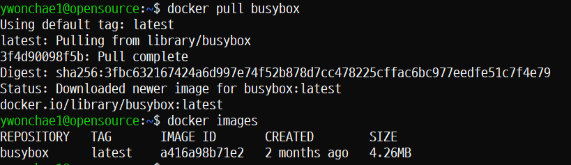
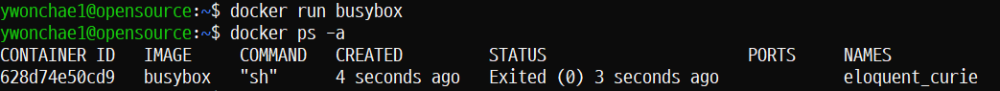
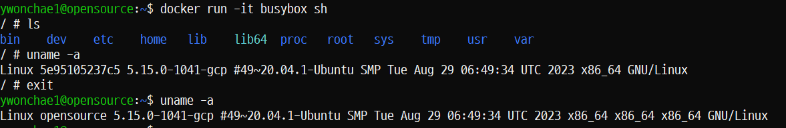
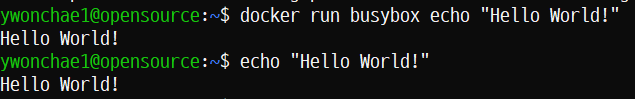
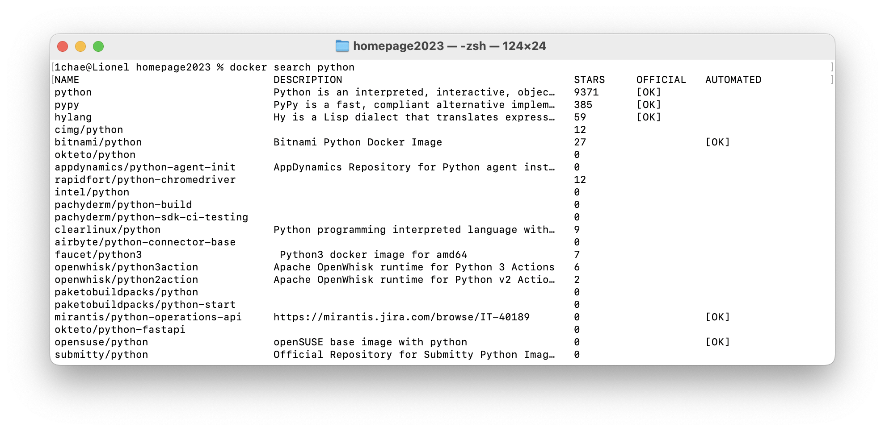
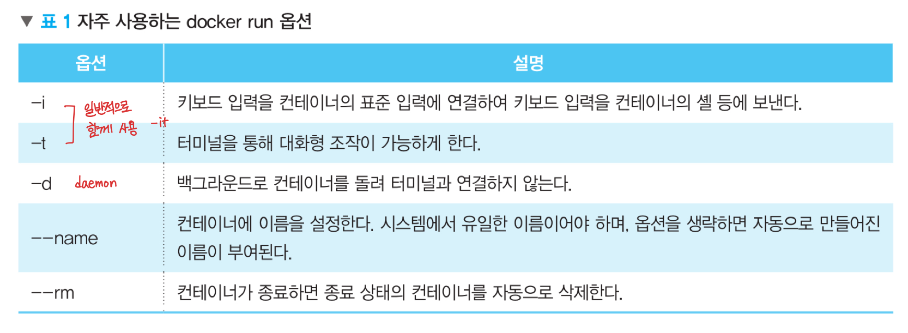

## 도커 자동 설치 스크립트 쓰기

```
sudo wget -qO- https://get.docker.com/ | sh
```

## 도커 실행 & 부팅 시 자동 실행

```
sudo systemctl start docker
sudo systemctl enable docker
```

## 현재 계정이 도커를 이용할 수 있도록 docker 그룹에 포함

```
sudo usermod -aG docker ${USER}
sudo systemctl restart docker
sudo systemctl status docker
sudo systemctl status containerd.service
```

로그아웃 후 재로그인

--- 설치 완료! ---

## busybox를 이용한 간단한 실습
으로 도커 환경을 이해해 보자

```
docker pull busybox
docker image ls
docker run busybox
docker container ls
```




`docker image ls`와 `docker images`는 동일한 명령어이다.

하지만 전자가 더 추천된다.

`docker container ls`와 `docker ps`는 동일한 명령어이다.

하지만 전자가 더 추천된다.

위 과정을 통해 아주 경량화된 리눅스 배포판인 busybox 컨테이너를 올렸다.

컨테이너를 실행시킬 때 따로 이름을 지정하지 않았으므로 랜덤 이름이 지정된 것을 알 수 있다.

busybox 컨테이너도 역시 하나의 리눅스 서버라고 생각할 수 있으므로 다음과 같은 명령어를 통해 안으로 들어갈 수 있다.

```
docker run -it busybox sh
```

이 명령어는 busybox 컨테이너를 실행할 때 컨테이너 안에서 sh 명령어를 실행한다는 뜻이므로 컨테이너 안의 셸이 보이게 된다.

여기서 컨테이너 안과 밖에서 `uname -a` 명령어를 써 보면 결과가 동일하며, 이는 컨테이너들이 동일한 OS를 공유하여 사용하고 있다는 것이다.



이번에는 hello world를 출력해 볼 텐데, busybox를 통해 출력하는 것과 직접 서버에서 출력하는 것의 차이를 느껴 보자.

```
docker run busybox echo "Hello World!"
```



docker run을 사용하여 Hello World를 출력했을 때 시간이 조금 더 걸리는 것을 느낄 수 있다.


컨테이너를 지나 출력되기 때문에 그렇다.

## Docker 명령어

### 🔎 이미지 찾기

```
docker search [이미지명]
```



docker registry에 base로 사용할 이미지가 있는지 찾는다. [여기서](https://hub.docker.com/)도 찾을 수 있다.

### 🔎 로컬로 이미지 받기

```
docker pull [OPTIONS] 이미지명:[태그]
docker pull python
```

태그를 생략하면 latest와 동일

### 🔎 로컬에서 이미지와 컨테이너 확인

```
docker image ls
docker container ls
```

로컬의 이미지와 컨테이너가 어떤 게 있는지 확인할 수 있는 명령어

리눅스의 ls 명령어와 유사하게 옵션을 사용하면 된다.

### 🔎 이미지 세부 정보 조회

```
docker image inspect [OPTIONS] 이미지명:[태그]
```

### 🔎 이미지 히스토리 조회

```
docker image history [OPTIONS] 이미지명:[태그]
```

### 🔎 이미지 태그 설정

```
docker tag 원본이미지명:[태그] 참조이미지명:[태그]
```

### 🔎 도커 로그인

```
docker login
docker logout
```

이때 비밀번호가 base64인코딩을 통해 파일에 저장되므로 logout을 하는 것이 필수! 해독이 너무 쉽다.

docker hub에 이미지를 업로드하기 위해 로그인이 필요하다.

### 🔎 도커 이미지 삭제

```
docker image rm [OPTIONS] 이미지명:[태그]
```

이미지명을 직접 쓰거나, 이미지ID를 써도 된다.

이미지가 컨테이너로 실행 중이라면 삭제할 수 없다.

```
docker image prune
```

컨테이너에 연결되어 있지 않은 모든 이미지를 제거

-a 옵션을 사용하면 사용 중이 아닌 모든 이미지를 제거

### 🔎 도커 컨테이너 실행

```
docker [container] run [OPTIONS] 이미지명:[태그] [실행명령]
```



--restart 옵션도 많이 사용한다. [no | on-failure | on-failure:횟수 | always]

### 🔎 도커 컨테이너 생성

```
docker [container] create [OPTIONS] 이미지명:[태그]
```

생성만 하고, 실행은 아님

### 🔎 도커 컨테이너 시작

```
docker [container] start [OPTIONS] 컨테이너명
```

### 🔎 도커 컨테이너 접속

```
docker [container] attach [OPTIONS] 컨테이너명
```

빠져나올 때는 `ctrl + p + q` 입력

`ctrl + c`나 `ctrl + d`는 컨테이너가 정지 됨

### 🔎 도커 컨테이너 삭제

```
docker [container] rm [OPTIONS] 컨테이너명
```

-f 옵션을 통해 동작 중인 컨테이너도 삭제 가능

```
docker container prune
```

실행 중이지 않은 컨테이너를 모두 제거

### 🔎 도커 컨테이너 정지

```
docker [container] stop 컨테이너명
```

### 🔎 도커 컨테이너 재시작

```
docker [container] restart 컨테이너명
```

컨테이너의 동작에는 영향을 주지 않음

호스트의 PID만 변경 됨

### 🔎 도커 컨테이너 외부에서 안에 명령어 실행

```
docker [container] exec 컨테이너명 실행명령
```

컨테이너가 실행 중이어야만 사용 가능

### 🔎 도커 컨테이너 표준 출력 호스트에 연결

```
docker [container] logs 컨테이너명
```

-f 옵션 사용 시 새로 출력되는 내용 계속 출력

### 🔎 도커 컨테이너와 호스트 간 파일 복사

```
docker [container] cp 컨테이너명:원본파일 대상파일
docker [container] cp 대상파일 컨테이너명:원본파일
```

### 🔎 도커 컨테이너 사용 현황 확인

```
docker [container] stats 컨테이너명
```

### 🔎 도커 컨테이너 변경 사항 확인

```
docker [container] diff 컨테이너명
```

### 🔎 도커 컨테이너 세부 정보 확인

```
docker [container] inspect 컨테이너명
```

할당 IP주소, 실행 명령 등 확인 가능

### 🔎 도커 컨테이너 변경 사항을 이미지로 생성

```
docker [container] commit [OPTIONS] 컨테이너명 이미지명:[태그]
```

> 다음엔 도커파일을 작성하고 이미지를 빌드하는 방법에 대해 배워보자!